# Racing Arcade — 产品需求文档（PRD）

> **文档版本**：v1.0  
> **最后更新**：2026-04-23  
> **文档状态**：Draft  

---

## 目录

- [1. 项目概述](#1-项目概述)
- [2. 用户角色与权限](#2-用户角色与权限)
- [3. 用户系统](#3-用户系统)
- [4. 赛事管理（后台）](#4-赛事管理后台)
- [5. 赛事浏览与报名（前台）](#5-赛事浏览与报名前台)
- [6. 成绩与排名](#6-成绩与排名)
- [7. 抗议与处罚](#7-抗议与处罚)
- [8. 赛事日历](#8-赛事日历)
- [9. 车队系统](#9-车队系统)
- [10. 通知系统](#10-通知系统)
- [11. 直播与内容](#11-直播与内容)
- [12. 管理数据看板](#12-管理数据看板)
- [13. 非功能需求与 MVP 规划](#13-非功能需求与-mvp-规划)

---

# 1. 项目概述

## 1.1 平台背景

Racing Arcade 是 MOZA Racing 旗下官方模拟赛车赛事发布平台，旨在为全球 MOZA 用户及模拟赛车爱好者提供高品质的线上竞速体验。

## 1.2 平台定位

Racing Arcade 是一个**由 MOZA Racing 官方运营的模拟赛车赛事发布与管理平台**。平台仅由 MOZA 官方团队发布和管理赛事，不是用户共创（UGC）平台。核心职责是：

- **赛事信息展示**：清晰、美观地呈现赛事信息（赛制、时间、赛道、车辆等）
- **报名管理**：为车手提供便捷的赛事报名/取消报名流程
- **成绩呈现**：展示比赛结果、积分排名和统计数据
- **通知触达**：确保车手及时收到赛事相关通知

平台不对赛制规则、晋级逻辑做强制系统化约束，复杂的赛事规则和晋级淘汰由运营团队人工管理，平台负责将结果展示给用户。

## 1.3 区域化战略

平台划分为四个独立运营区域：

| 区域代码 | 区域名称 | 覆盖范围 | 默认语言 | 可选语言 |
|---------|---------|---------|---------|---------|
| CN | 中国区 | 中国大陆 | 中文 | 中文 / 英文 |
| AP | 亚太区 | 日韩、东南亚、澳洲等 | 英文 | 英文 / 中文 |
| AM | 美洲区 | 北美、南美 | 英文 | 英文 / 中文 |
| EU | 欧非区 | 欧洲、非洲、中东 | 英文 | 英文 / 中文 |

**核心规则**：

- 各区域的赛事独立显示，默认只展示用户所在区域的赛事
- 用户可手动切换区域，浏览并报名其他区域的赛事
- 管理员创建赛事时选择发布区域（单区域 / 多区域 / 全球）
- 各区域拥有独立运营团队，但管理后台权限统一（所有管理员可管理全部区域）

## 1.4 竞品对比分析

| 维度 | SimGrid | Racing Arcade |
|------|---------|--------------|
| **运营模式** | 用户共创（UGC），1277+ 社区自行发布赛事 | 官方自营，仅 MOZA 运营团队发布赛事 |
| **盈利模式** | 免费 + Grid Pass 付费订阅（$5.99/月） | 完全免费 |
| **赛事来源** | 任何用户可创建社区并发布赛事 | 仅官方发布，品质统一 |
| **支持游戏** | 16+ 款（ACC、AC Evo、iRacing、LMU 等） | 多游戏平台（初期重点覆盖主流模拟赛车游戏） |
| **账号体系** | Discord / Steam 登录 | Pit House SSO（主）+ Discord / Steam 绑定 |
| **赛事规模** | 每天 24 小时不间断排位赛 + 社区联赛 | 每周 5-10 场精选赛事 |
| **Ranking 系统** | Grid Rating（Bronze/Silver/Gold/Platinum） | MVP 阶段不含 Rating，后续可扩展 |
| **硬件生态** | 无硬件关联 | MOZA 硬件生态（车手档案展示 MOZA 设备） |
| **社区功能** | 社区系统为核心 | 无社区功能，聚焦赛事 |
| **区域化** | 无明确区域划分 | 四区域独立运营 + 跨区可浏览可报名 |
| **成绩分析** | Performance Analysis（付费） | 免费（基础统计） |
| **直播集成** | 无内置直播 | 嵌入 Twitch / YouTube 直播 |

## 1.5 目标用户画像

### 主要用户：模拟赛车玩家

| 属性 | 描述 |
|------|------|
| 年龄 | 18-45 岁 |
| 特征 | 热爱赛车运动，拥有模拟赛车设备（方向盘、踏板等） |
| 痛点 | 缺少有组织、有品质保证的线上赛事；现有平台要么门槛高、要么赛事质量参差不齐 |
| 期望 | 稳定的赛事安排、公平的竞赛环境、清晰的成绩展示 |
| 设备 | 部分/全部使用 MOZA 硬件产品 |

### 次要用户：赛事观众

| 属性 | 描述 |
|------|------|
| 特征 | 对模拟赛车有兴趣但未参赛，或想学习观赛 |
| 需求 | 观看直播、查看赛事信息和成绩 |

---

# 2. 用户角色与权限

## 2.1 角色定义

| 角色 | 说明 | 典型操作 |
|------|------|---------|
| **管理员** | MOZA 官方运营团队成员 | 创建/编辑/取消赛事、录入成绩、处理抗议、管理用户封禁、发布新闻 |
| **车手** | 已注册的普通用户 | 浏览赛事、报名/取消报名、查看成绩、提交抗议、管理车队 |
| **访客** | 未注册/未登录的浏览者 | 浏览赛事列表和详情、查看公开的成绩排行 |

## 2.2 权限矩阵

| 功能模块 | 管理员 | 车手 | 访客 |
|---------|--------|------|------|
| 浏览赛事列表和详情 | ✅ | ✅ | ✅ |
| 查看成绩排行 | ✅ | ✅ | ✅ |
| 查看赛事日历 | ✅ | ✅ | ✅ |
| 注册/登录 | — | ✅ | ✅ |
| 报名赛事 | ✅（后台操作） | ✅ | ❌ |
| 取消报名 | — | ✅ | ❌ |
| 导出日历(.ics) | — | ✅ | ❌ |
| 查看/管理车队 | — | ✅ | ❌ |
| 提交抗议 | — | ✅ | ❌ |
| 查看个人通知 | — | ✅ | ❌ |
| 修改个人资料/设备展示 | — | ✅ | ❌ |
| 切换区域 | — | ✅ | ✅ |
| 创建/编辑/删除赛事 | ✅ | ❌ | ❌ |
| 录入/修改成绩 | ✅ | ❌ | ❌ |
| 处理抗议与处罚 | ✅ | ❌ | ❌ |
| 封禁/解禁用户 | ✅ | ❌ | ❌ |
| 发布新闻/公告 | ✅ | ❌ | ❌ |
| 管理赛事模板 | ✅ | ❌ | ❌ |
| 查看数据看板 | ✅ | ❌ | ❌ |
| 管理直播/VOD | ✅ | ❌ | ❌ |

## 2.3 管理员权限说明

- 管理员为**单一角色**，不区分区域管理员和超级管理员
- 所有管理员可管理**全部四个区域**的赛事和数据
- 管理员同时也可以作为车手身份参赛（需关联车手账号，或使用独立账号）

---

# 3. 用户系统

## 3.1 注册与登录

### 3.1.1 登录方式

平台以 **Pit House SSO** 作为主要登录方式，同时支持绑定 Discord 和 Steam 第三方账号。

| 登录方式 | 说明 | 优先级 |
|---------|------|--------|
| Pit House SSO | MOZA 设备调节软件 Pit House 的账号体系，OAuth 2.0 协议接入 | 主要 |
| Discord | 通过 Discord OAuth 2 登录 | 辅助 |
| Steam | 通过 Steam OpenID 登录 | 辅助 |

### 3.1.2 首次登录注册流程

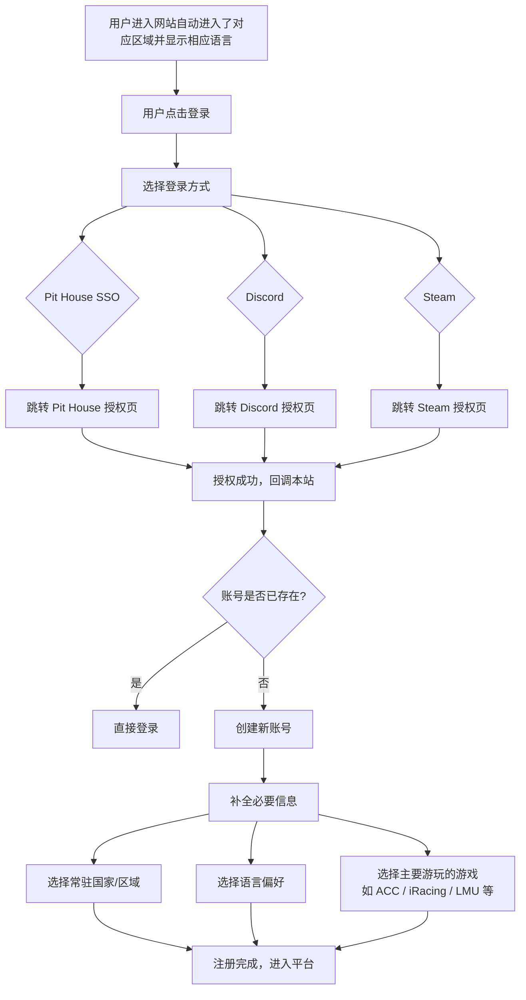

**流程步骤**：

1. 用户在登录页选择一种登录方式
2. 跳转至对应服务的授权页面完成认证
3. 认证成功后回调至本站
4. 系统检查该第三方账号是否已绑定平台账号
   - 若已绑定：直接登录
   - 若未绑定：创建新账号，引导补全信息
5. 首次注册需补全以下信息：
   - **常驻国家/区域**（从下拉列表中选择）
   - **语言偏好**（中文 / 英文）
   - **主要游玩的游戏**（多选，如 ACC / AC Evo / iRacing / LMU 等）
6. 注册完成，进入平台首页
7. 游戏 ID（Steam ID、iRacing ID 等）不在注册时要求填写，而是在报名对应平台赛事时按需校验和补充（详见 3.1.5）

### 3.1.3 账号绑定流程

已登录用户可在"账号设置"中绑定/解绑 Discord 和 Steam 账号。

**绑定流程**：

1. 用户进入账号设置 → 第三方账号管理
2. 点击"绑定 Discord"或"绑定 Steam"
3. 跳转至对应授权页面
4. 授权成功后回调，系统检查该第三方账号是否已被其他平台账号绑定
   - 若未被绑定：完成绑定
   - 若已被其他账号绑定：提示"该账号已绑定其他 MOZA Pit House 账号，请先解绑"
5. 绑定成功，显示已绑定状态

**解绑流程**：

1. 用户在账号设置中点击"解绑"
2. 系统检查当前账号的登录方式数量
   - 若仅剩一种登录方式：提示"不能解绑唯一的登录方式，请先绑定其他账号"
   - 若仍有多种登录方式：确认解绑
3. 解绑成功

### 3.1.4 边缘情况处理

| 边缘情况 | 处理方案 |
|---------|---------|
| Pit House Token 过期 | 前端检测 401 响应，自动跳转至登录页，提示"登录已过期，请重新登录" |
| Pit House 服务不可用 | 展示错误提示"登录服务暂时不可用，请稍后再试"。降级方案：已绑定 Discord/Steam 的用户可使用第三方登录 |
| 同一第三方账号被两个平台账号绑定 | 绑定时检测冲突，拒绝绑定并提示 |
| 用户解绑所有登录方式 | 系统不允许解绑最后一个登录方式，按钮置灰并提示 |
| 用户忘记密码（Pit House 侧） | 跳转至 Pit House 密码找回页面 |
| 第三方授权被用户拒绝 | 返回登录页，无错误提示 |
| 注册后未补全必要信息（关闭网页） | 用户下次登录时，系统检测账号是否已补全必要信息（常驻国家/区域、语言偏好、主要游玩游戏）。若未补全，全站显示补全引导遮罩层（不可跳过、不可关闭），强制用户完成信息填写后方可进入平台。补全页面仅包含必要字段，减少填写负担 |

### 3.1.5 报名时的游戏 ID 校验

游戏 ID（Steam ID、iRacing ID 等）不在注册时强制填写，而是在车手报名赛事时按需校验。

**校验规则**：

| 赛事游戏平台 | 校验字段 | 校验方式 |
|------------|---------|---------|
| iRacing PC | iRacing ID | 用户需在账号设置中填写 iRacing ID，或报名时弹出填写 |
| ACC / AC Evo / AC / LMU / rF2 / ETS2 等 Steam 平台游戏 | Steam 绑定 | 用户需已绑定 Steam 账号，或报名时弹出引导绑定 |

**报名校验流程**：

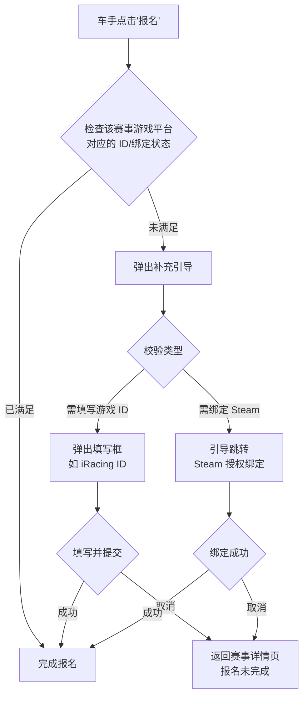

**补充信息持久化**：填写或绑定的游戏 ID 在报名成功后自动保存到用户账号中，后续报名同平台赛事时不再重复要求。

## 3.2 区域识别与语言偏好

### 3.2.1 区域自动识别

1. 用户首次访问平台时，系统根据 IP 地址判断所属区域
2. 自动跳转至对应区域页面
3. 已登录用户的区域偏好保存在账号设置中，后续访问以账号设置为准

**IP → 区域映射规则**：

| 区域 | IP 归属地 |
|------|----------|
| CN | 中国大陆 |
| AP | 日本、韩国、东南亚、澳洲、新西兰、印度等 |
| AM | 美国、加拿大、墨西哥、巴西、阿根廷等美洲国家 |
| EU | 欧洲各国、非洲各国、中东各国 |

### 3.2.2 语言策略

| 区域 | 默认界面语言 | 可切换 | 管理员录入内容 |
|------|------------|--------|--------------|
| CN | 中文 | 可切换为英文 | 双语录入（中文 + 英文） |
| AP / AM / EU | 英文 | 可切换为中文 | 双语录入（中文 + 英文） |

**展示逻辑**：

- 界面元素（按钮、菜单、提示文案等）：跟随用户语言偏好
- 管理员发布的内容（赛事名称、描述、赛制规则等）：
  - 优先展示用户偏好语言的版本
  - 若该语言版本未录入，则展示另一语言版本（降级显示）
  - 降级显示时标注"仅提供 XX 语言版本"

### 3.2.3 边缘情况处理

| 边缘情况 | 处理方案 |
|---------|---------|
| 用户使用 VPN 导致 IP 与实际常驻地不符 | 用户可手动切换区域，设置持久化 |
| 无法识别的 IP 归属地 | 默认归入 AM 区域 |
| 用户搬家到别的区域 | 网站根据用户IP自动进入相应区域，但用户的常驻国家/地区属性需要用户自己修改 |
| 管理员仅录入单语内容 | 前台降级展示已有语言版本 |
| 双语内容中某一语言版本明显过时 | 由运营团队内部流程保证内容同步，平台不校验 |

## 3.3 车手档案页

### 3.3.1 档案信息

| 信息类别 | 字段 | 可见性 | 可编辑 | 说明 |
|---------|------|--------|--------|------|
| **基础信息** | 昵称 | 始终公开 | ✅ | |
| | 头像 | 始终公开 | ✅ | |
| | 所在国家 | 始终公开 | ✅ | 仅展示国家，不展示区域标识 |
| | 个人简介 | 始终公开 | ✅ | |
| **游戏信息** | iRacing ID | 可配置公开/私密 | ✅ | 默认私密，用户可设为公开 |
| | Steam ID | 可配置公开/私密 | ✅ | 默认私密，用户可设为公开。通过 Steam 绑定自动获取 |
| **MOZA 设备** | 当前使用设备列表 | 可配置公开/私密 | ✅ | 默认公开，用户可设为私密 |
| | 如：R16/R21/R9 方向盘基座、CRP/CSR 踏板等 | | | |
| **统计数据** | 总参赛次数 | 始终公开 | ❌ 自动计算 | |
| | 胜场数 / 领奖台数 | 始终公开 | ❌ 自动计算 | |
| | 总积分 | 始终公开 | ❌ 自动计算 | |
| | 参赛历史列表 | 始终公开 | ❌ 自动聚合 | |

**可见性规则**：

- **始终公开**：基础信息（昵称、头像、区域、简介）和统计数据始终对所有访客可见
- **可配置公开/私密**：游戏 ID（iRacing ID、Steam ID）和 MOZA 设备列表，用户可在账号设置中逐项切换可见性
  - 游戏 ID 默认为**私密**（仅自己可见），防止隐私泄露
  - MOZA 设备默认为**公开**，发挥品牌展示作用
  - 设为私密时，其他用户访问该档案页看不到对应字段
  - 管理员在后台始终可查看所有字段（不受用户隐私设置影响）

### 3.3.2 MOZA 设备展示

- 用户在账号设置中可手动选择自己使用的 MOZA 设备（从设备列表中勾选）
- 设备信息在车手档案页以产品图标+名称的形式展示
- 设备列表由管理员在后台维护（随 MOZA 新品发布更新）
- 设备展示为可选项，用户可以选择不展示

### 3.3.3 车手档案 URL

- 格式：`/driver/{id}`
- username 可由用户自定义（唯一性校验）

## 3.4 封禁与禁赛体系

### 3.4.1 封禁类型

| 类型 | 说明 | 效果 |
|------|------|------|
| **警告** | 由人工判断，例如故意危险驾驶次数较少，轻微违规 | 仅站内通知 |
| **临时封禁** | 由人工判断，由于某些字段填写不合规，禁止登录和使用平台功能一段时间 | 无法报名、无法提交抗议、档案页显示"暂时不可用" |
| **永久封禁** | 由人工判断，由于某些原因，永久禁止使用平台 | 同上，永久生效 |
| **赛事禁赛** | 由人工判断，故意扰乱比赛，禁止报名特定赛事或所有赛事一段时间 | 可登录浏览，但无法报名新赛事 |

### 3.4.2 封禁管理流程

1. 管理员在后台"用户管理"中搜索目标用户
2. 选择封禁类型，填写原因和时长（临时封禁需设置起止时间）
3. 确认后立即生效
4. 系统自动发送通知给被封禁用户（站内通知 + 邮件）
5. 被封禁用户下次登录时看到封禁提示（含原因和截止时间）

### 3.4.3 解封流程

1. 管理员在后台查看封禁记录
2. 可手动提前解封，或等待封禁到期后自动解封
3. 解封后发送通知告知用户

### 3.4.4 边缘情况处理

| 边缘情况 | 处理方案 |
|---------|---------|
| 被封禁用户已报名了未来赛事 | 自动取消该用户的所有未来报名赛事 |
| 用户对封禁有异议 | 通过客服渠道（邮箱/Discord）联系运营团队处理 |
| 封禁记录需要追溯 | 管理后台保留完整的封禁/解封历史记录 |

---

# 4. 赛事管理（后台）

## 4.1 赛事数据模型

### 4.1.1 双语内容填写策略

管理后台的双语内容字段（赛事名称、描述、赛制规则等）遵循以下规则：

- 管理员在编辑表单顶部可切换当前填写语言（中文 / 英文）
- 切换后，表单中所有双语字段切换为对应语言的输入区域
- **发布条件**：至少完成一种语言的所有必填字段即可发布，不要求中英文全部填写完毕
- 管理员可在发布后随时补全另一种语言的内容
- 前台展示逻辑：优先展示用户偏好语言的版本，若该语言未录入则降级展示另一语言版本（见 3.2.2）

### 4.1.2 区域默认时区

管理员创建赛事时，系统根据赛事所属区域自动填充默认时区，方便管理员快速填写比赛时间。管理员可手动覆盖为其他时区。

| 区域 | 默认时区 | IANA 标识 | 说明 |
|------|---------|-----------|------|
| CN（中国区） | UTC+8 | Asia/Shanghai | 中国统一使用北京时间 |
| AP（亚太区） | UTC+9 | Asia/Tokyo | 日韩为主要市场，+9 是亚太最集中的时区 |
| AM（美洲区） | UTC-5 | America/New_York | 美东时间，覆盖北美东部主要城市 |
| EU（欧非区） | UTC+1 | Europe/Berlin | 中欧时间，覆盖西欧和大部分欧洲国家 |

**时区相关规则**：

- 所有时间在数据库中以 **UTC** 存储和传输
- 管理员在后台创建/编辑赛事时，时间选择器默认显示该区域的默认时区，管理员可切换为其他时区
- 前台对车手展示时自动转换为车手本地时区（根据设备/浏览器时区），同时标注赛事所在时区的时间
- 赛事发布到多个区域时，管理员填写时间时以第一个选中区域的默认时区为准，可手动调整
- 夏令时（DST）处理：使用 IANA 时区数据库自动计算，管理员无需手动处理

### 4.1.3 赛事（Event）核心字段

> **双语字段标记说明**：标记为 `中/英` 的字段，至少填写一种语言即可发布。
>
> **适用范围**：以下为**独立赛事**（不属于任何锦标赛）的完整字段。锦标赛子赛事的字段见 4.1.5。

| 字段名 | 类型 | 必填 | 说明 |
|--------|------|------|------|
| id | UUID | 自动 | 赛事唯一标识 |
| name_zh / name_en | String | 是（至少一种） | 赛事名称（中/英） |
| description_zh / description_en | RichText | 否 | 赛事描述（中/英） |
| cover_image | URL | 否 | 赛事封面图片 |
| game | Enum | 是 | 游戏平台（ACC PC / AC Evo PC / AC PC / iRacing PC / LMU PC / rF2 PC / ETS2 PC） |
| track | String | 是 | 赛道名称 |
| track_layout | String | 否 | 赛道布局（如 GP / Short / Endurance） |
| car_class | String | 是 | 车型组（GT3 / GT4 / Porsche Cup / LMP2 / Formula 等） |
| car_list | String[] | 否 | 可选车辆列表（若限制特定车辆） |
| championship_id | UUID | 否 | 所属锦标赛 ID（为空则表示独立单场赛） |
| regions | Enum[] | 是 | 发布区域（CN / AP / AM / EU，可多选） |
| conditions | String | 否 | 比赛条件描述（天气、路面等） |
| weather | Enum | 否 | 天气设置（晴天 / 多云 / 阴天 / 动态天气等） |
| has_pitstop | Boolean | 否 | 是否需要进站 |
| practice_duration | Integer | 否 | 练习赛时长（分钟） |
| qualifying_duration | Integer | 否 | 排位赛时长（分钟） |
| race_duration | Integer | 否 | 正赛时长（分钟）或圈数 |
| race_duration_type | Enum | 否 | 时长制 / 圈数制 |
| max_entries_per_split | Integer | 是 | 单 Split 最大参赛人数 |
| max_splits | Integer | 否 | 最大 Split 数（服务器资源上限）。为空表示不限制。总容量 = max_splits × max_entries_per_split，超出后拒绝新报名 |
| enable_multi_split | Boolean | 是 | 是否启用多 Split |
| split_assignment_rule | Enum | 否 | 分组规则（按实力 / 随机 / 手动 / 先到先得） |
| min_entries | Integer | 否 | 最低开赛人数阈值 |
| registration_open_at | DateTime | 是 | 报名起始时间（默认当前时间，即发布即开放；管理员可设置未来时间，赛事进入 Upcoming 状态） |
| registration_close_at | DateTime | 是 | 报名截止时间 |
| cancel_registration_deadline | DateTime | 否 | 允许车手取消报名的截止时间 |
| event_start_time | DateTime | 是 | 比赛开始时间（UTC） |
| status | Enum | 自动 | 赛事状态（见 4.3） |
| access_requirements | String | 否 | 准入条件描述（自由文本，如"需阅读规则并确认"） |
| rules_zh / rules_en | RichText | 否 | 赛制规则（中/英） |
| server_info | String | 否 | 服务器名称 / 密码（赛事开始前可见） |
| server_join_link | URL | 否 | 游戏直连链接（赛事开始前可见） |
| stream_url | URL | 否 | 直播嵌入链接 |
| vod_url | URL | 否 | 赛后回放链接 |
| scoring_rules_zh / scoring_rules_en | RichText | 否 | 积分规则自定义文字描述（中/英），可选 |
| scoring_table | ScoringTableEntry[] | 否 | 积分表格（名次-积分-备注），可选。与 scoring_rules 可同时存在，先显示文字再显示表格 |
| resources_zh / resources_en | RichText | 否 | 资源下载（中/英），自由文本区域，管理员可填写 MOD 下载链接、安装说明等任意内容 |
| created_by | UUID | 自动 | 创建者管理员 ID |
| created_at | DateTime | 自动 | 创建时间 |
| updated_at | DateTime | 自动 | 最后更新时间 |

### 4.1.4 锦标赛（Championship）数据模型

锦标赛是赛事的容器，承载赛事的公共属性。归属于锦标赛的各场赛事继承锦标赛的配置，自身仅保留本场独有的信息。

**设计理念**：

- 锦标赛定义通用规则（游戏平台、车型组、赛制、积分规则、区域、Split 配置等）
- 各场赛事仅定义本场独有信息（赛道、开赛时间、报名截止时间、服务器信息等）
- 赛事详情页同时展示锦标赛级公共信息和本场独有信息
- 车手报名锦标赛赛事时，报名的是具体的某一场赛事

**锦标赛字段**：

| 字段名 | 类型 | 必填 | 说明 |
|--------|------|------|------|
| id | UUID | 自动 | 锦标赛唯一标识 |
| name_zh / name_en | String | 是（至少一种） | 锦标赛名称（中/英） |
| description_zh / description_en | RichText | 否 | 锦标赛描述（中/英） |
| cover_image | URL | 否 | 锦标赛封面图片 |
| regions | Enum[] | 是 | 发布区域 |
| game | Enum | 是 | 游戏平台（同赛事 game 字段） |
| car_class | String | 是 | 车型组（同赛事 car_class 字段） |
| car_list | String[] | 否 | 可选车辆列表 |
| weather | Enum | 否 | 天气设置 |
| has_pitstop | Boolean | 否 | 是否需要进站 |
| practice_duration | Integer | 否 | 练习赛时长（分钟） |
| qualifying_duration | Integer | 否 | 排位赛时长（分钟） |
| race_duration | Integer | 否 | 正赛时长（分钟）或圈数 |
| race_duration_type | Enum | 否 | 时长制 / 圈数制 |
| max_entries_per_split | Integer | 是 | 单 Split 最大参赛人数 |
| max_splits | Integer | 否 | 最大 Split 数 |
| enable_multi_split | Boolean | 是 | 是否启用多 Split |
| split_assignment_rule | Enum | 否 | 分组规则 |
| min_entries | Integer | 否 | 最低开赛人数阈值 |
| cancel_registration_deadline_offset | String | 否 | 取消报名截止规则描述（如"比赛开始前 2 小时"） |
| access_requirements | String | 否 | 准入条件描述 |
| scoring_rules_zh / scoring_rules_en | RichText | 否 | 积分规则自定义文字描述（中/英），可选 |
| scoring_table | ScoringTableEntry[] | 否 | 积分表格（名次-积分-备注），可选 |
| progression_rules_zh / progression_rules_en | RichText | 否 | 晋级/淘汰规则（中/英） |
| rules_zh / rules_en | RichText | 否 | 赛事规则（中/英） |
| resources_zh / resources_en | RichText | 否 | 资源下载（中/英） |
| stream_url | URL | 否 | 直播嵌入链接（锦标赛通用） |
| events | Event[] | 是 | 包含的赛事列表 |
| created_by | UUID | 自动 | 创建者管理员 ID |
| created_at | DateTime | 自动 | 创建时间 |
| updated_at | DateTime | 自动 | 最后更新时间 |

> **结构说明**：锦标赛内包含各个赛事。轮次/分站信息由管理员写入各赛事的名称和描述中（如"第 1 站 - 蒙扎"、"Round 2 - Silverstone"）。锦标赛内的赛事排序由管理员手动调整（拖拽排序）。

**积分表数据结构（ScoringTableEntry）**：

管理员可选择使用纯文字描述积分规则，或使用结构化的积分表格，或两者兼有。前台展示时先显示自定义文字，再显示积分表格。

| 字段 | 类型 | 必填 | 说明 |
|------|------|------|------|
| position | Integer | 是 | 名次（如 1, 2, 3） |
| points | Integer | 是 | 对应积分 |
| note_zh | String | 否 | 备注（中文），为空时前端不显示 |
| note_en | String | 否 | 备注（英文），为空时前端不显示 |

前台渲染逻辑：如果整张积分表的备注列全部为空，则不显示"备注"列。

### 4.1.5 赛事（Event）关联锦标赛

赛事有两种类型：**独立赛事**和**锦标赛子赛事**。

#### 独立赛事

不归属于任何锦标赛，自身包含全部属性（游戏、赛道、时间、规则等）。数据模型同 4.1.2 定义的全部字段。

#### 锦标赛子赛事

归属于某个锦标赛时，子赛事仅保留本场独有信息，其余属性继承锦标赛：

| 子赛事独有字段 | 类型 | 必填 | 说明 |
|---------------|------|------|------|
| id | UUID | 自动 | 赛事唯一标识 |
| championship_id | UUID | 是 | 所属锦标赛 ID |
| name_zh / name_en | String | 是（至少一种） | 本场赛事名称（中/英），如"第 1 站 - 蒙扎" |
| description_zh / description_en | RichText | 否 | 本场补充说明（中/英） |
| cover_image | URL | 否 | 本场封面图（为空则使用锦标赛封面） |
| track | String | 是 | 赛道名称 |
| track_layout | String | 否 | 赛道布局 |
| registration_open_at | DateTime | 是 | 报名起始时间（默认当前时间） |
| registration_close_at | DateTime | 是 | 报名截止时间 |
| event_start_time | DateTime | 是 | 比赛开始时间（UTC） |
| server_info | String | 否 | 服务器名称 / 密码 |
| server_join_link | URL | 否 | 游戏直连链接 |
| stream_url | URL | 否 | 本场直播链接（为空则使用锦标赛通用直播链接） |
| vod_url | URL | 否 | 赛后回放链接 |
| resources_zh / resources_en | RichText | 否 | 本场额外资源（为空则展示锦标赛级资源） |
| status | Enum | 自动 | 赛事状态 |
| results | Result[] | 自动 | 本场比赛结果 |
| protests | Protest[] | 自动 | 本场抗议记录 |

**继承规则**：

| 属性 | 来源 | 说明 |
|------|------|------|
| 游戏平台 | 锦标赛 | 子赛事不可修改 |
| 车型组 / 车辆列表 | 锦标赛 | 子赛事不可修改 |
| 赛制参数（练习/排位/正赛时长等） | 锦标赛 | 子赛事不可修改 |
| Split 配置 | 锦标赛 | 子赛事不可修改 |
| 积分规则 / 晋级规则 | 锦标赛 | 子赛事不可修改 |
| 准入条件 | 锦标赛 | 子赛事不可修改 |
| 赛事规则 | 锦标赛 | 子赛事不可修改 |
| 发布区域 | 锦标赛 | 子赛事不可修改 |
| 封面图 | 子赛事 > 锦标赛 | 子赛事有封面则用子赛事的，否则用锦标赛的 |
| 直播链接 | 子赛事 > 锦标赛 | 子赛事有直播则用子赛事的，否则用锦标赛的 |
| 资源下载 | 子赛事 > 锦标赛 | 子赛事有额外资源则追加展示，否则仅展示锦标赛级资源 |
| 赛道 / 布局 | 子赛事 | 每场不同 |
| 比赛时间 | 子赛事 | 每场不同 |
| 服务器信息 | 子赛事 | 每场不同 |
| 成绩 / 抗议 | 子赛事 | 每场独立 |

**前台展示逻辑**：

锦标赛子赛事**没有独立的详情页面**，所有子赛事信息都在锦标赛详情页中展示（见 5.2）。锦标赛详情页内按以下分区展示子赛事：

1. **下一场可报名**：展示距当前最近一场处于 RegistrationOpen 状态的子赛事，跳过 Upcoming 状态的赛事
2. **未来赛事**：按时间顺序展示所有未来的子赛事（含 Upcoming 和 RegistrationOpen 两种状态），Upcoming 状态不显示报名按钮
3. **过往赛事**：按时间倒序展示所有已结束的子赛事（折叠/展开）

每场子赛事在锦标赛页面中仅展示本场独有字段：赛道、比赛时间、报名状态（Upcoming/RegistrationOpen 等）、报名人数、服务器信息（报名后可见）、成绩（赛后）、抗议入口。

### 4.1.6 资源下载（Resource）

部分赛事涉及自定义 MOD 赛道或车辆包，需要参赛车手提前下载安装。

- 管理员在创建/编辑赛事时，可在"资源下载"富文本区域自由填写下载链接、安装说明、注意事项等任意内容
- 支持插入超链接、列表等富文本格式，方便管理员组织多条资源信息
- 资源内容在赛事详情页公开可见，无需登录即可查看
- 遵循双语策略（见 4.1.1）：至少填写一种语言即可发布，另一种语言可后续补全

## 4.2 赛事创建流程

### 4.2.1 总览

管理员进入后台后，选择创建**独立赛事**或**锦标赛**，两者的流程不同：

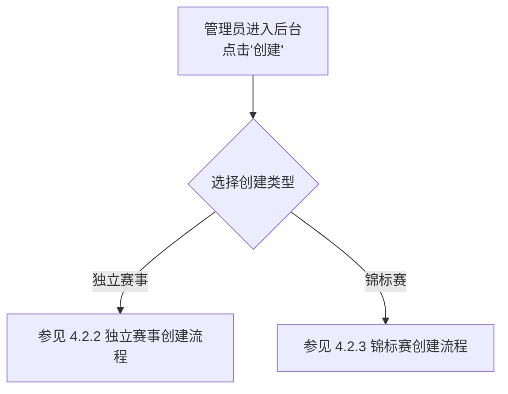

### 4.2.2 独立赛事创建流程

独立赛事不归属于任何锦标赛，所有信息在本赛事中完整填写。

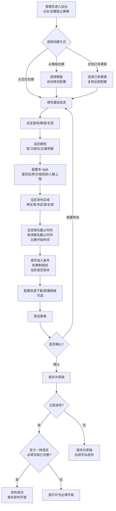

**流程步骤**：

1. 管理员在后台选择"创建独立赛事"
2. 选择创建方式：空白创建 / 从模板创建 / 复制已有赛事
3. 在表单顶部选择当前填写语言（中文 / 英文），切换后所有双语字段显示对应语言的输入区域
4. 填写基础信息（赛事名称、描述、封面图）—— 仅填写当前语言版本即可
5. 设定游戏平台、赛道、车型组
6. 设定赛制参数（练习/排位/正赛时长、天气、是否进站）
7. 配置多 Split 选项
   - 是否启用自动 Split
   - 单服务器最大人数
   - 分组规则（按实力/随机/手动/先到先得）
8. 选择发布区域（CN / AP / AM / EU，可多选或全选）
 9. 设定报名起始时间（默认当前时间，可设为未来时间使赛事进入 Upcoming 状态）、报名截止时间、取消报名截止时间、比赛开始时间
10. 填写准入条件和赛制规则（当前语言版本）
11. 配置资源下载、直播链接（可选）
12. 预览赛事信息
13. 确认后保存为草稿或立即发布
    - 发布时校验：至少一种语言的所有必填字段已填写
    - 另一种语言的内容可后续随时补全（编辑已发布赛事时切换语言填写）

### 4.2.3 锦标赛创建流程

锦标赛的创建分为两步：先创建锦标赛（填写公共属性），再逐场添加子赛事（填写本场独有信息）。

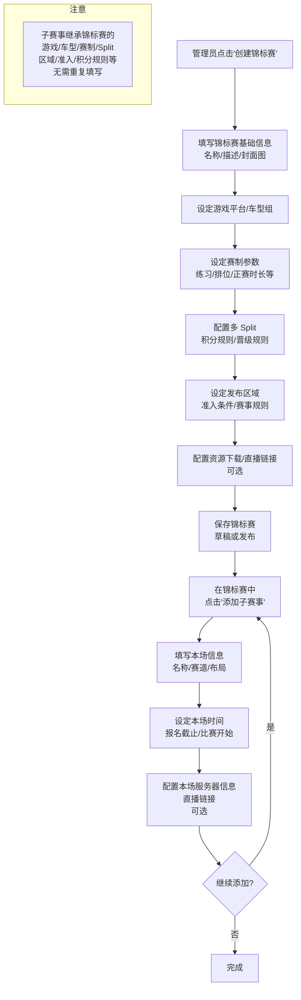

**流程步骤**：

1. 管理员在后台点击"创建锦标赛"
2. 填写锦标赛基础信息（名称中英/描述/封面图）
3. 设定游戏平台、车型组（所有子赛事共用）
4. 设定赛制参数（练习/排位/正赛时长、天气、是否进站，所有子赛事共用）
5. 配置多 Split、积分规则、晋级/淘汰规则
6. 设定发布区域、准入条件、赛事规则
7. 配置资源下载、直播链接（可选，所有子赛事可继承）
8. 保存锦标赛（草稿或发布）
9. 在锦标赛管理页面中逐场添加子赛事：
   - 填写本场名称（如"第 1 站 - 蒙扎"）
   - 选择赛道和布局
   - 设定本场报名截止时间和比赛开始时间
   - 配置本场服务器信息（可选）
   - 配置本场直播链接（可选，为空则使用锦标赛通用直播）
   - 配置本场额外资源下载（可选，为空则展示锦标赛级资源）
10. 可继续添加更多子赛事，或拖拽调整顺序
11. 各子赛事可独立发布（发布后本场报名即时开放），也可批量发布

**锦标赛模板**：

- 锦标赛同样支持保存为模板和复制功能
- 复制锦标赛时，可选择是否同时复制子赛事结构（时间等信息需重新填写）

## 4.3 赛事状态流转

> **实现说明**：赛事状态（Draft/Cancelled 除外）由系统根据当前时间和赛事日期字段自动计算，不依赖静态存储的 status 字段。计算逻辑：`getEventStatus(event)` 函数优先检查管理员覆盖状态（Cancelled/Draft），其次通过 results 数据检测已完成赛事，最终根据时间区间返回 Upcoming → RegistrationOpen → RegistrationClosed → InProgress。仅 Cancelled 和 Draft 为管理员手动设置的状态。

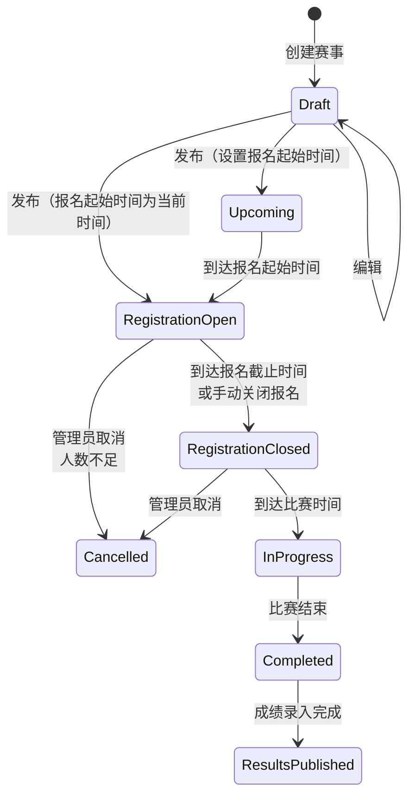

| 状态 | 说明 | 可执行操作 |
|------|------|-----------|
| **Draft（草稿）** | 赛事已创建但未发布 | 编辑、删除、发布 |
| **Upcoming（未来）** | 已发布但报名未开放（当前时间 < registrationOpenAt） | 编辑报名起始时间、取消赛事 |
| **RegistrationOpen（报名中）** | 报名通道开放中 | 关闭报名、取消赛事 |
| **RegistrationClosed（报名截止）** | 报名已截止，等待比赛开始 | 取消赛事、修改服务器信息 |
| **InProgress（进行中）** | 比赛正在进行 | 无 |
| **Completed（已结束）** | 比赛已结束 | 录入成绩 |
| **ResultsPublished（成绩已发布）** | 成绩已录入并发布 | 修改成绩（需记录变更日志） |
| **Cancelled（已取消）** | 赛事被取消 | 无 |

## 4.4 赛事模板系统

### 4.4.1 模板功能

- 管理员可将任意已创建的赛事保存为模板
- 模板保存全部配置（除时间和赛事名称外的所有字段）
- 创建新赛事时可从模板列表中选择，自动填充配置
- 模板支持编辑和删除

### 4.4.2 模板管理

| 操作 | 说明 |
|------|------|
| 创建模板 | 从已有赛事"另存为模板"，或直接创建新模板 |
| 编辑模板 | 修改模板中的任意配置 |
| 删除模板 | 仅删除模板，不影响已创建的赛事 |
| 复制赛事 | 选择任意已有赛事，复制其全部配置创建新赛事（时间等需重新填写） |

## 4.5 多 Split（分组/多服务器）配置

### 4.5.1 功能概述

当报名人数超过单个游戏服务器容量时，系统自动将参赛者分配到多个并行的游戏服务器（Split）中。每个 Split 独立进行比赛。

### 4.5.2 配置项

| 配置项 | 类型 | 说明 |
|--------|------|------|
| 启用多 Split | Boolean | 开关，是否启用自动多 Split |
| 单 Split 最大人数 | Integer | 每个服务器容纳的最大车手数，取决于游戏和赛道 |
| 最大 Split 数 | Integer | 服务器资源上限。总报名容量 = 最大 Split 数 × 单 Split 最大人数。报名人数达到总容量后拒绝新报名。为空表示不限制 |
| 分组规则 | Enum | 按实力 / 随机 / 手动 / 先到先得 |
| 允许车手自选 Split | Boolean | 仅在"先到先得"模式下可选 |
| 各 Split 时间安排 | Option | 同时并行 / 错开时间 |

### 4.5.3 报名容量控制

启用多 Split 时，报名人数上限为：

> **总容量 = max_splits × max_entries_per_split**

- 若未设置 max_splits（为空），则不限制报名人数，Split 数量随报名人数自动扩展
- 若设置了 max_splits，报名人数达到总容量后，新用户无法报名，报名按钮变为"名额已满"
- 报名页面实时显示："当前已报名 X / Y 人（Z 个服务器）"
- 车手取消报名后释放名额，后续候补或新用户可继续报名

### 4.5.4 Split 分组流程

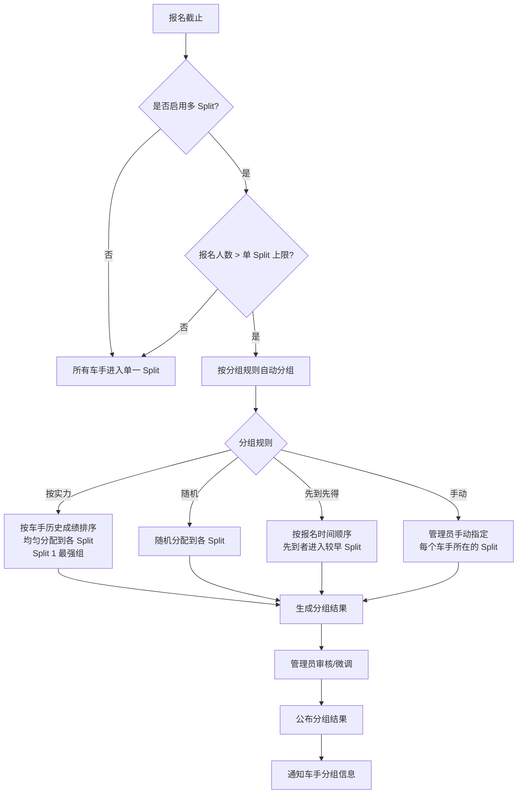

### 4.5.5 Split 信息展示

- 报名页面实时显示："当前已报名 X / Y 人（Z 个服务器）"，其中 Y = max_splits × max_entries_per_split
- 分组公布后，车手在赛事详情页看到自己所在的 Split 编号
- 每个 Split 独立展示：参赛名单、服务器信息、比赛时间、成绩

### 4.5.6 边缘情况处理

| 边缘情况 | 处理方案 |
|---------|---------|
| 报名人数刚超过临界值（如上限 60，报了 61 人） | 由管理员决定是否将首个 Split 中的更多用户移到第二个 Split 中 |
| 车手临时退赛导致某 Split 人数骤减 | 由管理员实时观察报名情况，管理员可决定保留、合并 Split 或调整分组 |
| 按实力分组时部分车手无历史成绩（新用户） | 新用户默认分配到最后一个 Split（最弱组），管理员可手动调整 |
| 锦标赛不同赛事分组可能变化 | 每场赛事独立重新分组 |
| 并行 Split 成绩如何统一排名 | 由管理员在赛制规则中说明（各 Split 独立积分 / 按 Split 系数折算等），平台不做强制约束 |
| 管理员在报名进行中修改 Split 配置 | 系统弹出确认提示"修改将影响已报名车手的分组，是否继续？"，修改后需要重新计算预计 Split 数。若缩小 max_splits 导致总容量低于当前已报名人数，不允许修改 |
| 自选 Split 模式下某 Split 已满 | 该 Split 不再可选，车手只能选择未满的 Split |
| 未设置 max_splits（为空） | 不限制报名人数，Split 数量无上限，随报名人数自动扩展 |
| max_splits = 1 且报名已满 | 等同于未启用多 Split 的人数上限，报名按钮显示"名额已满" |

## 4.6 赛事准入门槛

### 4.6.1 准入配置

管理员创建赛事时可配置准入条件：

| 准入类型 | 说明 | 配置方式 |
|---------|------|---------|
| 无限制 | 所有注册用户均可报名 | 默认选项 |
| 规则确认 | 报名前需阅读并勾选确认赛事规则 | 勾选框 |
| 自定义条件 | 文字描述准入条件（如"需持有 DLC"） | 自由文本 |

> 注：MVP 阶段不含 Rating 系统，因此暂不包含基于 Rating 的准入门槛。后续版本可扩展。

### 4.6.2 报名确认流程

1. 车手点击"报名"按钮
2. 系统检查准入条件
   - 若需规则确认：弹出赛事规则内容，车手需勾选"我已阅读并同意"
   - 若有自定义条件：弹出条件说明，车手点击"确认参加"
3. 检查通过后完成报名

## 4.7 赛事取消与最低人数

### 4.7.1 最低人数阈值

- 管理员可配置赛事最低开赛人数
- 报名截止时，若报名人数低于阈值：
  - 系统在管理后台发出警告提示
  - 管理员可选择：强制开赛 / 取消赛事 / 延长报名时间

### 4.7.2 管理员取消赛事流程

1. 管理员在后台选择要取消的赛事
2. 填写取消原因（中英双语）
3. 确认取消
4. 系统自动：
   - 赛事状态变为"已取消"
   - 向所有已报名车手发送取消通知（站内 + 邮件，根据配置）
   - 取消原因展示在赛事详情页

### 4.7.3 边缘情况处理

| 边缘情况 | 处理方案 |
|---------|---------|
| 取消锦标赛中的某一场（非整个锦标赛） | 管理员可单独取消某一场赛事，锦标赛整体状态不变，积分规则由管理员手动调整 |
| 已有人报名后修改赛事关键参数 | 以下字段在有人报名后不可修改：游戏平台、赛道、比赛时间。其他字段修改需确认提示 |
| 赛事时间与其他已发布赛事冲突 | 管理后台显示警告"同一时段已有 N 场赛事"，但不强制阻止发布 |

---

## 4.8 游戏平台参考指南

不同游戏的多人联机方式、服务器搭建和成绩导出能力差异较大，直接影响管理员在后台的配置方式和前台车手的加入方式。

### 4.8.1 游戏分类

#### A 类：自建专用服务器

管理员需要搭建或租用专用服务器，配置服务器参数后车手通过游戏内服务器浏览器加入。

| 游戏 | 服务器获取 | 配置方式 | 车手加入方式 | 成绩导出能力 |
|------|-----------|---------|------------|------------|
| **ACC PC** | Steam 下载"ACC Dedicated Server"工具 | JSON 配置文件（configuration.json / event.json / entrylist.json），端口转发 UDP/TCP 9600 | 游戏内服务器浏览器 / Quick Join 排位匹配 | **优秀**：自动生成 JSON 结果文件、CSV 排名、MoTeC 遥测 |
| **AC PC** | SteamCMD 下载（支持 Windows/Linux） | INI 配置文件（server_cfg.ini / entry_list.ini），端口转发 UDP 9600 + TCP 8081 | 游戏内服务器浏览器 / Content Manager / 直连 IP | **优秀**：JSON 结果 + 社区插件（KMRS、sTracker） |
| **AC Evo PC** | Steam 下载专用服务器工具（v0.6 新增） | 配置方式持续完善中 | 游戏内服务器浏览器 | **一般**：MoTeC 遥测已支持，结果导出持续完善中 |
| **LMU PC** | Steam 下载专用服务器工具（基于 rF2 架构） | JSON 配置文件，端口转发 | 游戏内服务器浏览器 / Quick Race 匹配 / 直连 IP | **良好**：JSON 结果文件 + rF2 插件生态 |
| **rF2 PC** | Steam 免费下载"rFactor 2 Dedicated Server" | JSON 配置或内置 Web 管理界面（端口 5398），端口转发 | 游戏内服务器浏览器 / 直连 IP | **优秀**：JSON/XML 结果 + 插件 API + MoTeC 遥测 |
| **ETS2 PC** | SteamCMD 下载 Dedicated Server（支持 Windows/Linux） | 服务器配置文件（server_config.sii），端口转发 | 游戏内服务器浏览器 / 直连 IP | **一般**：通过社区工具和日志获取部分结果信息 |

#### B 类：官方服务器

游戏厂商提供全部服务器基础设施，无需自建。管理员通过游戏内或官网创建赛程。

| 游戏 | 服务器类型 | 开赛方式 | 车手加入方式 | 成绩导出能力 |
|------|-----------|---------|------------|------------|
| **iRacing PC** | iRacing 官方基础设施 | 选择 Official Series 或创建 Hosted Session，按时间槽注册 | iRacing 官网注册 → 客户端参赛 | **优秀**：iRacing API（JSON）、CSV 导出 |

### 4.8.2 对平台功能的影响

#### 管理员后台 — 服务器信息配置

不同游戏类型，管理员在后台填写的"服务器信息"内容不同：

| 游戏类型 | 管理员填写内容 | 示例 |
|---------|--------------|------|
| **A 类（自建服务器）** | 服务器名称 + 密码（车手在游戏内搜索加入），可选直连链接 | `服务器名: MOZA Race 01 / 密码: racing123` |
| **B 类 - iRacing** | iRacing Session 名称 / 密码或 Hosted Session 链接 | `Session: MOZA GT3 Round 3 / Password: moza2026` |

前台赛事详情页的"服务器信息"板块根据游戏类型展示对应内容，并给出加入指引文字（如"请在游戏内搜索服务器名称"或"请在 iRacing 客户端中查找对应 Session"）。

#### 成绩导入能力

| 导入等级 | 游戏 | 导入方式 |
|---------|------|---------|
| **可自动导入** | ACC、AC、LMU、rF2 | 上传 JSON/XML 结果文件，系统自动解析 |
| **API 导入** | iRacing | 调用 iRacing membersite API 获取成绩 |
| **仅手动录入** | AC Evo（暂）、ETS2 | 无结构化数据导出，管理员手动输入成绩 |

### 4.8.3 后续迭代建议

- **AC Evo**：目前处于 Early Access，服务器配置和结果导出能力持续完善中，需持续跟进
- **ETS2**：关注 SCS Software 是否开放更完善的多人联机结果数据接口

### 4.8.4 玩家身份映射

成绩导入时需要将游戏结果中的玩家与平台用户对应起来。不同游戏的玩家唯一标识不同，映射策略如下：

**映射对照表**：

| 游戏 | 游戏内唯一标识 | 平台用户对应字段 | 匹配方式 |
|------|--------------|----------------|---------|
| ACC / AC / AC Evo / LMU / rF2 / ETS2 | SteamID64 | 用户绑定的 Steam 账号获取的 SteamID64 | **自动匹配**（结果文件含 SteamID64） |
| iRacing | iRacing Customer ID（custId） | 用户填写的 iRacing ID | **自动匹配**（API 返回 custId） |

**自动匹配流程**（适用于 ACC / AC / LMU / rF2 / iRacing 等支持结果文件或 API 的游戏）：

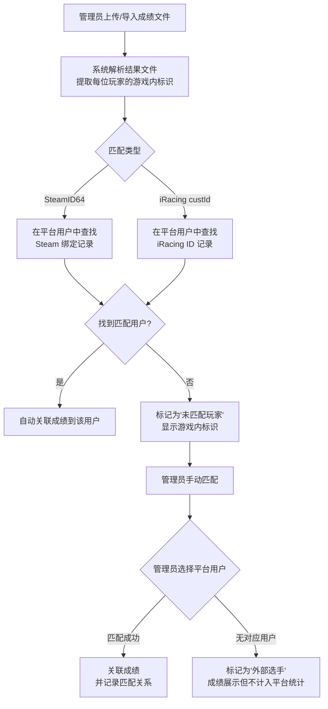

**匹配失败处理**：

| 场景 | 处理方案 |
|------|---------|
| 结果文件中的玩家未在平台注册 | 标记为"未匹配"，管理员可标记为"外部选手"，成绩展示但不计入平台用户统计 |
| 结果文件中的玩家已注册但未绑定对应游戏 ID | 标记为"未匹配"，显示游戏内 ID。管理员可通知该用户补充游戏 ID 后重新匹配 |
| 多个平台用户绑定了相同的 Steam 账号 | 系统不允许（绑定时校验唯一性） |
| 用户更换了 Steam/iRacing 账号 | 用户可在账号设置中更新，管理员可在后台手动修改匹配关系 |
| 手动录入成绩（AC Evo / ETS2） | 管理员直接从平台已报名车手列表中选择，无需匹配步骤 |

---

# 5. 赛事浏览与报名（前台）

## 5.1 赛事列表页

### 5.1.1 页面功能

- 展示当前区域的所有赛事（含跨区域赛事中发布到本区域的赛事）
- 支持筛选和排序
- 支持切换区域查看其他区域的赛事

### 5.1.2 筛选条件

| 筛选项 | 类型 | 说明 |
|--------|------|------|
| 游戏平台 | 多选 | AC / ACC / AC Evo / iRacing / LMU / F1 25 等 |
| 车型组 | 多选 | GT3 / GT4 / Formula 等 |
| 时间范围 | 单选 | 本周 / 本月 / 未来所有 |

### 5.1.3 排序选项

| 排序方式 | 说明 |
|---------|------|
| 时间先后（默认） | 按比赛开始时间排序 |
| 报名热度 | 按当前报名人数排序 |
| 最近发布 | 按赛事创建时间排序 |

### 5.1.4 列表卡片信息

**独立赛事卡片**展示：

- 封面图 + 游戏平台标签
- 赛事图标 + 赛事名称
- 车型组
- 赛道名称
- 比赛时间（用户本地时间）
- 报名人数（如 X / 30）+ 报名状态标签（右对齐）

**锦标赛卡片**展示：

- 封面图 + 游戏平台标签 + 锦标赛标签
- 锦标赛图标 + 锦标赛名称
- 车型组 + 子赛事数量
- 下一场赛道名称
- 下一场比赛时间
- 下一场报名人数 + 下一场报名状态标签（右对齐）

## 5.2 赛事详情页

平台有两种详情页：**独立赛事详情页**和**锦标赛详情页**。

### 5.2.1 独立赛事详情页

独立赛事拥有自己的详情页，展示完整赛事信息。

```
┌──────────────────────────────────────────┐
│ 封面图 + 赛事名称 + 状态标签             │
├──────────────────────────────────────────┤
│ 基础信息栏                               │
│ ├── 游戏平台                             │
│ ├── 赛道 / 布局                          │
│ ├── 车型组                               │
│ ├── 天气 / 进站                          │
│ ├── 比赛时间（本地时间 + UTC）           │
│ └── 赛制信息                             │
│ ├── 练习赛 / 排位赛 / 正赛 时长          │
│ ├── 赛制规则（富文本）                   │
│ └── 积分规则（自定义文字 + 积分表格）   │
├──────────────────────────────────────────┤
│ 报名信息                                 │
│ ├── 报名按钮 / 已报名状态                │
│ ├── 报名人数 / 预计 Split 数             │
│ ├── 准入条件                             │
│ └── 取消报名按钮 + 截止时间              │
├──────────────────────────────────────────┤
│ Split 分组（分组公布后显示）             │
│ ├── Split 1: 参赛名单 / 时间 / 服务器   │
│ ├── Split 2: ...                        │
│ └── ...                                 │
├──────────────────────────────────────────┤
│ 资源下载（公开可见，无需登录）           │
│ ├── 下载链接 + 安装说明                  │
│ └── 仅在管理员添加了资源时显示           │
├──────────────────────────────────────────┤
│ 服务器信息（报名后展示，未填写时提示稍后提供）│
│ ├── 服务器名称 / 密码                    │
│ └── 直连链接                             │
├──────────────────────────────────────────┤
│ 直播区域（赛事期间展示）                 │
│ └── 嵌入 Twitch / YouTube 播放器        │
├──────────────────────────────────────────┤
│ 参赛名单（完整列表）                     │
├──────────────────────────────────────────┤
│ 成绩（赛后展示）                         │
│ └── 排名 / 车手 / 成绩 / 最快圈等       │
├──────────────────────────────────────────┤
│ 赛事公告 / 更新日志                      │
└──────────────────────────────────────────┘
```

### 5.2.2 锦标赛详情页

锦标赛详情页是锦标赛及其所有子赛事的统一展示页面。子赛事**没有独立页面**，全部在锦标赛页面内展示。

```
┌──────────────────────────────────────────┐
│ 封面图 + 锦标赛名称 + 状态标签           │
├──────────────────────────────────────────┤
│ Tab 切换：锦标赛信息 / 赛程 / 成绩       │
├──────────────────────────────────────────┤
│ Tab 1: 锦标赛公共信息                    │
│ ├── 游戏平台                             │
│ ├── 车型组 / 车辆列表                    │
│ ├── 天气 / 进站                          │
│ ├── 赛制参数（练习/排位/正赛时长）       │
│ ├── 赛制规则（富文本）                   │
│ ├── 积分规则（自定义文字 + 积分表格）   │
│ ├── 晋级/淘汰规则                        │
│ ├── 准入条件                             │
│ ├── 资源下载（锦标赛级）                 │
│ └── 积分榜（锦标赛总积分排名）           │
├──────────────────────────────────────────┤
│ Tab 2: 赛程                              │
│ ├── ▶ 下一场可报名（侧边栏突出显示）    │
│ │   ├── 子赛事名称                       │
│ │   ├── 赛道 / 布局                      │
│ │   ├── 比赛时间                         │
│ │   ├── 报名人数（数字独立一行凸显）     │
│ │   ├── 报名按钮 / 取消报名按钮          │
│ │   └── 服务器信息（独立卡片，报名后可见，未填写时提示稍后提供）│
│ ├── 未来赛事（不显示状态标签、报名按钮）  │
│ │   ├── 子赛事名称 / 赛道 / 时间          │
│ │   └── ...更多未来赛事                    │
│ └── 过往赛事（不含状态标签，不含服务器信息）│
│     ├── 子赛事卡片：名称/赛道/时间       │
│     ├── 成绩摘要（冠军/领奖台）          │
│     ├── "查看成绩"→ 跳转成绩 Tab         │
│     ├── 直播回放链接                     │
│     ├── 抗议入口                         │
│     └── ...更多过往赛事                  │
├──────────────────────────────────────────┤
│ Tab 3: 成绩（右侧栏隐藏，全宽展示）      │
│ ├── 赛事筛选（必须选择具体赛事）         │
│ ├── 环节切换（正赛/排位赛）              │
│ └── 成绩表                               │
│     └── 排名/车手/车队/用时/圈数/积分    │
├──────────────────────────────────────────┤
│ 锦标赛公告 / 更新日志                    │
└──────────────────────────────────────────┘
```

**子赛事在锦标赛页面中的展示规则**：

- 子赛事仅展示本场独有字段：名称、赛道、布局、比赛时间、报名人数、服务器信息（报名后可见）、成绩、抗议入口
- 公共信息（游戏、车型、赛制等）由锦标赛页面顶部统一展示，子赛事区域不重复
- 下一场可报名的子赛事在右侧栏突出显示（含独立的服务器信息卡片）
- 未来赛事和过往赛事默认折叠，用户可展开查看详情
- 未来赛事显示状态标签（区分 Upcoming / RegistrationOpen），过往赛事不显示状态标签
- Upcoming 状态的子赛事不显示报名按钮，显示"尚未开放报名"
- 车手报名/取消报名操作在锦标赛页面内完成（每场子赛事有独立的报名按钮）
- 过往赛事点击"查看成绩"跳转至成绩 Tab 并自动筛选到该赛事
- 成绩 Tab 必须选择具体赛事查看，不支持全部赛事混合展示

### 5.2.3 双时区显示

- 所有时间同时显示**赛事当地时间**和**用户本地时间**
- 格式示例：`2026-04-20 20:00 (UTC+8) / 2026-04-20 12:00 (UTC)`
- 跨区域报名的赛事：额外标注赛事所在时区

## 5.3 报名流程

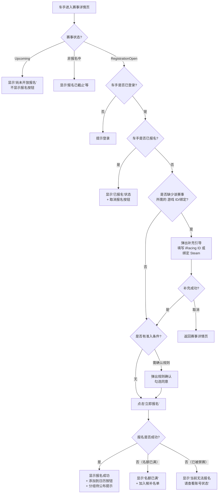

### 5.3.1 报名成功后操作

| 操作 | 说明 |
|------|------|
| **添加到日历** | 生成 .ics 文件，用户可导入 Google Calendar / Outlook / Apple Calendar 等。包含赛事名称、时间、赛道、服务器信息 |
| **查看参赛名单** | 在赛事详情页查看所有已报名车手 |
| **等待分组通知** | 若启用多 Split，提示"报名截止后将公布分组结果" |

### 5.3.2 取消报名流程

1. 车手在赛事详情页点击"取消报名"
2. 系统检查是否在取消报名截止时间之前
   - 若已过截止时间：提示"已过取消报名截止时间，如需退出请联系管理员"
   - 若仍在截止时间之前：弹出确认对话框
3. 车手确认取消
4. 名额释放，系统更新报名人数
5. 若启用多 Split 且分组已公布，从对应 Split 中移除该车手
6. 发送取消确认通知（站内）

## 5.4 候补机制

当赛事报名人数达到上限时：

1. 后续报名的车手进入候补名单（Waitlist）
2. 候补名单按报名时间排序
3. 当有车手取消报名释放名额时：
   - 系统自动按候补顺序通知下一位候补车手
   - 候补车手收到通知后需在限定时间内（如 24 小时）确认参赛
   - 超时未确认则名额顺延至下一位候补
4. 候补状态在报名页面实时展示（如"候补名单第 3 位"）

## 5.5 服务器信息展示

### 5.5.1 展示规则

- 服务器信息卡片在**报名后**对已报名车手始终可见
- 如管理员已填写服务器信息（名称/密码），正常展示
- 如管理员尚未填写，卡片仍显示，提示"比赛进入方式稍后提供"
- 未报名用户看不到服务器信息卡片
- 直连链接（如有）同步展示

### 5.5.2 展示方式

| 方式 | 说明 | 适用场景 |
|------|------|---------|
| 文字信息 | 展示服务器名称、密码 | 所有游戏 |
| 直连链接 | 点击链接直接启动游戏并加入服务器 | 支持 URL Scheme 的游戏（如 ACC 的 `acc://` 链接） |

两种方式同时展示，车手可选择使用。

## 5.6 边缘情况处理

| 边缘情况 | 处理方案 |
|---------|---------|
| 赛事详情页加载时赛事刚刚被取消 | 页面顶部显示醒目的"本场赛事已取消"横幅，附取消原因 |
| 用户尝试报名其他区域的赛事 | 允许报名，但在报名确认时额外提示"该赛事位于 XX 区域，请注意时区差异" |
| 报名时网络中断 | 前端防重复提交，后端幂等设计。恢复网络后查询报名状态 |
| .ics 文件中的时区信息 | 使用 IANA 时区标准（如 Asia/Shanghai），确保各日历应用正确解析 |
| 车手在多台设备上同时操作 | 以最后一次操作为准，服务端校验报名状态 |
| 车手报名后修改了用户名 | 不影响报名记录，报名记录使用用户 ID 关联 |

---

# 6. 成绩与排名

## 6.1 成绩录入

### 6.1.1 混合录入模式

平台支持两种成绩录入方式，具体能力取决于游戏平台（详见 4.8.2）：

| 方式 | 说明 | 适用游戏 |
|------|------|---------|
| **自动导入** | 上传游戏生成的结果文件（JSON/XML），系统自动解析并匹配车手 | ACC、AC、LMU、rF2 |
| **API 导入** | 通过游戏官方 API 自动获取比赛结果 | iRacing |
| **手动录入** | 管理员手动输入成绩表 | AC Evo（暂）、ETS2 |

### 6.1.2 成绩录入流程

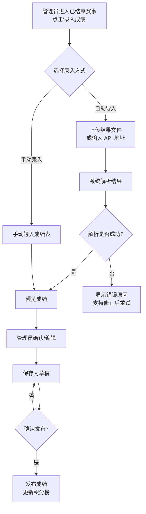

### 6.1.3 成绩数据字段

| 字段名 | 类型 | 说明 |
|--------|------|------|
| position | Integer | 最终名次 |
| driver_id | UUID | 车手 ID |
| team_id | UUID | 车队 ID（如有） |
| split_number | Integer | Split 编号 |
| total_time | String | 完赛总时间 |
| best_lap | String | 最快单圈时间 |
| laps_completed | Integer | 完成圈数 |
| gap_to_leader | String | 与领先者的差距 |
| status | Enum | 完赛 / DNF（未完赛） / DNS（未开始） / DSQ（取消资格） |
| penalty | String | 罚时说明（如有） |
| points | Integer | 获得积分 |

## 6.2 积分榜

### 6.2.1 锦标赛积分榜

- 按锦标赛维度展示积分排名
- 积分规则由管理员在锦标赛配置中以自定义文字和/或结构化积分表格描述（平台不做强制计算）
- 管理员可手动输入每位车手在每轮的积分
- 积分榜支持展示：总积分、各赛事得分明细、参赛场次

### 6.2.2 人工管理晋级

- 晋级/淘汰由运营团队完全人工管理
- 管理员可手动标记哪些车手晋级到下一轮
- 锦标赛中各赛事之间的参赛名单由管理员手动配置
- 平台展示晋级结果，不做晋级逻辑的自动计算

## 6.3 排行榜

### 6.3.1 排行榜维度

| 排行榜类型 | 说明 |
|-----------|------|
| 总积分排行 | 所有车手的总积分排名 |
| 胜场排行 | 所有车手的获胜次数排名 |
| 参赛次数排行 | 所有车手的总参赛次数排名 |
| 领奖台排行 | 所有车手的领奖台（前三名）次数排名 |

### 6.3.2 排行榜筛选

- 按时间段筛选（本赛季 / 全部时间）
- 按游戏平台筛选

## 6.4 边缘情况处理

| 边缘情况 | 处理方案 |
|---------|---------|
| 成绩导入文件格式错误 | 系统校验文件结构，返回具体的字段错误提示，管理员可修正后重新上传 |
| 成绩中包含未报名车手 | 系统标记异常，管理员确认后可将其标记为"外卡选手"或移除 |
| 成绩发布后需要修正 | 管理员可编辑已发布成绩，但所有修改记录变更日志（谁、何时、修改了什么） |
| 积分规则导致平分 | 由管理员在赛制规则中定义 Tie-breaker 规则，管理员手动调整排名 |
| 车手对成绩有异议 | 通过抗议系统（第7章）提交，管理员审核后可修正成绩并重算积分 |

---

# 7. 抗议与处罚

## 7.1 抗议系统

### 7.1.1 抗议提交流程

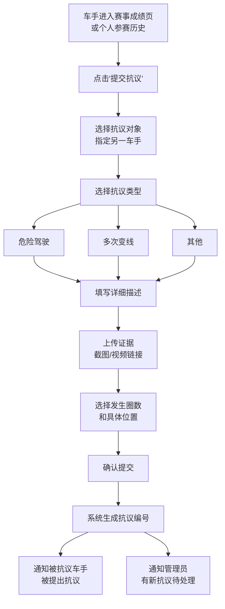

### 7.1.2 抗议数据字段

| 字段名 | 类型 | 说明 |
|--------|------|------|
| protest_id | UUID | 抗议唯一标识 |
| event_id | UUID | 关联赛事 ID |
| reporter_id | UUID | 提交抗议的车手 ID |
| reported_id | UUID | 被抗议的车手 ID |
| type | Enum | 抗议类型 |
| description | String | 详细描述 |
| evidence_urls | URL[] | 证据链接列表 |
| lap_number | Integer | 发生圈数 |
| location | String | 赛道位置描述 |
| status | Enum | 待审核 / 审核中 / 已裁决 / 已驳回 |
| created_at | DateTime | 提交时间 |
| deadline | DateTime | 抗议截止时间（如赛后 48 小时内） |

### 7.1.3 抗议时间窗口

- 车手只能在赛后规定时间内（如 48 小时，管理员可配置）提交抗议
- 超时后抗议入口关闭

## 7.2 处罚管理

### 7.2.1 处罚类型

| 处罚类型 | 说明 | 效果 |
|---------|------|------|
| **警告** | 轻微违规的书面警告 | 记录在案 |
| **罚时** | 对该场比赛成绩加罚时间 | 成绩名次可能下调 |
| **名次下调** | 在该场比赛中降低若干名次 | 成绩修改 |
| **取消该场成绩** | 取消该场比赛的成绩 | 该场无积分 |
| **取消锦标赛资格** | 取消整个锦标赛的参赛资格 | 所有赛事成绩作废 |
| **禁赛（按场次）** | 禁止参加接下来 N 场赛事 | 无法报名指定数量的赛事 |
| **禁赛（按时长）** | 禁止参赛一段时间 | 无法报名期间的赛事 |

### 7.2.2 管理员裁决流程

1. 管理员查看抗议列表（按赛事分组）
2. 点击某条抗议，查看详细信息和证据
3. 管理员做出裁决：
   - 驳回抗议（无处罚）
   - 确认违规并选择处罚类型和程度
4. 填写裁决理由
5. 确认裁决
6. 系统自动：
   - 更新抗议状态
   - 如有成绩变更：更新成绩并重算积分
   - 如有禁赛：更新用户状态
   - 通知双方车手裁决结果

### 7.2.3 申诉流程

被处罚的车手可在裁决通知后规定时间内（如 24 小时）提出申诉：

1. 车手在通知详情中点击"提出申诉"
2. 填写申诉理由和补充证据
3. 提交给管理员（由另一位未参与初次裁决的管理员复审，如人员允许）
4. 管理员最终裁决：维持原判 / 减轻处罚 / 撤销处罚
5. 申诉结果为最终结果，通知双方

### 7.3 边缘情况处理

| 边缘情况 | 处理方案 |
|---------|---------|
| 车手对已过抗议窗口的事件提出抗议 | 系统拒绝提交，提示"抗议窗口已关闭" |
| 同一事件被多人抗议 | 管理员可合并处理，一次裁决针对被抗议者的多起抗议 |
| 管理员未在规定时间内处理抗议 | 系统在后台发出超时提醒，但不自动裁决 |
| 抗议涉及管理员自身参赛 | 由其他管理员处理 |
| 处罚导致积分榜排名变化 | 管理员手动更新积分并发布变更通知 |

---

# 8. 赛事日历

## 8.1 日历视图

### 8.1.1 视图模式

| 模式 | 说明 |
|------|------|
| **月历视图** | 默认，按月展示赛事安排，每天格子内显示赛事卡片 |
| **周历视图** | 按周展示，每天内按时间线排列赛事 |
| **列表视图** | 按时间顺序列出所有赛事，信息更完整 |

### 8.1.2 日历卡片信息

每场赛事在日历中展示：
- 赛事名称
- 比赛时间
- 游戏平台标签（颜色区分）
- 报名状态指示

## 8.2 日历筛选

| 筛选项 | 说明 |
|--------|------|
| 区域 | 当前区域 / 全部区域 |
| 游戏平台 | 多选 |
| 赛事类型 | 独立赛事 / 锦标赛 / 全部 |
| 已报名赛事 | 仅展示用户已报名的赛事（需登录） |

## 8.3 时区处理

- 所有时间以 UTC 存储和传输
- 前端根据用户浏览器/设备时区自动转换为本地时间展示
- 用户可在设置中手动指定时区（覆盖自动检测）
- 跨区域赛事同时显示赛事所在时区时间和用户本地时间

## 8.4 个人日历订阅

- 已报名车手可在赛事详情页点击"添加到日历"下载 .ics 文件
- .ics 文件内容：赛事名称、时间、赛道、服务器信息（如有）
- 支持导入 Google Calendar / Outlook / Apple Calendar 等

## 8.5 边缘情况处理

| 边缘情况 | 处理方案 |
|---------|---------|
| 夏令时切换 | 使用 IANA 时区数据库自动处理，展示的本地时间自动调整 |
| 赛事时间被管理员修改 | 已导出 .ics 不会自动更新，但站内通知提醒车手时间变更 |
| 同一时段多场赛事 | 日历格子内显示多场赛事缩略信息，点击展开 |
| 用户设备时区与账号设置时区不一致 | 优先使用账号设置中的时区偏好 |

---

# 9. 车队系统

## 9.1 车队功能概述

车队系统允许车手组建团队，以车队名义参加耐力赛、团队赛等需要多人协作的赛事。

## 9.2 车队数据模型

| 字段名 | 类型 | 说明 |
|--------|------|------|
| team_id | UUID | 车队唯一标识 |
| name | String | 车队名称（唯一） |
| logo | URL | 车队 Logo |
| description | String | 车队简介 |
| captain_id | UUID | 队长用户 ID |
| members | Member[] | 成员列表 |
| region | Enum | 车队所属区域 |
| created_at | DateTime | 创建时间 |

### 成员（Member）

| 字段名 | 类型 | 说明 |
|--------|------|------|
| user_id | UUID | 用户 ID |
| role | Enum | 队长 / 成员 |
| joined_at | DateTime | 加入时间 |

## 9.3 车队管理流程

### 9.3.1 创建车队

1. 车手在"我的车队"页面点击"创建车队"
2. 填写车队名称、缩写、Logo、简介
3. 选择车队所属区域
4. 提交创建
5. 创建者自动成为队长

### 9.3.2 邀请成员

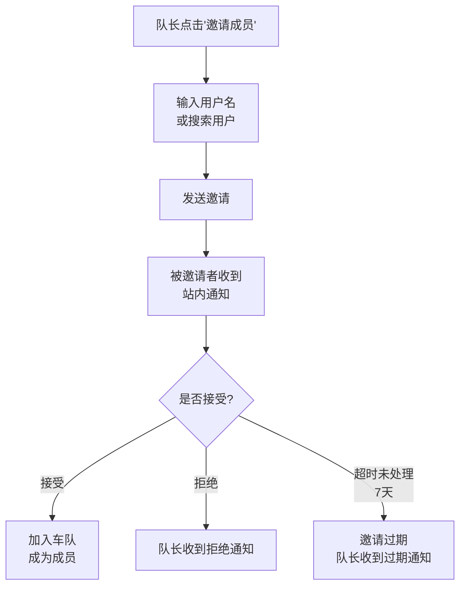

### 9.3.3 移除成员

1. 队长在车队管理页选择要移除的成员
2. 确认移除
3. 被移除的成员收到通知
4. 系统检查该成员是否有正在进行的团队赛事
   - 若有：提示队长"该成员正在参加 XX 赛事，移除后该赛事成绩可能受影响"
   - 队长确认后移除

### 9.3.4 转让队长

1. 队长选择要转让的成员
2. 确认转让
3. 新队长收到通知
4. 原队长变为普通成员

### 9.3.5 退出车队

1. 普通成员在车队页面点击"退出车队"
2. 系统检查是否有进行中的团队赛事
3. 确认退出
4. 队长收到成员退出通知

### 9.3.6 解散车队

1. 队长点击"解散车队"
2. 系统检查是否有正在进行的赛事
   - 若有：提示"车队有正在进行中的赛事，无法解散"
   - 若无：确认解散
3. 所有成员收到解散通知
4. 车队历史成绩保留，但车队页面显示"已解散"

## 9.4 车队报名赛事

- 团队赛赛事中，由队长代表车队报名
- 报名时选择参赛的车队成员（从车队成员列表中勾选）
- 报名成功后，被选中的成员收到通知
- 成员变更：报名截止前队长可修改参赛成员

## 9.5 车队公开页面

- URL 格式：`/team/{team_id}`
- 展示：车队名称、Logo、简介、成员列表、参赛历史、成绩统计
- 所有用户可查看

## 9.6 边缘情况处理

| 边缘情况 | 处理方案 |
|---------|---------|
| 车队解散后历史成绩归属 | 成绩保留，但标记为"已解散车队"，成员个人参赛记录仍保留 |
| 队长被封禁 | 队长被封禁期间车队功能冻结，管理员可指定新队长或解散 |
| 成员退出时正在进行团队赛事 | 允许退出但警告，该赛事中车队可能因人数不足而被视为 DNF |
| 同一用户加入多个车队 | 不允许，一个用户同一时间只能属于一个车队 |
| 车队名称被占用 | 唯一性校验，提示"该名称已被使用" |
| 被移除的成员不满 | 通过客服渠道申诉，管理员可介入处理 |

---

# 10. 通知系统

## 10.1 通知架构

### 10.1.1 通知渠道

| 渠道 | 说明 | 默认状态 |
|------|------|---------|
| **站内通知** | 平台内通知中心，登录后可见 | 始终开启 |
| **邮件通知** | 发送至用户绑定的邮箱 | 默认开启，用户可关闭 |

### 10.1.2 通知渠道配置

- 管理员可在后台配置每类通知的渠道
- 可选项：**仅站内** / **站内 + 邮件**
- 用户可在账号设置中关闭邮件通知（站内通知不可关闭）

## 10.2 通知类型与触发场景

| 通知类型 | 触发场景 | 推荐渠道 | 接收者 |
|---------|---------|---------|--------|
| **报名确认** | 车手成功报名赛事 | 站内 | 报名车手 |
| **报名取消确认** | 车手取消报名 | 站内 | 取消车手 |
| **赛事取消** | 管理员取消赛事 | 站内 + 邮件 | 所有已报名车手 |
| **赛事时间变更** | 管理员修改比赛时间 | 站内 + 邮件 | 所有已报名车手 |
| **赛事开始提醒** | 比赛开始前（如提前 1 小时） | 站内 + 邮件 | 所有已报名车手 |
| **分组结果公布** | Split 分组完成并公布 | 站内 + 邮件 | 所有已报名车手 |
| **成绩公布** | 赛事成绩录入并发布 | 站内 | 所有参赛车手 |
| **抗议通知** | 车手被提出抗议 | 站内 + 邮件 | 被抗议车手 |
| **裁决结果通知** | 管理员对抗议做出裁决 | 站内 + 邮件 | 抗议双方 |
| **处罚通知** | 管理员对车手做出处罚 | 站内 + 邮件 | 被处罚车手 |
| **封禁通知** | 车手被封禁 | 站内 + 邮件 | 被封禁车手 |
| **解封通知** | 车手被封禁解除 | 站内 + 邮件 | 被解封车手 |
| **车队邀请** | 被邀请加入车队 | 站内 + 邮件 | 被邀请者 |
| **候补转正** | 候补车手获得名额 | 站内 + 邮件 | 候补车手 |
| **锦标赛晋级** | 管理员标记车手晋级 | 站内 | 晋级车手 |
| **新闻/公告** | 管理员发布新闻或公告 | 站内 | 所有用户 |

## 10.3 站内通知中心

### 10.3.1 功能

- 导航栏显示通知铃铛图标，未读数量气泡
- 点击展开通知列表（最近 20 条）
- 点击单条通知跳转至相关页面
- "查看全部"进入通知中心页面
- 通知中心支持分页、按类型筛选、全部标记已读

### 10.3.2 通知数据模型

| 字段名 | 类型 | 说明 |
|--------|------|------|
| notification_id | UUID | 通知唯一标识 |
| user_id | UUID | 接收者用户 ID |
| type | Enum | 通知类型 |
| title_zh | String | 通知标题（中文） |
| title_en | String | 通知标题（英文） |
| body_zh | String | 通知内容（中文） |
| body_en | String | 通知内容（英文） |
| link | URL | 点击跳转链接 |
| is_read | Boolean | 是否已读 |
| created_at | DateTime | 创建时间 |

## 10.4 邮件通知

### 10.4.1 邮件模板

- 每类通知有对应的邮件模板
- 模板包含：平台 Logo、通知标题、通知内容、相关链接、退订链接
- 支持中英文两套模板

### 10.4.2 邮件发送策略

- 邮件通过异步队列发送，避免阻塞主流程
- 发送失败自动重试（最多 3 次，间隔递增）
- 同一用户短时间内多封邮件不合并（MVP 阶段，后续可优化为摘要邮件）

## 10.5 通知偏好设置

用户可在账号设置中配置：

| 设置项 | 选项 |
|--------|------|
| 邮件通知总开关 | 开 / 关 |
| 按类型细粒度控制 | 每类通知可单独开关邮件渠道 |

> 注：站内通知始终开启，不可关闭。

## 10.6 边缘情况处理

| 边缘情况 | 处理方案 |
|---------|---------|
| 邮件发送失败 | 重试 3 次，3 次均失败则标记发送失败，站内通知正常发出。后台可查看发送失败的邮件列表 |
| 大量用户同时触发通知（如赛事取消） | 使用消息队列异步发送，避免阻塞。后台可查看发送进度 |
| 用户未绑定邮箱但开启了邮件通知 | 系统发送站内通知，邮件不发送（无目标地址） |
| 通知内容包含链接但目标页面已被删除 | 通知仍然展示，链接点击后显示"该内容已不可用" |
| 用户设置了邮箱但长时间未验证 | 仅发送站内通知，邮箱标记为"未验证"状态，提示用户验证邮箱 |
| 候补转正通知中限定确认时间 | 通知中明确标注"请在 X 小时内确认"，超时后名额自动释放 |

---

# 11. 直播与内容

## 11.1 直播嵌入

### 11.1.1 功能描述

- 赛事详情页嵌入 Twitch / YouTube 直播播放器
- 管理员在赛事配置中填入直播链接
- 赛事进行期间，直播窗口在赛事详情页显著位置展示
- 未直播时显示"直播未开始"占位或隐藏

### 11.1.2 支持的平台

| 平台 | 嵌入方式 |
|------|---------|
| Twitch | iframe 嵌入 |
| YouTube | iframe 嵌入 |
| 其他 | 链接跳转（不嵌入） |

### 11.1.3 直播可见性

| 赛事状态 | 直播展示 |
|---------|---------|
| 未开始 | 隐藏或显示"直播即将开始"占位 |
| 进行中 | 展示直播播放器 |
| 已结束 | 隐藏直播，展示 VOD 回放链接 |

## 11.2 VOD 回放

- 管理员在赛后录入 VOD 回放链接（YouTube / Twitch VOD）
- 在赛事详情页展示"观看回放"按钮
- VOD 链接永久有效（除非源平台删除）

## 11.3 新闻与公告

### 11.3.1 功能描述

- 管理员可发布新闻/公告文章
- 支持中英双语内容录入
- 文章类型：赛事公告 / 平台更新 / 赛事回顾 / 其他

### 11.3.2 文章数据字段

> 同赛事双语策略（见 4.1.1），至少填写一种语言即可发布。

| 字段名 | 类型 | 必填 | 说明 |
|--------|------|------|------|
| article_id | UUID | 自动 | 文章唯一标识 |
| title_zh / title_en | String | 是（至少一种） | 标题（中/英） |
| content_zh / content_en | RichText | 是（至少一种） | 正文（中/英） |
| cover_image | URL | 否 | 封面图 |
| category | Enum | 是 | 分类 |
| regions | Enum[] | 是 | 展示区域 |
| is_pinned | Boolean | 否 | 是否置顶 |
| published_at | DateTime | 自动 | 发布时间 |
| author | String | 否 | 作者 |

### 11.3.3 展示位置

- 首页新闻模块（最近 3-5 条）
- 独立的新闻列表页（`/news`）
- 赛事详情页关联公告（如赛事相关的公告）

## 11.4 边缘情况处理

| 边缘情况 | 处理方案 |
|---------|---------|
| 直播链接失效 | 播放器显示错误信息，不影响赛事页面其他内容 |
| 直播链接为非 Twitch/YouTube | 不嵌入播放器，显示为外部链接按钮 |
| 管理员未配置直播链接 | 不显示直播区域 |
| 新闻仅录入单语 | 降级展示已有语言版本 |
| 新闻设置的区域不包含用户当前区域 | 该新闻不在该用户的新闻列表中显示 |

---

# 12. 管理数据看板

## 12.1 看板指标

### 12.1.1 核心指标

| 指标 | 说明 | 时间维度 |
|------|------|---------|
| 总注册用户数 | 平台累计注册车手数量 | 实时 |
| 新增用户数 | 新注册车手数量 | 日 / 周 / 月 |
| 活跃用户数 | 有登录行为的用户数量 | 日 / 周 / 月 |
| 赛事总数 | 已创建的赛事数量 | 实时 |
| 本周赛事数 | 本周安排的赛事数量 | 周 |
| 平均报名人数 | 每场赛事的平均报名人数 | 周 / 月 |
| 赛事参与率 | 报名人数 / 最大名额 | 周 / 月 |

### 12.1.2 趋势图表

| 图表 | 说明 |
|------|------|
| 用户增长曲线 | 按日/周/月的注册用户增长趋势 |
| 报名人数趋势 | 按赛事或按时间的报名人数变化 |
| 游戏平台分布 | 各游戏平台的赛事/报名占比 |
| 区域分布 | 四区域的用户数/赛事数/报名数对比 |
| 赛事完成率 | 已完成的赛事数 / 已发布的赛事数 |

### 12.1.3 筛选条件

- 按区域筛选（全部 / CN / AP / AM / EU）
- 按时间范围筛选（今日 / 本周 / 本月 / 自定义）

## 12.2 数据看板权限

- 仅管理员可访问数据看板
- 位于管理后台首页

---

# 13. 非功能需求与 MVP 规划

## 13.1 多语言（i18n）

### 13.1.1 需求

- 界面元素支持中文和英文
- 使用标准的 i18n 框架（如 react-intl / vue-i18n）
- 用户可随时切换语言，切换后整个界面即时更新
- 语言偏好持久化至用户账号或浏览器本地存储

### 13.1.2 内容双语

- 管理员在后台录入内容时提供中英文双栏编辑器
- 前台根据用户语言偏好展示对应版本
- 缺失某语言版本时降级展示

## 13.2 响应式设计

| 设备 | 优先级 | 说明 |
|------|--------|------|
| 桌面端（1280px+） | 最高 | 主要使用场景 |
| 平板端（768px-1279px） | 中 | 适配浏览 |
| 移动端（<768px） | 中 | 适配浏览和基础操作 |

## 13.3 SEO 优化

- 赛事列表页和详情页需要被搜索引擎收录
- 关键页面设置合适的 meta 标签（title / description / OG tags）
- 使用服务端渲染（SSR）或静态生成（SSG）确保爬虫可抓取
- 生成 sitemap.xml
- URL 结构清晰语义化（如 `/events/{slug}`, `/championships/{slug}`）

## 13.4 性能要求

| 指标 | 目标值 |
|------|--------|
| 首页加载时间（FCP） | < 2s |
| 交互响应时间（TTI） | < 3s |
| API 响应时间（P95） | < 500ms |
| 并发用户支持 | 初期 1000 并发 |

## 13.5 安全要求

| 安全措施 | 说明 |
|---------|------|
| HTTPS | 全站 HTTPS |
| XSS 防护 | 所有用户输入转义处理 |
| CSRF 防护 | 表单和 API 使用 CSRF Token |
| SQL 注入防护 | 使用参数化查询 / ORM |
| 频率限制 | API 限流（如报名接口每用户每分钟 5 次） |
| 防刷报名 | 同一赛事同一用户仅允许报名一次（服务端校验） |
| 管理后台访问控制 | IP 白名单 + 管理员账号双因素认证（2FA） |
| 敏感信息保护 | 服务器密码等信息加密存储，仅对已报名用户解密展示 |

## 13.6 技术方案建议

此处仅用于AI生成原型。

| 层次 | 建议技术 | 说明 |
|------|---------|------|
| 前端 | React / Vue 3 + TypeScript | SPA 或 SSR |
| 后端 | Node.js / Go / Java（根据团队技术栈） | RESTful API 或 GraphQL |
| 数据库 | PostgreSQL | 关系型数据 |
| 缓存 | Redis | 会话、热点数据缓存 |
| 文件存储 | S3 兼容对象存储 | 图片、结果文件 |
| 消息队列 | RabbitMQ / Redis Queue | 异步通知发送 |
| 部署 | Docker + 云服务 | 弹性扩缩 |

## 13.7 MVP 分期规划

### Phase 1 — MVP（核心功能上线）

**目标**：平台具备基本的赛事发布、浏览、报名和成绩展示能力。

| 模块 | 包含功能 |
|------|---------|
| 用户系统 | Pit House SSO 登录、Discord/Steam 绑定、基础车手档案 |
| 区域系统 | IP 自动识别区域、手动切换区域 |
| 赛事管理 | 创建/编辑赛事、赛事模板、发布到区域、赛事状态流转 |
| 赛事浏览 | 赛事列表、筛选、赛事详情页 |
| 报名系统 | 报名/取消报名、取消截止时间、.ics 日历导出 |
| 多 Split | 基础多 Split 配置和展示 |
| 成绩系统 | 手动录入成绩、成绩展示 |
| 通知系统 | 站内通知（核心场景：报名确认、赛事取消、成绩公布） |
| 日历 | 月历/列表视图 |
| 中英双语 | 界面双语 + 管理员双语录入 |

**不包含**：Rating 系统、车队系统、抗议系统、邮件通知、直播嵌入、数据看板

### Phase 2 — 社区与竞赛增强

**目标**：增加竞赛相关的完整功能链路。

| 模块 | 包含功能 |
|------|---------|
| 抗议与处罚 | 抗议提交、管理员裁决、处罚记录、申诉流程 |
| 车队系统 | 车队创建/管理/邀请、团队报名 |
| 封禁体系 | 完整的用户封禁/禁赛管理 |
| 邮件通知 | 邮件通知渠道、通知偏好设置 |
| API 自动导入 | 对接支持 API 的游戏自动导入成绩 |
| 锦标赛增强 | 锦标赛赛事管理、积分榜、人工晋级管理 |
| 直播嵌入 | Twitch/YouTube 直播嵌入 |

### Phase 3 — 增长与运营

**目标**：运营效率提升和数据驱动。

| 模块 | 包含功能 |
|------|---------|
| 数据看板 | 运营数据统计看板 |
| 新闻/公告 | 文章发布系统 |
| 候补机制 | 报名满员后的候补名单 |
| VOD 回放 | 赛后回放链接管理 |
| MOZA 设备展示 | 车手档案页 MOZA 设备展示 |
| 通知增强 | 更多通知场景、邮件模板优化 |

### Phase 4 — 扩展功能（远期）

| 模块 | 包含功能 |
|------|---------|
| Rating 系统 | 车手实力评分、基于 Rating 的准入和 Split 分组 |
| 排行榜增强 | 多维度排行榜 |
| 性能分析 | 基础的赛后数据分析（圈速趋势等） |
| 移动端优化 | 响应式优化或独立移动端 |

---

> **文档结束**  
