# Racing Arcade — 产品需求文档（PRD）

> **文档版本**：v1.5
> **最后更新**：2026-06-22
> **文档状态**：Draft

---

## 目录

- [1. 项目概述](#1-项目概述)
- [2. 用户角色与权限](#2-用户角色与权限)
- [3. 用户系统](#3-用户系统)
- [4. 赛事管理（后台）](#4-赛事管理后台)
- [5. 赛事浏览与报名（前台）](#5-赛事浏览与报名前台)
- [6. 成绩与排名](#6-成绩与排名)
- [7. 抗议与处罚](#7-抗议与处罚)
- [8. 赛事日历](#8-赛事日历)
- [9. 车队系统](#9-车队系统)
- [10. 通知系统](#10-通知系统)
- [11. 直播与内容](#11-直播与内容)
- [12. 管理数据看板](#12-管理数据看板)
- [13. 非功能需求与 MVP 规划](#13-非功能需求与-mvp-规划)

---

# 1. 项目概述

## 1.1 平台背景

Racing Arcade 是 MOZA Racing 旗下官方模拟赛车赛事发布平台，旨在为全球 MOZA 用户及模拟赛车爱好者提供高品质的线上竞速体验。

## 1.2 平台定位

Racing Arcade 是一个**由 MOZA Racing 官方运营的模拟赛车赛事发布与管理平台**。平台仅由 MOZA 官方团队发布和管理赛事，不是用户共创（UGC）平台。核心职责是：

- **赛事信息展示**：清晰、美观地呈现赛事信息（赛制、时间、赛道、车辆等）
- **报名管理**：为车手提供便捷的赛事报名/取消报名流程
- **成绩呈现**：展示比赛结果、积分排名和统计数据
- **通知触达**：确保车手及时收到赛事相关通知

平台不对赛制规则、晋级逻辑做强制系统化约束，复杂的赛事规则和晋级淘汰由运营团队人工管理，平台负责将结果展示给用户。

## 1.3 区域化战略

平台划分为四个独立运营区域：

| 区域代码 | 区域名称 | 覆盖范围 | 默认语言 | 可选语言 |
|---------|---------|---------|---------|---------|
| CN | 中国区 | 中国大陆 | 中文 | 中文 / 英文 |
| AP | 亚太区 | 日韩、东南亚、澳洲等 | 英文 | 英文 / 中文 |
| AM | 美洲区 | 北美、南美 | 英文 | 英文 / 中文 |
| EU | 欧非区 | 欧洲、非洲、中东 | 英文 | 英文 / 中文 |

**核心规则**：

- 各区域的赛事独立显示，默认只展示用户所在区域的赛事
- 用户可手动切换区域，浏览并报名其他区域的赛事
- 管理员创建赛事时选择发布区域（单区域 / 多区域 / 全球）
- 各区域拥有独立运营团队，但管理后台权限统一（所有管理员可管理全部区域）

## 1.4 竞品对比分析

| 维度 | SimGrid | Racing Arcade |
|------|---------|--------------|
| **运营模式** | 用户共创（UGC），1277+ 社区自行发布赛事 | 官方自营，仅 MOZA 运营团队发布赛事 |
| **赛事来源** | 任何用户可创建社区并发布赛事 | 仅官方发布，品质统一 |
| **支持游戏** | 16+ 款（ACC、AC Evo、iRacing、LMU 等） | 初期聚焦 AC / ACC，先打通自动开服与成绩导入闭环 |
| **账号体系** | Discord / Steam 登录 | Pit House SSO（主）+ Discord / Steam 绑定 |
| **赛事规模** | 每天 24 小时不间断排位赛 + 社区联赛 | 每周 5-10 场精选赛事 |
| **Ranking 系统** | Grid Rating（Bronze/Silver/Gold/Platinum） | MVP 阶段不含 Rating，后续可扩展 |
| **硬件生态** | 无硬件关联 | MOZA 硬件生态（车手档案展示 MOZA 设备） |
| **社区功能** | 社区系统为核心 | 无社区功能，聚焦赛事 |
| **区域化** | 无明确区域划分 | 四区域独立运营 + 跨区可浏览可报名 |
| **成绩分析** | Performance Analysis | 基础统计 |
| **直播集成** | 无内置直播 | 嵌入 Twitch / YouTube 直播 |

## 1.5 目标用户画像

### 主要用户：模拟赛车玩家

| 属性 | 描述 |
|------|------|
| 年龄 | 18-45 岁 |
| 特征 | 热爱赛车运动，拥有模拟赛车设备（方向盘、踏板等） |
| 痛点 | MOZA官方赛事目前为止没有一个清晰的展示平台 |
| 期望 | 稳定的赛事安排、公平的竞赛环境、清晰的成绩展示 |
| 设备 | 部分/全部使用 MOZA 硬件产品 |

### 次要用户：赛事观众

| 属性 | 描述 |
|------|------|
| 特征 | 对模拟赛车有兴趣但未参赛，或想学习观赛 |
| 需求 | 观看直播、查看赛事信息和成绩 |

---

# 2. 用户角色与权限

## 2.1 角色定义

| 角色 | 说明 | 典型操作 |
|------|------|---------|
| **管理员** | MOZA 官方运营团队成员 | 创建/编辑/取消赛事、录入成绩、处理抗议、管理用户封禁、发布新闻 |
| **车手** | 已注册的普通用户 | 浏览赛事、报名/取消报名、查看成绩、提交抗议、管理车队 |
| **访客** | 未注册/未登录的浏览者 | 浏览赛事列表和详情、查看公开的成绩排行 |

## 2.2 权限矩阵

| 功能模块 | 管理员 | 车手 | 访客 |
|---------|--------|------|------|
| 浏览赛事列表和详情 | ✅ | ✅ | ✅ |
| 查看成绩排行 | ✅ | ✅ | ✅ |
| 查看赛事日历 | ✅ | ✅ | ✅ |
| 注册/登录 | — | ✅ | ✅ |
| 报名赛事 | ✅（后台操作） | ✅ | ❌ |
| 取消报名 | — | ✅ | ❌ |
| 导出日历(.ics) | — | ✅ | ❌ |
| 查看/管理车队 | — | ✅ | ❌ |
| 提交抗议 | — | ✅ | ❌ |
| 查看个人通知 | — | ✅ | ❌ |
| 修改个人资料/设备展示 | — | ✅ | ❌ |
| 切换区域 | — | ✅ | ✅ |
| 创建/编辑/删除赛事 | ✅ | ❌ | ❌ |
| 录入/修改成绩 | ✅ | ❌ | ❌ |
| 处理抗议与处罚 | ✅ | ❌ | ❌ |
| 封禁/解禁用户 | ✅ | ❌ | ❌ |
| 发布新闻/公告 | ✅ | ❌ | ❌ |
| 管理赛事模板 | ✅ | ❌ | ❌ |
| 查看数据看板 | ✅ | ❌ | ❌ |
| 管理直播/VOD | ✅ | ❌ | ❌ |

## 2.3 管理员权限说明

- 管理员为**单一角色**，不区分区域管理员和超级管理员
- 所有管理员可管理**全部四个区域**的赛事和数据
- 管理员同时也可以作为车手身份参赛（需关联车手账号，或使用独立账号）

---

# 3. 用户系统

## 3.1 注册与登录

### 3.1.1 登录方式

平台以 **Pit House SSO** 作为主要登录方式，同时支持绑定 Discord 和 Steam 第三方账号。

| 登录方式 | 说明 | 优先级 |
|---------|------|--------|
| Pit House SSO | MOZA 设备调节软件 Pit House 的账号体系，OAuth 2.0 协议接入 | 主要 |
| Discord | 通过 Discord OAuth 2 登录 | 辅助 |
| Steam | 通过 Steam OpenID 登录 | 辅助 |

### 3.1.2 首次登录注册流程

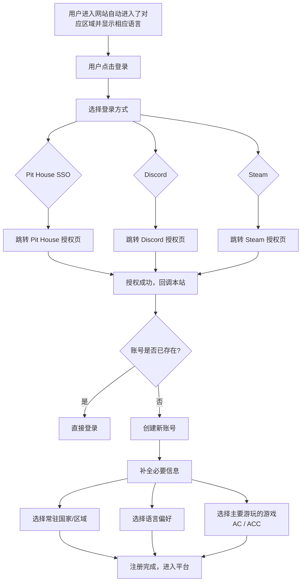
```mermaid
flowchart TD
    A["用户进入网站自动进入了对应区域并显示相应语言"] --> B
    B["用户点击登录"] --> C["选择登录方式"]
    C --> D{"Pit House SSO"} & E{"Discord"} & F{"Steam"}
    D --> G["跳转 Pit House 授权页"]
    E --> H["跳转 Discord 授权页"]
    F --> I["跳转 Steam 授权页"]
    G --> J["授权成功，回调本站"]
    H --> J
    I --> J
    J --> K{"账号是否已存在?"}
    K -- 是 --> L["直接登录"]
    K -- 否 --> M["创建新账号"]
    M --> N["补全必要信息"]
    N --> O["选择常驻国家/区域"] & P["选择语言偏好"] & R["选择主要游玩的游戏<br>AC / ACC"]
    O --> Q["注册完成，进入平台"]
    P --> Q
    R --> Q
```

**流程步骤**：

1. 用户在登录页选择一种登录方式
2. 跳转至对应服务的授权页面完成认证
3. 认证成功后回调至本站
4. 系统检查该第三方账号是否已绑定平台账号
   - 若已绑定：直接登录
   - 若未绑定：创建新账号，引导补全信息
5. 首次注册需补全以下信息：
   - **常驻国家/区域**（从下拉列表中选择）
   - **语言偏好**（中文 / 英文）
   - **主要游玩的游戏**（多选，初期为 AC / ACC）
6. 注册完成，进入平台首页
7. 游戏 ID（初期为 Steam 绑定）不在注册时要求填写，而是在报名对应平台赛事时按需校验和补充（详见 3.1.5）

### 3.1.3 账号绑定流程

已登录用户可在"账号设置"中绑定/解绑 Discord 和 Steam 账号。

**绑定流程**：

1. 用户进入账号设置 → 第三方账号管理
2. 点击"绑定 Discord"或"绑定 Steam"
3. 跳转至对应授权页面
4. 授权成功后回调，系统检查该第三方账号是否已被其他平台账号绑定
   - 若未被绑定：完成绑定
   - 若已被其他账号绑定：提示"该账号已绑定其他 MOZA Pit House 账号，请先解绑"
5. 绑定成功，显示已绑定状态

**解绑流程**：

1. 用户在账号设置中点击"解绑"
2. 系统检查当前账号的登录方式数量
   - 若仅剩一种登录方式：提示"不能解绑唯一的登录方式，请先绑定其他账号"
   - 若仍有多种登录方式：确认解绑
3. 解绑成功

### 3.1.4 边缘情况处理

| 边缘情况 | 处理方案 |
|---------|---------|
| Pit House Token 过期 | 前端检测 401 响应，自动跳转至登录页，提示"登录已过期，请重新登录" |
| Pit House 服务不可用 | 展示错误提示"登录服务暂时不可用，请稍后再试"。降级方案：已绑定 Discord/Steam 的用户可使用第三方登录 |
| 同一第三方账号被两个平台账号绑定 | 绑定时检测冲突，拒绝绑定并提示 |
| 用户解绑所有登录方式 | 系统不允许解绑最后一个登录方式，按钮置灰并提示 |
| 用户忘记密码（Pit House 侧） | 跳转至 Pit House 密码找回页面 |
| 第三方授权被用户拒绝 | 返回登录页，无错误提示 |
| 注册后未补全必要信息（关闭网页） | 用户下次登录时，系统检测账号是否已补全必要信息（常驻国家/区域、语言偏好、主要游玩游戏）。若未补全，全站显示补全引导遮罩层（不可跳过、不可关闭），强制用户完成信息填写后方可进入平台。补全页面仅包含必要字段，减少填写负担 |

### 3.1.5 报名时的游戏 ID 校验

游戏 ID（初期为 Steam 绑定）不在注册时强制填写，而是在车手报名赛事时按需校验。MVP 阶段赛事仅支持 AC / ACC，因此报名校验只要求用户完成 Steam 账号绑定。

**校验规则**：

| 赛事游戏平台 | 校验字段 | 校验方式 |
|------------|---------|---------|
| AC / ACC | Steam 绑定 | 用户需已绑定 Steam 账号，或报名时弹出引导绑定 |

**报名校验流程**：

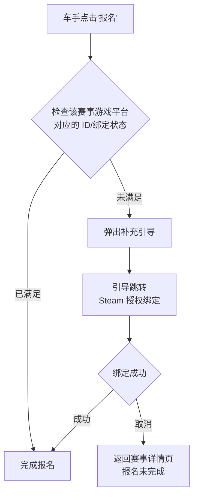
```mermaid
flowchart TD
    A[车手点击'报名'] --> B{检查该赛事游戏平台<br/>对应的 ID/绑定状态}
    B -->|已满足| C[完成报名]
    B -->|未满足| D[弹出补充引导]

    D --> E[引导跳转<br/>Steam 授权绑定]
    E --> F{绑定成功}

    F -->|成功| C
    F -->|取消| G[返回赛事详情页<br/>报名未完成]
```

**补充信息持久化**：绑定的 Steam ID 在报名成功后自动保存到用户账号中，后续报名 AC / ACC 赛事时不再重复要求。

## 3.2 区域识别与语言偏好

### 3.2.1 区域自动识别

1. 用户首次访问平台时，系统根据 IP 地址判断所属区域
2. 自动跳转至对应区域页面
3. 已登录用户的区域偏好保存在账号设置中，后续访问以账号设置为准

**IP → 区域映射规则**：

| 区域 | IP 归属地 |
|------|----------|
| CN | 中国大陆 |
| AP | 日本、韩国、东南亚、澳洲、新西兰、印度等 |
| AM | 美国、加拿大、墨西哥、巴西、阿根廷等美洲国家 |
| EU | 欧洲各国、非洲各国、中东各国 |

### 3.2.2 语言策略

| 区域 | 默认界面语言 | 可切换 | 管理员录入内容 |
|------|------------|--------|--------------|
| CN | 中文 | 可切换为英文 | 双语录入（中文 + 英文） |
| AP / AM / EU | 英文 | 可切换为中文 | 双语录入（中文 + 英文） |

**展示逻辑**：

- 界面元素（按钮、菜单、提示文案等）：跟随用户语言偏好
- 管理员发布的内容（赛事名称、描述、赛制规则等）：
  - 优先展示用户偏好语言的版本
  - 若该语言版本未录入，则展示另一语言版本（降级显示）
  - 降级显示时标注"仅提供 XX 语言版本"

### 3.2.3 边缘情况处理

| 边缘情况 | 处理方案 |
|---------|---------|
| 用户使用 VPN 导致 IP 与实际常驻地不符 | 用户可手动切换区域，设置持久化 |
| 无法识别的 IP 归属地 | 默认归入 AM 区域 |
| 用户搬家到别的区域 | 网站根据用户IP自动进入相应区域，但用户的常驻国家/地区属性需要用户自己修改 |
| 管理员仅录入单语内容 | 前台降级展示已有语言版本 |
| 双语内容中某一语言版本明显过时 | 由运营团队内部流程保证内容同步，平台不校验 |

### 3.2.4 区域内容筛选规则

**区域筛选总原则**：

- **公共内容按区域筛选**：赛事列表、新闻列表、日历页、排行榜等公共展示页面，仅展示发布到当前区域的赛事和数据。切换区域后，列表内容随之刷新
- **用户个人数据不按区域筛选**：用户的报名记录（我的赛事）、通知、抗议、个人统计数据等，无论当前选择哪个区域，均展示完整数据，不因区域切换而隐藏
- **详情页展示完整数据**：一旦用户通过列表进入某个具体赛事/锦标赛/新闻的详情页，展示该条目的完整数据，不受区域筛选影响

**多区域赛事规则**：

- 区域仅作为赛事的**发现和筛选维度**，不创建独立的赛事实例。一个赛事发布到多个区域时，仍然是同一个赛事（同一条记录、同一个 ID）
- 报名数据**全局共享**：无论用户从哪个区域发起报名，都是对同一赛事的同一份报名记录。报名人数、参赛名单、成绩等数据不按区域拆分
- 用户在一个区域报名后，切换到其他区域查看同一赛事时，显示"已报名"状态，不可重复报名
- 赛事时间在所有区域统一为同一 UTC 时间，前端根据用户本地时区自动转换显示

**各功能区域筛选行为**：

| 功能/页面 | 是否按区域筛选 | 说明 |
|----------|--------------|------|
| 赛事列表 | 是 | 仅展示 `regions` 包含当前区域的赛事 |
| 新闻列表 | 是 | 仅展示 `regions` 包含当前区域的新闻 |
| 首页（近期赛事/新闻） | 是 | 跟随赛事列表和新闻列表的筛选结果 |
| 日历页 | 是 | 仅展示当前区域的赛事 |
| 排行榜 | 是 | 仅统计当前区域赛事的成绩和积分（见 6.3） |
| 赛事详情页 | 否（进入后展示完整数据） | 从列表点击进入后展示该赛事全部信息 |
| 分站详情页 | 否（进入后展示完整数据） | 同上 |
| 新闻详情页 | 否（进入后展示完整数据） | 同上 |
| 我的赛事 | 否（用户个人数据） | 展示用户已报名的所有赛事，包括其他区域的赛事 |
| 通知中心 | 否（用户个人数据） | 展示所有通知，不区分区域 |
| 我的抗议 | 否（用户个人数据） | 展示所有抗议记录 |
| 车手档案 | 否（个人统计数据） | 车手的参赛次数、积分等统计数据为全区域汇总 |
| 车队公开页 | 否（团队统计数据） | 车队统计数据为全区域汇总 |

## 3.3 车手档案页

### 3.3.1 档案信息

| 信息类别 | 字段 | 可见性 | 可编辑 | 说明 |
|---------|------|--------|--------|------|
| **基础信息** | 昵称 | 始终公开 | ✅ | |
| | 头像 | 始终公开 | ✅ | |
| | 所在国家 | 始终公开 | ✅ | 仅展示国家，不展示区域标识 |
| | 个人简介 | 始终公开 | ✅ | |
| **游戏信息** | Steam ID | 可配置公开/私密 | ✅ | 默认私密，用户可设为公开。通过 Steam 绑定自动获取；初期用于 AC / ACC 报名与成绩匹配 |
| **MOZA 设备** | 已拥有的设备列表（从 Pit House 同步） | 可配置公开/私密 | 部分（选择展示哪些） | 默认公开，用户可设为私密；设备来源为 Pit House 自动同步，用户仅控制展示 |
| | 如：R16/R21/R9 方向盘基座、CRP/CSR 踏板等 | | | |
| **统计数据** | 总参赛次数 | 始终公开 | ❌ 自动计算 | |
| | 胜场数 / 领奖台数 | 始终公开 | ❌ 自动计算 | |
| | 总积分 | 始终公开 | ❌ 自动计算 | |
| | 参赛历史列表 | 始终公开 | ❌ 自动聚合 | |

**可见性规则**：

- **始终公开**：基础信息（昵称、头像、区域、简介）和统计数据始终对所有访客可见
- **可配置公开/私密**：游戏 ID（初期为 Steam ID）和 MOZA 设备列表，用户可在账号设置中逐项切换可见性
  - 游戏 ID 默认为**私密**（仅自己可见），防止隐私泄露
  - MOZA 设备默认为**公开**，发挥品牌展示作用
  - 设为私密时，其他用户访问该档案页看不到对应字段
  - 管理员在后台始终可查看所有字段（不受用户隐私设置影响）

### 3.3.2 MOZA 设备展示

- 平台通过 Pit House SSO 接口自动获取用户已拥有的 MOZA 设备列表（基于 Pit House 后台的设备注册/激活数据）
- 用户无法手动添加设备，只能从已获取的设备列表中选择要在档案页公开展示的设备
- 设备信息在车手档案页以产品图标+名称的形式展示
- 设备展示为可选项，用户可以选择不展示任何设备
- 新设备首次连接 Pit House 后自动同步到平台，用户无需手动操作

### 3.3.3 车手档案 URL

- 格式：`/driver/{id}`
- username 可由用户自定义（唯一性校验）

## 3.4 封禁与禁赛体系

### 3.4.1 封禁类型

| 类型 | 说明 | 效果 |
|------|------|------|
| **警告** | 由人工判断，例如故意危险驾驶次数较少，轻微违规 | 仅站内通知 |
| **临时封禁** | 由人工判断，由于某些字段填写不合规，禁止登录和使用平台功能一段时间 | 无法报名、无法提交抗议、档案页显示"暂时不可用" |
| **永久封禁** | 由人工判断，由于某些原因，永久禁止使用平台 | 同上，永久生效 |
| **赛事禁赛** | 由人工判断，故意扰乱比赛，禁止报名特定赛事或所有赛事一段时间 | 可登录浏览，但无法报名新赛事 |

### 3.4.2 封禁管理流程

1. 管理员在后台"用户管理"中搜索目标用户
2. 选择封禁类型，填写原因和时长（临时封禁需设置起止时间）
3. 确认后立即生效
4. 系统自动发送通知给被封禁用户（站内通知 + 邮件）
5. 被封禁用户下次登录时看到封禁提示（含原因和截止时间）

### 3.4.3 解封流程

1. 管理员在后台查看封禁记录
2. 可手动提前解封，或等待封禁到期后自动解封
3. 解封后发送通知告知用户

### 3.4.4 边缘情况处理

| 边缘情况 | 处理方案 |
|---------|---------|
| 被封禁用户已报名了未来赛事 | 自动取消该用户的所有未来报名赛事 |
| 用户对封禁有异议 | 通过客服渠道（邮箱/Discord）联系运营团队处理 |
| 封禁记录需要追溯 | 管理后台保留完整的封禁/解封历史记录 |

---

# 4. 赛事管理（后台）

## 4.1 赛事数据模型

### 4.1.1 双语内容填写策略

管理后台的双语内容字段（赛事名称、描述、赛制规则等）遵循以下规则：

- 管理员在编辑表单顶部可切换当前填写语言（中文 / 英文）
- 切换后，表单中所有双语字段切换为对应语言的输入区域
- **发布条件**：至少完成一种语言的所有必填字段即可发布，不要求中英文全部填写完毕
- 管理员可在发布后随时补全另一种语言的内容
- 前台展示逻辑：优先展示用户偏好语言的版本，若该语言未录入则降级展示另一语言版本（见 3.2.2）

### 4.1.2 区域默认时区

管理员创建赛事时，系统根据赛事所属区域自动填充默认时区，方便管理员快速填写比赛时间。管理员可手动覆盖为其他时区。

| 区域 | 默认时区 | IANA 标识 | 说明 |
|------|---------|-----------|------|
| CN（中国区） | UTC+8 | Asia/Shanghai | 中国统一使用北京时间 |
| AP（亚太区） | UTC+9 | Asia/Tokyo | 日韩为主要市场，+9 是亚太最集中的时区 |
| AM（美洲区） | UTC-5 | America/New_York | 美东时间，覆盖北美东部主要城市 |
| EU（欧非区） | UTC+1 | Europe/Berlin | 中欧时间，覆盖西欧和大部分欧洲国家 |

**时区相关规则**：

- 所有时间在数据库中以 **UTC** 存储和传输
- 管理员在后台创建/编辑赛事时，时间选择器默认显示该区域的默认时区，管理员可切换为其他时区
- 前台对车手展示时自动转换为车手本地时区（根据设备/浏览器时区），同时标注赛事所在时区的时间
- 赛事发布到多个区域时，管理员填写时间时以第一个选中区域的默认时区为准，可手动调整
- 夏令时（DST）处理：使用 IANA 时区数据库自动计算，管理员无需手动处理

> **实现说明（后台原型）**：时区为 **Competition 级字段** `timezone`，建赛/编辑页 Info 区以 4 个区域档位（中国 UTC+8 / 亚太 UTC+9 / 欧洲 UTC+1 / 美洲 UTC-5）选择。赛事内所有时间输入（Round 报名三时间、Stage 起止）按此时区与 UTC 互转，输入框标签与各处时间展示均带 `(UTC±X)` 后缀。

### 4.1.3 赛事核心分层模型

> **双语字段标记说明**：标记为 `中/英` 的字段，至少填写一种语言即可发布。

平台统一采用 `Competition → Round → Stage → Session` 四层结构。赛事复杂度由 Round/Stage 的层级关系自然体现：只有 1 个 Round 即为单场赛，多个 Round 即为锦标赛或系列赛，无需额外的形态字段。

| 层级 | 中文含义 | 解决的问题 | 示例 |
|------|----------|------------|------|
| Competition | 整项赛事 / 锦标赛 / 年度赛事项目 | 承载品牌、规则、区域、积分、车型等公共信息 | MOZA GT3 年度锦标赛 2026 |
| Round | 一站 / 一场分站 | 承载赛道、时间窗口、报名入口、分站状态 | 第 12 站 - 铃鹿 |
| Stage | 分站内阶段 | 承载预选、正赛日、决赛等流程阶段；**设定并行服务器（Split）数量与共享开赛参数** | 长时间开放预选赛、正赛日 |
| Session | 游戏内时段 / **成绩归属的最小颗粒度** | Practice / Qualifying / Race 等游戏内时序；成绩在此层归属，可分别查看 | 正赛日内的 Qualifying 成绩、Race 成绩 |

**Stage、Split、Session 三者的关系**：

- **Split 是 Stage 的横向并行维度**：一个 Stage 可拆分为多个 Split（并行服务器实例）以容纳更多车手。Split 数量在**报名截止后于报名页确定**（按实际人数均分，见 4.5.4）；默认仅 1 个 Split。
- **一份开赛参数（`game_config`）共享给 Stage 下所有 Split**：该参数含赛道、天气、规则、辅助等游戏引擎配置，**Session 的时序信息（P/Q/R 时长、时段、时间倍率）也定义在这份开赛参数中**，因此同一 Stage 内各 Split 运行的 Session 时序完全一致。
- **Session 归属于 Split**：每个 Split（服务器）各自按统一的时序运行这些 Session，并产出独立成绩。Session 是成绩归属的最小颗粒度——例如在同一个"正赛日" Stage 中，车手既能查看 Qualifying Session 的排位成绩，也能查看 Race Session 的正赛成绩，两者互不覆盖。
- **各 Split 的服务器参数从基准派生**：Split 1 为"基准服务器"（母版），密码、端口、标志位、容量等服务器参数由 Split 1 统一设置并**自动同步**到其他 Split（见 4.5.7）；仅 serverName 按编号派生（`基准名 #N`）、Entry List 和成绩各自独立。开赛参数与 Session 时序由 Stage 统一掌控。
- **成绩汇总方向**：Session（单场时段成绩）→ Split（服务器成绩）→ Stage（阶段成绩）→ Round（分站成绩）→ Competition（总积分）。晋级名单、分站成绩和年度积分均沿此链路聚合。

**创建服务器的流程顺序**（管理员视角）：

1. 报名截止后于报名页按实际人数确定服务器（Split）数量并均分（见 4.5.4）
2. 配置一套开赛参数（`game_config`：赛道、天气、规则、辅助，以及 Session 时序 P/Q/R）
3. 将这套开赛参数分发给各个服务器（Split）；各 Split 仅补充自己的服务器参数与 Entry List
4. 每个 Split 按开赛参数中的 Session 时序依次运行 Practice / Qualifying / Race，产出各 Session 的成绩

**建模原则**：

- 1 个 Round 的 Competition = 单场比赛
- 多个 Round 的 Competition = 多站赛事（锦标赛 / 系列赛）
- 每个 Round 可只含"正赛日"阶段，也可含"预选赛"+"正赛日"等多个 Stage
- "Stage"只表示 Round 内部流程，不表示整届赛事的大阶段
- 车手报名默认以 Round 为目标
- 多 Split 仅用于扩容：同一 Stage 的各 Split 共享开赛参数与 Session 时序，仅在服务器实例和参赛名单上独立

### 4.1.4 Competition 数据模型

Competition 是前台列表中的主要卡片对象，也是详情页的主入口。

| 字段名 | 类型 | 必填 | 说明 |
|--------|------|------|------|
| id | UUID | 自动 | Competition 唯一标识 |
| name_zh / name_en | String | 是（至少一种） | 赛事项目名称（中/英） |
| description_zh / description_en | RichText | 否 | 赛事项目描述（中/英） |
| cover_image | URL | 否 | 封面图片 |
| regions | Enum[] | 是 | 发布区域（CN / AP / AM / EU，可多选） |
| timezone | String | 否 | 赛事级时区（如 `UTC+8`）；时间统一以 UTC 存储，输入/展示按此时区换算（见 4.1.2） |
| game | Enum | 是 | 游戏平台；MVP 仅开放 AC / ACC，后续可扩展其他模拟赛车游戏 |
| car_class | String | 是 | 车型组（GT3 / GT4 / Porsche Cup / LMP2 / Formula 等） |
| car_list | String[] | 否 | 可选车辆列表 |
| result_lock_window_hours | Integer | 否 | 成绩公示/申诉窗口时长（小时），到期自动锁定；默认 24，可提前锁定（见 4.3.3）。**赛事级（Competition）字段**，非 ruleset 内 |
| default_ruleset | CompetitionRuleset | 是 | 默认赛制、准入、积分、资源、直播等公共配置 |
| rounds | Round[] | 是 | 分站列表，管理员可拖拽排序 |
| status | Enum | 自动 | 取**当前站**（current round）的状态（见 4.3.1），除非 `status_override`=Draft/Cancelled |
| created_by | UUID | 自动 | 创建者管理员 ID |
| created_at | DateTime | 自动 | 创建时间 |
| updated_at | DateTime | 自动 | 最后更新时间 |

**CompetitionRuleset**：

| 字段名 | 类型 | 必填 | 说明 |
|--------|------|------|------|
| access_requirements_zh / access_requirements_en | String | 否 | 准入条件描述（中/英） |
| scoring_table | ScoringTableEntry[] | 否 | 默认积分表 |
| scoring_note_zh / scoring_note_en | String | 否 | 积分表总计备注（中/英），显示在积分表末尾 |
| resources_zh / resources_en | RichText | 否 | 默认资源下载（中/英） |
| stream_url | URL | 否 | 默认直播链接 |

> **已合并字段**：赛制规则（rules）、积分规则说明（scoring_rules）、晋级规则说明（advancement_rules）已合并到 Competition 的 `description` 字段中，不再作为独立字段。
> **已移除字段**：`cancel_registration_deadline_offset` 不再作为 Competition 级配置；`weather`、`has_pitstop` 由 Stage 的 `game_config` 表达，不在 ruleset 内；`min_entries` 位于 Stage 层级（见 4.1.6）。
> **锁定窗口**：`result_lock_window_hours` 为 **Competition 级**字段（非 ruleset 内，见 4.1.4 主表）。
> **分组配置**：服务器（Split）数量在**报名截止后于报名页确定并均分**（见 4.5.4），不再有 `max_splits` / `max_entries_per_split` / `enable_multi_split` 概念；Stage 仅保留 `min_entries`（开赛下限）与 `split_assignment_rule`（默认分组方式）。

### 4.1.5 Round 数据模型

Round 是用户实际报名和参赛的主要单位，对应"一站"或"一场分站"。

| 字段名 | 类型 | 必填 | 说明 |
|--------|------|------|------|
| id | UUID | 自动 | Round 唯一标识 |
| competition_id | UUID | 是 | 所属 Competition |
| name_zh / name_en | String | 是（至少一种） | 分站名称，如"第 12 站 - 铃鹿" |
| description_zh / description_en | RichText | 否 | 分站补充说明 |
| track | String | 否 | 赛道名称；纯线上热圈活动可为空 |
| cover_image | URL | 否 | 分站封面图（横幅比例），未填则使用 Competition 封面 |
| registration_open_at | DateTime | 是 | Round 报名起始时间 |
| registration_close_at | DateTime | 是 | Round 报名截止时间 |
| cancel_registration_deadline | DateTime | 否 | 允许取消 Round 报名的截止时间 |
| max_registrations | Integer | 否 | **分站报名人数上限**（Round 级），仅用于限制报名总量；在创建/编辑页填写，为空表示不限制。**不在 Stage 层做分组容量校验** |
| registration_override | Enum | 否 | 报名状态人工覆盖：`forceOpen`（重开报名）/ `forceClosed`（提前结束报名）；为空时按时间推导（见 4.3.x） |
| stages | Stage[] | 是 | 本 Round 下的 Stage 列表（内嵌；分站序号由排列顺序派生） |
| status | Enum | 自动 | **跟随最新（已开赛）Stage 的状态**（含派生锁定）；报名阶段按时间 + `registration_override` 推导（见 4.3） |

### 4.1.6 Stage 数据模型

Stage 是 Round 内部的流程阶段，用来表达"预选赛 → 正赛日 → 决赛"这类同一站内的推进关系。**一个 Stage 对应一份共享开赛参数**——Stage 统一管理游戏引擎参数（`game_config`）、Session 时序模板（`sessions`，即 P/Q/R 的时长与时段，共享给所有 Split）、默认分组方式与开赛下限；各 Split（并行服务器）按这套统一的时序运行 Session 并各自产出成绩，服务器参数从 Split 1（基准）派生（见 4.5.7），仅在 serverName、参赛名单与成绩上各自独立。详见 4.1.3 的层级关系。

| 字段名 | 类型 | 必填 | 说明 |
|--------|------|------|------|
| id | UUID | 自动 | Stage 唯一标识 |
| round_id | UUID | 是 | 所属 Round |
| type | Enum | 否 | qualifier / race_day / final / consolation / practice / custom。由模板预设，编辑器中不再可选择，不在头部显示类型徽章 |
| name_zh / name_en | String | 是（至少一种） | 阶段名称，如"预选赛"、"正赛日" |
| description_zh / description_en | RichText | 否 | 阶段说明（始终可编辑） |
| starts_at | DateTime | 是 | 阶段开始时间 |
| ends_at | DateTime | 是 | 阶段结束时间 |
| game_config | SessionGameConfig | 否 | 共享开赛参数（赛道、天气、规则、辅助限制等），按 AC/ACC 配置文件组织，详见 4.1.8；分发给该 Stage 下所有 Split |
| sessions | Session[] | 是 | **共享的 Session 时序模板**（Practice/Qualifying/Race 的时长、时段、时间倍率等），定义在开赛参数中，所有 Split 按此统一时序运行；详见 4.1.7 |
| splits | Split[] | 是 | 服务器实例列表；每个 Split 对应一个并行服务器，按统一的 Session 时序运行。服务器参数（密码、端口、标志位等）从 Split 1（基准）派生并自动同步（见 4.5.7），仅 serverName 按编号区分；参赛名单（Entry List）和成绩各自独立。**各 Session 的成绩按 Session 归属**（同一 Split 内 qualify 与 race 成绩各自独立），未启用多 Split 时仅有 1 个 Split |
| bop_entries | BopEntry[] | 否 | 性能平衡（BoP）条目，每项含 `track`、`carModel`、`ballastKg` |
| eligibility_source | Enum | 否 | `roundRegistration` / `previousStageResult` / `manualInvite`，各选项的子字段见下方 |
| advancement_rule | AdvancementRule | 否 | 晋级规则，见下方 |
| split_assignment_rule | Enum | 否 | **默认分组方式**：`time`（按报名时间）/ `random`（随机）/ `skill`（按水平，即将推出）。报名页分组时以此为默认值 |
| awards_points | Boolean | 否 | **是否计入积分**，默认计入（缺省视为 true）。关闭时该 Stage 成绩照常展示但不进任何积分榜；仅该 Stage 的 race session 成绩作为发放积分依据，多 Split 自动汇总 |
| min_entries | Integer | 否 | 最低开赛人数阈值；报名截止人数低于此值时报名页提示，亦作为分组时"每组人数过少"的下限 |
| results_lock_at | DateTime | 否 | **成绩计划锁定时间**；未设则默认 = `ends_at` + `result_lock_window_hours`（默认 24h）。到此时间自动锁定，管理员亦可手动提前锁定（见 4.3.3） |
| status | Enum | 自动 | 从时间与 Session 成绩聚合（沿 Session → Split → Stage 链路） |

> **服务器（Split）数量**不在 Stage 预设，而是在**报名截止后于报名页确定**：管理员按实际报名人数选择服务器数 N，系统据此创建 N 个 Split 并把报名**尽量均分**（组间人数差 ≤1）。已删除 `max_splits` / `max_entries_per_split` / `enable_multi_split` 概念。

**Split 数据结构**：

| 字段名 | 类型 | 必填 | 说明 |
|--------|------|------|------|
| id | UUID | 自动 | Split 唯一标识 |
| split_number | Integer | 是 | Split 序号（1, 2, 3…） |
| server_name | String | 否 | 游戏服务器名称 |
| server_password | String | 否 | 车手加入密码 |
| admin_password | String | 否 | 管理员密码（不明文展示） |
| max_connections / max_car_slots | Integer | 否 | 最大连接数 / 车位 |
| register_to_lobby | Boolean | 否 | 是否注册到大厅 |
| udp_port / tcp_port / http_port | Integer | 否 | 网络端口 |
| entry_list | EntryListEntry[] | 否 | 参赛名单，可从 Round 报名自动生成或手动编辑 |
| results | SessionResult[] | 自动 | 本 Split 产出的成绩，**按 Session 归属**（每条记录指明属于哪个 Session，如 qualifying 或 race）；同一 Split 内不同 Session 的成绩各自独立。详见 4.1.7 |
| results_locked_at | DateTime | 自动 | 成绩**锁定**时间（锁定以整个 Stage 为单位，该 Stage 各 Split 同时写入；锁定前为"公示中"，见 4.3.3） |

> Split 还包含各游戏引擎专用的服务器参数字段（AC 的 `pickup_mode_enabled`、`locked_entry_list`、`max_ballast_kg`、以及高级项 `num_threads`/`sleep_time`/`udp_plugin_*`/`auth_plugin_address` 等；ACC 的 `is_race_locked`、`short_formation_lap`、`dump_leaderboards` 等），覆盖 AC/ACC server guide 中除报名名单外的全部字段，完整字段参见 4.1.8 配置文件参考表。这些服务器字段在「服务器配置弹窗」与「模板编辑页」中均可编辑（共用同一套字段组件）。

**EntryListEntry 数据结构**（参赛名单条目）：

| 字段名 | 类型 | 必填 | 说明 |
|--------|------|------|------|
| id | UUID | 自动 | 条目唯一标识 |
| driver_id | UUID | 否 | 关联车手 ID（自动生成时有值，手动添加可空） |
| driver_name | String | 是 | 车手姓名 |
| team_name | String | 否 | 车队名称 |
| race_number | Integer | 是 | 赛车号码 |
| car_model | String | 否 | 车辆型号 |
| ballast_kg | Integer | 否 | 配重（kg） |
| restrictor | Integer | 否 | 进气限制器 |
| is_server_admin | Boolean | 否 | 是否为服务器管理员 |
| is_auto_generated | Boolean | 否 | 是否由系统从 Round 报名自动生成 |

**AdvancementRule 数据结构**（晋级规则）：

| 字段名 | 类型 | 必填 | 说明 |
|--------|------|------|------|
| source_session_id | UUID | 否 | 参考成绩来源的 Session/Split |
| metric | Enum | 是 | `lapTime` / `points` / `position` / `manual`。排序方向自动推断：`lapTime` 和 `position` 为升序（越小越好），`points` 为降序（越大越好） |
| lap_time_multiplier | Float | 否 | 当 metric 为 `lapTime` 时使用；所有圈速在最优圈速的 `multiplier` 倍以内者均可晋级（如 1.05 = 最快圈速的 105% 以内） |
| limit | Integer | 否 | 当 metric 为 `points` 或 `position` 时使用；取前 N 名晋级 |
| target_stage_id | UUID | 否 | 晋级目标 Stage |
| fallback_policy | Enum | 否 | `none` / `fillNext`，名额不足时的补位策略 |

**EligibilitySource 条件子字段**：

| eligibility_source | 子字段 | 说明 |
|--------------------|--------|------|
| `roundRegistration` | 无（仅提示文案） | 所有已报名 Round 的车手均可参与 |
| `previousStageResult` | advancement_rule（metric、lap_time_multiplier / limit） | 按上一 Stage 成绩排序晋级；metric 为 `lapTime` 时按圈速倍率筛选，为 `points`/`position` 时按名额取前 N 名 |
| `manualInvite` | selected_driver_ids (UUID[]) | 管理员从已报名车手中多选勾选参赛名单 |

### 4.1.7 Session 数据模型

Session 是四层结构的最底层，也是**成绩归属的最小颗粒度**。它在两个层面发挥作用：

- **时序定义（共享）**：Session 的时序参数（Practice/Qualifying/Race 的时长、时段、时间倍率）作为模板定义在 Stage 的开赛参数中（`Stage.sessions`），共享给该 Stage 下所有 Split——同一 Stage 内各服务器运行的 Session 时序完全一致。
- **成绩归属（按 Split 独立）**：每个 Split 按统一时序运行这些 Session 后**各自产出独立成绩**，成绩归属于具体的（Split, Session）。例如同一个"正赛日" Stage 中，qualifying Session 的排位成绩与 race Session 的正赛成绩分别存放、互不覆盖，车手可分别查看。

| 字段名 | 类型 | 必填 | 说明 |
|--------|------|------|------|
| id | UUID | 自动 | Session 唯一标识 |
| type | Enum | 是 | `practice` / `qualifying` / `race` / `timeTrial` |
| name_zh / name_en | String | 是（至少一种） | Session 名称 |
| duration_minutes | Integer | 否 | 固定时长（分钟） |
| race_duration | Integer | 否 | 正赛时长或圈数 |
| race_duration_type | Enum | 否 | `time` / `laps` |
| day_of_weekend | Integer | 否 | ACC 事件日（1=周五, 2=周六, 3=周日） |
| hour_of_day | Integer | 否 | 游戏内开始时段（0-24） |
| time_multiplier | Integer | 否 | 时间倍率（游戏内时间流逝速度） |
| wait_time | Integer | 否 | AC 等待时间（秒） |
| is_open | Integer | 否 | AC 是否开放（1/0） |

> **成绩归属**：成绩记录（`SessionResult`）存放在 Split 上（`Stage.splits[].results`），**每条记录指明所属的 Session**（如 qualifying / race）。聚合时沿 Session → Split → Stage → Round → Competition 逐级汇总：先按 Session 在 Split 间合并，再聚合到 Stage，由此可分别得到排位榜、正赛成绩、分站成绩和年度积分。

> **已移除的字段**：`starts_at`/`ends_at`（使用 Stage 时间窗口）、`server_info`/`server_password`/`server_join_link`（移至 Split）、`stream_url`/`vod_url`（移至 Round/Competition 默认直播）、`game_session_restart_policy`/`restart_interval`/`result_merge_rule`（服务器重启策略由 Stage/Split 级配置控制）。

**长时间开放预选赛示例**：

- Stage：预选赛，开放时间由管理员配置（`starts_at` / `ends_at`），可持续数小时、数天或更长
- Session：`type = practice`，配置时长和开放参数
- 服务器实例（Split）：按管理员设定的间隔自动重启游戏内 Session，避免单个房间长期运行不稳定
- 结果导入：每次游戏内 Session 结束后导入圈速结果到对应 Split 的该 Session 成绩
- 合并规则：每位车手只取所有游戏内 Session 中最快的一次有效圈速
- 晋级规则：按合并后的 Stage 榜单排序，使用 `advancement_rule`（`metric = lapTime`，配 `lap_time_multiplier`）筛选晋级车手进入正赛日 Stage

### 4.1.8 自动开服配置（AC / ACC 初期范围）

MVP 阶段赛事只面向 AC 与 ACC。后台创建赛事时，管理员不是只填写一段"服务器信息"，而是先填写可生成游戏专用配置文件的参数；系统将这些参数写入服务器配置目录并启动对应 Dedicated Server 工具。前台赛事详情页只复用其中对车手有意义且允许展示的字段。

**配置归属原则**：

- **一个 Stage = 一份共享开赛参数**：自动开服配置（`Stage.game_config`）与 Session 时序模板（`Stage.sessions`）绑定在 Stage 层级，统一分发给该 Stage 下所有 Split
- Stage 下的每个 Split 对应一个并行服务器实例；服务器参数（密码、端口、标志位等）从 Split 1（基准）派生并自动同步，仅 serverName 按编号区分、Entry List 和成绩各自独立（详见 4.5.7）；各 Split 按统一的 Session 时序运行，并**各自产出按 Session 归属的成绩**（qualifying / race 等独立）
- Competition / Round 提供默认赛道、车型、规则、天气等模板，Stage 可覆盖具体参数
- 游戏内 Session 时序（Practice/Qualifying/Race 的时长、时段、时间倍率）通过 `Stage.sessions`（Session[]）编排，作为模板共享给所有 Split
- 基础设施字段（端口、容器路径、管理员密码、插件地址）由系统生成或运维配置，不要求普通赛事管理员手填
- 隐私和安全字段（管理员密码、Steam GUID、内部端口、插件地址）不得在前台展示
- 前台"服务器信息"卡片只展示服务器名称、加入密码、直连链接/加入方式、当前 Session 时间、赛道、车辆和必要规则摘要

**Stage 层级开服配置结构**：

开服配置由以下 Stage 字段协同组成（见 4.1.6）：

| Stage 字段 | 对应配置内容 | 说明 |
|------------|-------------|------|
| `game_config` | 游戏引擎参数 | 赛道、天气、规则、辅助限制等，按 AC/ACC 配置文件组织（event.json、eventRules.json、assistRules.json、settings.json / server_cfg.ini） |
| `sessions` | 游戏内 Session 时序 | Practice/Qualifying/Race 的时长、时段、时间倍率 |
| `splits[]` | 服务器实例 | 每个 Split 的服务器参数从 Split 1（基准）派生并自动同步（见 4.5.7），仅 serverName 按编号区分、Entry List 和成绩各自独立；多 Split 时各实例共享 `game_config` 和 `sessions` 时序，各自产出按 Session 归属的成绩 |
| `bop_entries` | 性能平衡 | BoP 表，对应 ACC `bop.json` 或 AC `entry_list.ini [CAR_N].BALLAST` |

**Entry List 管理**：

- 每个 Split 维护独立的 `entry_list`（EntryListEntry[]）
- 支持从 Round 报名名单自动生成（`is_auto_generated = true`），自动填充车手姓名、车队、赛车号
- 支持手动添加/编辑/删除条目，可覆盖配重（ballastKg）、限制器（restrictor）等参数
- 自动生成时会弹出确认提示，覆盖现有手动条目

**后台自动开服流程**：

```mermaid
flowchart TD
    A[管理员配置 Competition/Round/Stage] --> B[在 Stage 的"会话与服务器配置"弹窗中<br/>选择 AC 或 ACC 开服模板]
    B --> C[填写游戏专用参数<br/>Sessions/Splits/GameSettings/EntryList]
    C --> D[系统校验字段与容量]
    D --> E[生成配置文件]
    E --> F[投放到服务器配置目录]
    F --> G[启动或重启 Dedicated Server]
    G -->     H[采集服务器状态与结果文件]
    H --> I[导入并按 Session 归属合并各 Split 成绩]
```

**开服触发时机**：

平台的核心能力是**按赛段预设时间自动开服，无需人工值守**。开服有两种触发方式：

| 触发方式 | 说明 |
|---------|------|
| **定时自动开服（默认）** | 系统在每个 Stage（或其首个 Session）的预设开始时间（`Stage.starts_at`）自动完成"生成配置文件 → 投放到服务器目录 → 启动 Dedicated Server"，并注册到大厅等待车手连接。多 Split 则并行拉起多台服务器。管理员无需在开赛时在线值守。 |
| **手动立即开服（兜底）** | 管理员可在后台随时手动触发立即开服 / 重启，用于提前测试、临时调整，或定时任务异常时的人工接管。 |

**说明**：

- 开服时使用的参赛名单（`entrylist.json`）由该 Round 已报名（自动通过）的名册**自动生成并一并部署**，无需单独的"生成名单"步骤（参赛名单即已报名的名册，见 4.1.9）。
- 长时间开放预选赛的服务器按设定间隔自动重启游戏内 Session（见 4.1.7），同属定时自动化范畴。
- 定时开服依赖服务端调度；开服结果（成功 / 失败 / 在线数 / 日志）回报后台供管理员监控，失败时通知管理员并允许手动重试。

**前台可复用字段**：

| 前台展示位置 | ACC 来源字段 | AC 来源字段 | 展示规则 |
|-------------|-------------|------------|----------|
| 游戏平台 | Competition.game | Competition.game | 仅 AC / ACC |
| 赛道/布局 | `event.json.track` | `TRACK` / `CONFIG_TRACK` | 可转为中英文显示名 |
| 车型组/车辆 | `settings.json.carGroup`、`entrylist.json.forcedCarModel` | `CARS`、`entry_list.ini.MODEL` | 车手只看车型/车辆名，不看内部代码 |
| 当前服务器 | `settings.json.serverName` | `[SERVER].NAME` | 报名后展示 |
| 加入密码 | `settings.json.password` | `[SERVER].PASSWORD` | 报名后展示；为空则显示公开服务器 |
| 参赛容量 | `settings.json.maxCarSlots` | `[SERVER].MAX_CLIENTS` | 用于容量与 Split 展示 |
| Session 时长 | `event.json.sessions[].sessionDurationMinutes` | `[PRACTICE/QUALIFY/RACE].TIME` / `LAPS` | 转为 Practice / Qualifying / Race 时间线 |
| 天气摘要 | `event.json.ambientTemp` / `trackTemp` / `cloudLevel` / `rain` / `weatherRandomness` | `[WEATHER_*]`、`[DYNAMIC_TRACK]`、`SUN_ANGLE` | 前台可做简要展示 |
| 规则摘要 | `eventRules.json`、`assistRules.json` | `ABS_ALLOWED`、`TC_ALLOWED`、`DAMAGE_MULTIPLIER`、`FUEL_RATE`、`TYRE_WEAR_RATE`、`ALLOWED_TYRES_OUT`、进站窗口 | 前台展示可读规则，不展示原始字段名 |
| 参赛名单 | `entrylist.json.entries[].drivers` | `entry_list.ini [CAR_N]` | 前台隐藏 Steam ID / GUID |
| 不展示字段 | 端口、管理员密码、内部路径、BoP 细节、Steam ID | 端口、管理员密码、插件地址、GUID、线程参数 | 仅后台或系统使用 |

**ACC Dedicated Server 配置文件字段**：

| 文件 | 用途 | 字段 |
|------|------|------|
| `configuration.json` | 网络和大厅注册 | `udpPort`、`tcpPort`、`maxConnections`、`lanDiscovery`、`registerToLobby`、`configVersion` |
| `settings.json` | 服务器基础设置 | `serverName`、`adminPassword`、`password`、`spectatorPassword`、`centralEntryListPath`、`carGroup`、`trackMedalsRequirement`、`safetyRatingRequirement`、`racecraftRatingRequirement`、`maxCarSlots`、`isRaceLocked`、`isLockedPrepPhase`、`shortFormationLap`、`dumpLeaderboards`、`dumpEntryList`、`randomizeTrackWhenEmpty`、`allowAutoDQ`、`ignorePrematureDisconnects`、`formationLapType`、`configVersion` |
| `event.json` | 赛道、天气和 Session 编排 | `track`、`ambientTemp`、`trackTemp`、`cloudLevel`、`rain`、`weatherRandomness`、`simracerWeatherConditions`、`isFixedConditionQualification`、`preRaceWaitingTimeSeconds`、`sessionOverTimeSeconds`、`postQualySeconds`、`postRaceSeconds`、`sessions`、`configVersion` |
| `event.json.sessions[]` | 游戏内 Session | `sessionType`（`P` / `Q` / `R`）、`dayOfWeekend`、`hourOfDay`、`sessionDurationMinutes`、`timeMultiplier` |
| `eventRules.json` | 赛事规则 | `qualifyStandingType`、`pitWindowLengthSec`、`driverStintTimeSec`、`mandatoryPitstopCount`、`maxTotalDrivingTime`、`maxDriversCount`、`tyreSetCount`、`isRefuellingAllowedInRace`、`isRefuellingTimeFixed`、`isMandatoryPitstopRefuellingRequired`、`isMandatoryPitstopTyreChangeRequired`、`isMandatoryPitstopSwapDriverRequired` |
| `assistRules.json` | 驾驶辅助限制 | `disableIdealLine`、`disableAutosteer`、`stabilityControlLevelMax`、`disableAutoPitLimiter`、`disableAutoGear`、`disableAutoClutch`、`disableAutoEngineStart`、`disableAutoWiper`、`disableAutoLights` |
| `bop.json` | 性能平衡 | `entries[].track`、`entries[].carModel`、`entries[].ballastKg` |
| `entrylist.json` | 车手/车辆名单 | `entries[].teamName`、`raceNumber`、`defaultGridPosition`、`ballastKg`、`restrictor`、`isServerAdmin`、`forcedCarModel`、`overrideCarModelForCustomCar`、`overrideDriverInfo`、`customCar`、`drivers`、`forceEntryList` |
| `entrylist.json.drivers[]` | 车手身份 | `driverCategory`、`firstName`、`lastName`、`playerID`、`shortName`、`nationality` |

**AC Dedicated Server 配置文件字段**：

| 文件/段落 | 用途 | 字段 |
|----------|------|------|
| `server_cfg.ini [SERVER]` | 服务器、赛道、车辆、规则和网络 | `NAME`、`CARS`、`TRACK`、`CONFIG_TRACK`、`SUN_ANGLE`、`TIME_OF_DAY_MULT`、`MAX_CLIENTS`、`UDP_PORT`、`TCP_PORT`、`HTTP_PORT`、`PASSWORD`、`ADMIN_PASSWORD`、`REGISTER_TO_LOBBY`、`PICKUP_MODE_ENABLED`、`LOOP_MODE`、`LOCKED_ENTRY_LIST`、`TC_ALLOWED`、`ABS_ALLOWED`、`STABILITY_ALLOWED`、`AUTOCLUTCH_ALLOWED`、`DAMAGE_MULTIPLIER`、`FUEL_RATE`、`TYRE_WEAR_RATE`、`TYRE_BLANKETS_ALLOWED`、`ALLOWED_TYRES_OUT`、`QUALIFY_MAX_WAIT_PERC`、`START_RULE`、`RACE_OVER_TIME`、`RESULT_SCREEN_TIME`、`RACE_EXTRA_LAP`、`RACE_PIT_WINDOW_START`、`RACE_PIT_WINDOW_END`、`REVERSED_GRID_RACE_POSITIONS`、`MAX_BALLAST_KG`、`WELCOME_MESSAGE`、`CLIENT_SEND_INTERVAL_HZ`、`SLEEP_TIME`、`NUM_THREADS`、`UDP_PLUGIN_LOCAL_PORT`、`UDP_PLUGIN_ADDRESS`、`AUTH_PLUGIN_ADDRESS` |
| `server_cfg.ini [PRACTICE]` | 练习/长时间预选 | `NAME`、`TIME`、`WAIT_TIME`、`IS_OPEN` |
| `server_cfg.ini [QUALIFY]` | 排位 | `NAME`、`TIME`、`WAIT_TIME`、`IS_OPEN` |
| `server_cfg.ini [RACE]` | 正赛 | `NAME`、`LAPS`、`TIME`、`WAIT_TIME`、`IS_OPEN` |
| `server_cfg.ini [DYNAMIC_TRACK]` | 动态路面 | `SESSION_START`、`RANDOMNESS`、`LAP_GAIN`、`SESSION_TRANSFER` |
| `server_cfg.ini [WEATHER_0..N]` | 天气 | `GRAPHICS`、`BASE_TEMPERATURE_AMBIENT`、`VARIATION_AMBIENT`、`BASE_TEMPERATURE_ROAD`、`VARIATION_ROAD`、`WIND_BASE_SPEED_MIN`、`WIND_BASE_SPEED_MAX`、`WIND_BASE_DIRECTION`、`WIND_VARIATION_DIRECTION` |
| `entry_list.ini [CAR_N]` | 车位、车辆、车手和 BoP | `MODEL`、`SKIN`、`DRIVERNAME`、`TEAM`、`GUID`、`SPECTATOR_MODE`、`BALLAST`、`RESTRICTOR`、`FIXED_SETUP` |

### 4.1.9 报名与成绩归属

| 对象 | 默认归属 | 说明 |
|------|----------|------|
| Registration | Round | 用户报名某一站，获得该站预选资格 |
| Split Assignment | Stage（通过 `Stage.splits`） | 每个 Stage 可配置多 Split（多服务器实例），正赛可根据预选榜单重新分组 |
| Result | Session（`Stage.splits[].results`，按 Session 归属） | 成绩归属的最小颗粒度为 Session：每条成绩记录指明所属 Split 与 Session（qualifying / race 等），先在 Split 间按 Session 合并，再聚合到 Stage/Round/Competition |
| Entry List | Split | 每个 Split 维护独立的参赛名单，可从 Round 报名自动生成或手动编辑 |
| Protest | Stage | 抗议针对具体 Stage 的具体成绩或事故 |
| Advancement | Stage | 晋级名单由 Stage 的 `advancement_rule` 配置生成，可参考某一 Session 的成绩（如 qualifying 榜单），可由管理员复核 |

### 4.1.10 积分表数据结构（ScoringTableEntry）

管理员可选择使用纯文字描述积分规则，或使用结构化的积分表格，或两者兼有。前台展示时先显示自定义文字，再显示积分表格。

| 字段 | 类型 | 必填 | 说明 |
|------|------|------|------|
| position | Integer | 是 | 名次（如 1, 2, 3） |
| points | Integer | 是 | 对应积分 |
| note_zh | String | 否 | 备注（中文），为空时前端不显示 |
| note_en | String | 否 | 备注（英文），为空时前端不显示 |

前台渲染逻辑：如果整张积分表的备注列全部为空，则不显示"备注"列。

### 4.1.11 资源下载（Resource）

部分赛事涉及自定义 MOD 赛道或车辆包，需要参赛车手提前下载安装。

- 管理员在创建/编辑赛事时，可在"资源下载"富文本区域自由填写下载链接、安装说明、注意事项等任意内容
- 支持插入超链接、列表等富文本格式，方便管理员组织多条资源信息
- 资源内容在赛事详情页公开可见，无需登录即可查看
- 遵循双语策略（见 4.1.1）：至少填写一种语言即可发布，另一种语言可后续补全

## 4.2 赛事创建流程

### 4.2.1 总览

管理员进入后台后统一创建 Competition，再根据需要配置 Round、Stage。无论单场赛还是多站锦标赛都使用同一套编辑器，仅模板预设的 Round/Stage 结构不同。

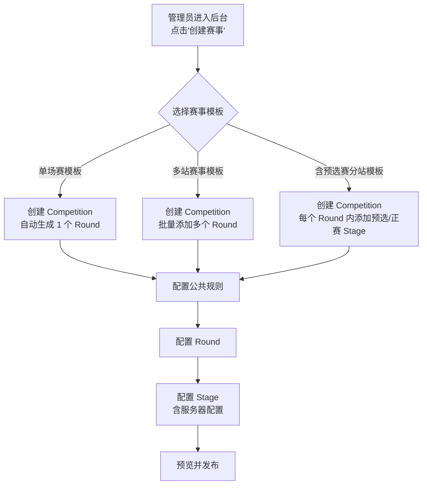
```mermaid
flowchart TD
    A[管理员进入后台<br/>点击'创建赛事'] --> B{选择赛事模板}

    B -->|单场赛模板| C[创建 Competition<br/>自动生成 1 个 Round]
    B -->|多站赛事模板| D[创建 Competition<br/>批量添加多个 Round]
    B -->|含预选赛分站模板| E[创建 Competition<br/>每个 Round 内添加预选/正赛 Stage]

    C --> F[配置公共规则]
    D --> F
    E --> F
    F --> G[配置 Round]
    G --> H[配置 Stage<br/>含服务器配置]
    H --> J[预览并发布]
```

### 4.2.2 Competition 创建流程

Competition 承载整项赛事的公共信息和默认规则。

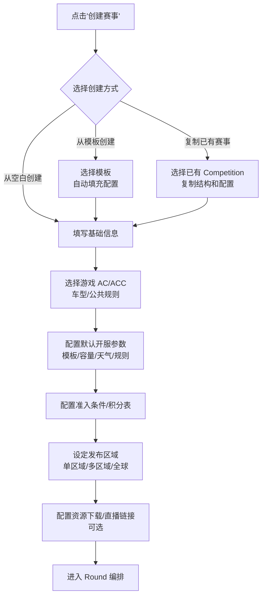
```mermaid
flowchart TD
    A[点击'创建赛事'] --> B{选择创建方式}

    B -->|从空白创建| C[填写基础信息]
    B -->|从模板创建| C1[选择模板<br/>自动填充配置]
    B -->|复制已有赛事| C2[选择已有 Competition<br/>复制结构和配置]

    C1 --> C
    C2 --> C

    C --> D[选择游戏 AC/ACC<br/>车型/公共规则]
    D --> E[配置默认开服参数<br/>模板/容量/天气/规则]
    E --> F[配置准入条件/积分表]
    F --> G[设定发布区域<br/>单区域/多区域/全球]
    G --> H[配置资源下载/直播链接<br/>可选]
    H --> I[进入 Round 编排]
```

**流程步骤**：

1. 管理员在后台选择"创建赛事"
2. 选择创建方式：空白创建 / 从模板创建 / 复制已有 Competition
3. 在表单顶部选择当前填写语言（中文 / 英文），切换后所有双语字段显示对应语言的输入区域
4. 填写 Competition 基础信息（名称、描述、封面图）—— 仅填写当前语言版本即可
5. 设定游戏平台、车型组、公共赛制参数、默认天气、默认是否进站；MVP 只允许选择 AC / ACC
6. 配置默认开服参数：
   - ACC：后台生成 `configuration.json`、`settings.json`、`event.json`、`eventRules.json`、`assistRules.json`、`bop.json`、`entrylist.json`
   - AC：后台生成 `server_cfg.ini`、`entry_list.ini`
   - 端口、管理员密码、容器路径由系统生成或运维模板提供
   - 服务器名称、加入密码、赛道、车辆、Session 时长、天气和规则可复用到前台展示
7. 配置准入条件和积分表
   - 准入条件描述（中/英）
   - 结构化积分表（可选）
   - 赛制规则、积分规则说明、晋级规则说明已合并到描述字段中
8. 选择发布区域（CN / AP / AM / EU，可多选或全选）
9. 配置资源下载、直播链接（可选）
10. 进入 Round 编排器

### 4.2.3 Round / Stage 编排流程

Round 编排器用于配置每一站的具体流程。管理员可以逐站添加，也可以用模板批量生成全赛季结构。

```mermaid
flowchart TD
    A[进入 Round 编排器] --> B{添加方式}
    B -->|单个添加| C[填写 Round 信息<br/>名称/赛道/报名时间]
    B -->|批量生成| D[填写起始日期<br/>重复规则/站数/赛道表]

    D --> C
    C --> E[添加 Stage]
    E --> F[配置名称/描述/时间<br/>Eligibility Source]
    F --> F1{eligibility_source?}
    F1 -->|roundRegistration| F2[无需额外配置]
    F1 -->|previousStageResult| F3[配置 advancement_rule<br/>metric/lapTimeMultiplier/limit]
    F1 -->|manualInvite| F4[勾选已报名车手]

    F2 & F3 & F4 --> K[打开"会话与服务器配置"弹窗<br/>统一配置 Sessions/Splits/GameSettings/EntryList]
    K --> L{继续添加 Stage?}
    L -->|是| E
    L -->|否| M{继续添加 Round?}
    M -->|是| C
    M -->|否| N[预览并发布]
```

**流程步骤**：

1. 管理员为 Competition 添加 Round
2. 填写 Round 名称、赛道、报名开始/截止、取消报名截止时间
3. 如是长期锦标赛，可批量生成多个 Round，并逐站补充赛道
4. 为 Round 添加 Stage（不再选择 Stage 类型，Stage 性质由名称和配置自然体现）：
   - 设置名称、描述（始终可编辑）、时间窗口
   - 配置 Eligibility Source：
     - `roundRegistration`：无需额外配置（仅提示文案）
     - `previousStageResult`：配置 `advancement_rule`——选择 metric（`lapTime`/`points`/`position`）；metric 为 `lapTime` 时填写圈速倍率（`lap_time_multiplier`，如 1.05 = 最快圈速的 105% 以内），为 `points`/`position` 时填写名额（`limit`）
     - `manualInvite`：从已报名车手中勾选参赛名单
   - 配置 Stage 级多 Split 参数（如需）
5. 在 Stage 的**"会话与服务器配置"弹窗**中统一配置（一个 Stage = 一份服务器配置）：
   - **Sessions 标签页**：编排游戏内 Practice/Qualifying/Race 的时长、时段、时间倍率（`Session`）
   - **Servers (Splits) 标签页**：配置 Split 1（基准服务器）的名称、密码、端口、车位等；多 Split 时其余 Split 从基准自动派生（见 4.5.7），可从开服模板快速填充基准配置
   - **Game Settings 标签页**：按 AC/ACC 配置文件（event.json、eventRules.json、assistRules.json、settings.json / server_cfg.ini）填写赛道、天气、规则、辅助限制等参数
   - **Entry List**：为每个 Split 管理参赛名单——可从 Round 报名自动生成，或手动添加/编辑条目
   - **BoP**：配置性能平衡条目
   - 系统根据 AC / ACC 自动生成对应配置文件，前台只展示可见字段
6. 预览 Competition 详情、每个 Round 的阶段时间线、当前/下一可报名 Round
7. 确认后保存为草稿或立即发布
   - 发布时校验：至少一种语言的所有必填字段已填写
   - 另一种语言的内容可后续随时补全

### 4.2.4 模板与复制

- 单场赛模板：生成 1 个 Round，默认包含 Practice / Qualifying / Race 的 `sessions`
- 多站赛事模板：批量生成多个 Round，每个 Round 复用相同 Stage 结构（含 `game_config` 和 `sessions`）
- 含预选赛分站模板：每个 Round 默认包含"预选赛"Stage（长时间开放 practice）和"正赛日"Stage（Practice / Qualifying / Race）
- 复制 Competition 时，可选择仅复制公共规则、复制 Round 结构、复制 Stage 结构（含服务器配置）；所有时间必须重新确认

## 4.3 赛事状态流转

> 状态分 **Competition / Round / Stage** 三层：**报名生命周期挂在 Round**，**比赛与成绩生命周期挂在 Stage**，**Competition 状态取"当前站"**（4.3.1）。状态主要由"时间到点 + 成绩动作"自动推导，叠加少量管理员人工覆盖（4.3.6）。

### 4.3.1 三层与聚合口径

- **Round（分站）** —— 用户报名与参赛的主单位，状态见 4.3.2。
- **Stage（阶段）** —— Round 内的预选/正赛等阶段，自身有时间窗口与成绩子状态（4.3.3）。
- **Competition（赛事）= 当前站状态** —— 按 `round_number` 顺序取**第一个尚未进入终态（Completed / ResultsLocked / Cancelled）的 Round**；若全部终结，则取最后一站。Competition 状态 = 该站的状态（**取代旧的优先级聚合**；列表筛选、首页待办均按此口径）。`Draft` / `Cancelled` 人工覆盖仍优先。

### 4.3.2 Round 状态机

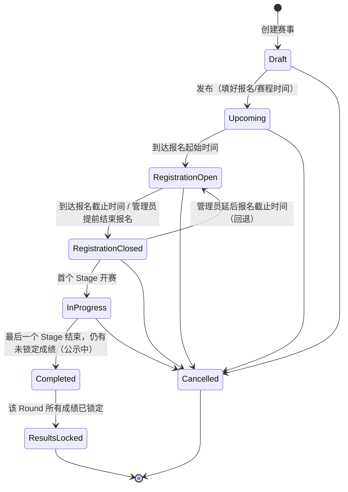
```mermaid
stateDiagram-v2
    [*] --> Draft: 创建赛事
    Draft --> Upcoming: 发布（填好报名/赛程时间）
    Upcoming --> RegistrationOpen: 到达报名起始时间
    RegistrationOpen --> RegistrationClosed: 到达报名截止时间 / 管理员提前结束报名
    RegistrationClosed --> RegistrationOpen: 管理员延后报名截止时间（回退）
    RegistrationClosed --> InProgress: 首个 Stage 开赛
    InProgress --> Completed: 最后一个 Stage 结束，仍有未锁定成绩（公示中）
    Completed --> ResultsLocked: 该 Round 所有成绩已锁定
    ResultsLocked --> [*]
    Draft --> Cancelled
    Upcoming --> Cancelled
    RegistrationOpen --> Cancelled
    RegistrationClosed --> Cancelled
    InProgress --> Cancelled
    Cancelled --> [*]
```

| 流转 | 触发 |
|------|------|
| Draft → Upcoming | 赛事发布且当前时间 < 报名开始 |
| Upcoming → RegistrationOpen | 到达报名起始时间 |
| RegistrationOpen → RegistrationClosed | 到达报名截止时间，或管理员**提前结束报名** |
| RegistrationClosed → RegistrationOpen | 管理员**延后报名截止时间 / 重开报名**（回退） |
| RegistrationClosed → InProgress | 任一 Stage 进入其时间窗口 |
| InProgress → Completed | 最后一个 Stage 结束，存在"已出成绩但未锁定（公示中）" |
| Completed → ResultsLocked | 该 Round 所有成绩已锁定 |
| 任意 → Cancelled | 管理员取消（开赛前可撤销恢复） |

### 4.3.3 Stage 成绩子状态：公示 → 锁定

成绩生命周期挂在 Stage 上，分两段（取代旧的"录入 → 发布才可见"）：

| 阶段 | 含义 | 可见 | 可改成绩 | 可申诉 | 积分 |
|------|------|:---:|:---:|:---:|------|
| **无成绩** | Stage 未结束或未上报 | — | — | — | — |
| **公示中** | Stage 结束 / 服务器上报后，成绩**立即对用户展示**；进入复核 + 申诉窗口 | ✅ 立即 | ✅ 管理员 | ✅ 选手 | 未计入 |
| **锁定** | 管理员锁定，或公示窗口到期自动锁定 | ✅ | 🔒 | 🔒 | **发放并计入榜单** |

- **展示不需要"发布"动作**：服务器成绩一产生即对用户可见；管理员的关键动作是**锁定**。
- **公示窗口可配**：时长为每赛事配置项 `result_lock_window_hours`（默认 24h）；窗口到期**自动锁定**，管理员也可**提前锁定**。
- **锁定以整个 Stage 为单位**一次完成（该 Stage 所有 Split 同时锁定，无逐 Split 部分锁定）。
- 锁定后**冻结成绩与统计口径、停止申诉、发放积分**；**仅已锁定的成绩计入积分榜**。
- 多 Round 锦标赛：**下一 Round 仍为自由报名**，不依据上一 Round 成绩定资格；`previousStageResult` 资格来源仅在**同一 Round 内 Stage 之间**（如预选→正赛）生效，且以**已锁定成绩**为依据。

### 4.3.4 各状态可执行操作（选手 / 管理员）

| 状态 | 选手 | 管理员 |
|------|------|--------|
| **Draft 草稿** | 不可见 | 编辑全部、删除、发布 |
| **Upcoming 已发布·报名未开放** | 浏览详情/规则/赛程 | 编辑配置、提前开放报名、取消 |
| **RegistrationOpen 报名中** | **报名**（自动通过）、截止前自助取消、满员加入候补 | 移除/转候补个别车手、提前结束报名、取消；身份/规则已锁 |
| **RegistrationClosed 报名截止** | 查看最终名单/分组、不可再自助报名 | **分组+应用名单**、开服、延后报名回退、缺额补位；资格来源已锁 |
| **InProgress 进行中** | 参赛、看实时成绩、赛后窗口提交抗议 | 监控/启停服务器、Stage 结束后修正成绩、判罚；开始时间锁、结束时间可调 |
| **Completed 成绩公示中** | **立即看成绩**、公示窗口内提交抗议/申诉 | 修正成绩、判罚、**锁定成绩**（可提前） |
| **ResultsLocked 成绩已锁定** | 看最终成绩/名次/积分构成；不可再申诉 | 算下一 Stage 名单（晋级）；成绩已锁定不可修改 |
| **Cancelled 已取消** | 看取消通知与原因 | 开赛前可撤销恢复 |

### 4.3.5 字段编辑锁（硬拦截）

**编辑锁为硬拦截**：被锁字段在该状态下禁用、提交即拒绝（非软提醒）。关键规则：

- **身份/规则**（游戏、车型组、赛区、积分表、准入门槛）：**报名一开放即锁定**，此后不可改。
- **成绩锁定窗口**（`result_lock_window_hours`）：**成绩锁定前随时可改**；一旦该 Stage 成绩锁定（手动或自动），不可再改。
- **人数上限 / 容量**：报名开放后可改，但**不得低于当前已报名人数**。
- **参赛资格来源**（eligibility_source）：**报名截止起锁定**。
- **Stage 起止时间**：Stage 进行中**开始时间锁定、结束时间可调**；已结束阶段锁定。
- **服务器配置 / 参赛名单**：对应 Stage 已开服 / 已开赛后锁定。
- **成绩与统计口径**：公示中可改，**锁定后锁死**。
- **报名时间**：报名截止后仍可延后以回退到"报名开放"。
- 完整字段 × 状态矩阵见配套文档《赛事状态流转设计》§4。

### 4.3.6 人工状态覆盖

默认由时间 + 成绩推导，管理员可额外**手动覆盖**以下报名阶段状态（均留痕）：

| 覆盖 | 作用 |
|------|------|
| 草稿 / 取消（恢复） | 保持未发布 / 终止赛事（开赛前可恢复） |
| **提前结束报名** | 未到截止也立即关闭报名 → RegistrationClosed |
| **重新开放 / 延长报名** | 已截止后重新开放 → RegistrationOpen |

> 比赛/成绩阶段（进行中/公示/锁定）**不设强制跳转**——管理员通过调整 Stage 时间或"提前锁定"动作控制，而非直接改状态。

## 4.4 赛事模板系统

### 4.4.1 模板功能

- 管理员可将任意已创建的赛事保存为模板
- 模板保存完整开服配方三块：`game_config`（游戏引擎参数）、`sessions`（游戏内 P/Q/R Session 时序）、`split_config`（**服务器设置**：服务器名称、密码、端口、容量及各类服务器开关/高级项——除参赛报名名单外的全部服务器字段）
- 模板编辑页直接编辑上述三块（服务器设置、Session 时序、游戏配置），与赛事内"会话与服务器配置"弹窗使用同一套字段组件
- **不含**与实际报名相关的内容（参赛名单 / BoP / 实际组数与每组人数）——这些在报名后按真实情况生成
- 创建新赛事时可从模板列表中选择，自动填充配置；在 Stage 的"会话与服务器配置"弹窗中可从开服模板快速加载参数
- 模板支持编辑和删除

### 4.4.2 模板管理

| 操作 | 说明 |
|------|------|
| 创建模板 | 从已有赛事"另存为模板"，或直接创建新模板 |
| 编辑模板 | 修改模板中的任意配置 |
| 删除模板 | 仅删除模板，不影响已创建的赛事 |
| 复制赛事 | 选择任意已有赛事，复制其全部配置创建新赛事（时间等需重新填写） |

## 4.5 多 Split（分组/多服务器）配置

### 4.5.1 功能概述

当报名人数较多、需要多个并行游戏服务器（Split）时，管理员在**报名截止后**根据实际报名人数决定分几个服务器，并把报名**尽量均分**到各 Split。每个 Split 独立进行比赛，对应一个服务器实例，维护独立的参赛名单（Entry List）和成绩。

> **配置层级**：服务器（Split）数量**不在 Stage 预设**，而是在报名截止后于报名页确定（见 4.5.4）。Stage 层级仅保留 `split_assignment_rule`（默认分组方式）与 `min_entries`（开赛下限），不再有 `max_splits` / `max_entries_per_split` / `enable_multi_split` 及"总容量"概念。

### 4.5.2 配置项

> 以下为 Stage 级字段，在 Stage 编辑界面和"会话与服务器配置"弹窗中设置。

| 配置项 | 类型 | 说明 |
|--------|------|------|
| 默认分组方式 `split_assignment_rule` | Enum | `time`（按报名时间）/ `random`（随机）/ `skill`（按水平，即将推出）。仅作为报名页分组时的**默认值**，实际分组在报名截止后于报名页执行（见 4.5.4） |
| 开赛下限 `min_entries` | Integer | 最低开赛人数；报名截止人数低于此值时报名页提示，亦作为分组时"每组人数过少"的下限 |

> **Entry List（参赛名单）**：每个 Split 维护独立的 `entry_list`（EntryListEntry[]），可从 Round 报名名单自动生成（自动填充车手姓名、车队、赛车号），也支持手动添加/编辑/删除。自动生成时会弹出确认提示。详见 4.1.6 EntryListEntry 和 4.1.8。

### 4.5.3 报名总量控制

报名总量由 **Round 级 `max_registrations`** 控制（仅用于限制报名过多，不做 Stage 容量校验）：

- 为空表示不限制报名人数
- 达到 `max_registrations` 后，新用户无法报名（报名按钮显示"名额已满"），可加入候补
- 车手取消报名后释放名额，候补或新用户可继续报名
- 报名页实时显示："当前已报名 X 人"；分组后显示 "N 个服务器，每组约 ⌊X/N⌋ 人"

### 4.5.4 Split 分组流程

分组在**报名管理页**进行（入口：报名管理 → 选赛事 → 进入单赛事报名页，按分站逐级展开）。核心原则：**报名截止后由管理员根据实际报名人数决定分几组，且各组人数均分**（组间人数差 ≤ 1）。

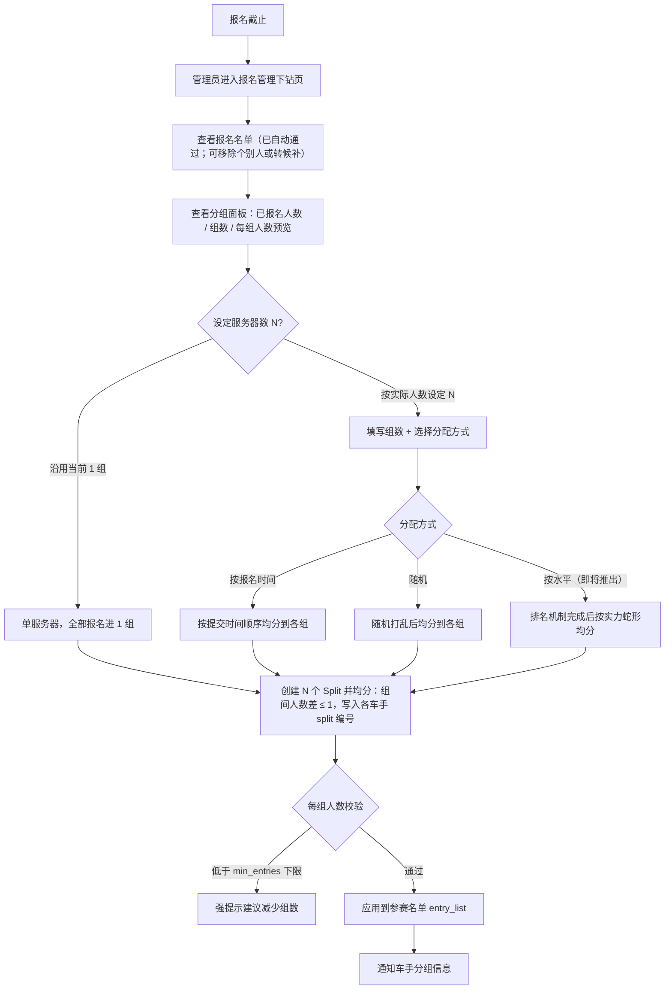
```mermaid
flowchart TD
    A[报名截止] --> B[管理员进入报名管理下钻页]
    B --> C[查看报名名单（已自动通过；可移除个别人或转候补）]
    C --> D[查看分组面板：已报名人数 / 组数 / 每组人数预览]
    D --> E{设定服务器数 N?}
    E -->|沿用当前 1 组| F[单服务器，全部报名进 1 组]
    E -->|按实际人数设定 N| G[填写组数 + 选择分配方式]
    G --> H{分配方式}
    H -->|按报名时间| H1[按提交时间顺序均分到各组]
    H -->|随机| H2[随机打乱后均分到各组]
    H -->|按水平（即将推出）| H3[排名机制完成后按实力蛇形均分]
    F & H1 & H2 & H3 --> I[创建 N 个 Split 并均分：组间人数差 ≤ 1，写入各车手 split 编号]
    I --> J{每组人数校验}
    J -->|低于 min_entries 下限| K[强提示建议减少组数]
    J -->|通过| L[应用到参赛名单 entry_list]
    L --> M[通知车手分组信息]
```

- **均分**：N 组 M 人时，前 `M%N` 组各 `⌈M/N⌉` 人、其余各 `⌊M/N⌋` 人，保证组间人数差 ≤ 1
- **服务器数 N** 在报名截止后由管理员决定（无预设上限/容量）；填写 N 后系统创建 N 个 Split 并均分
- **分配方式**：`按报名时间`（默认，保留报名顺序）、`随机`；`按水平` 待排名（ranking）机制完成后再开放（蛇形均分各组实力）
- **强提示场景**：按当前组数均分后每组人数低于 `min_entries`，建议减少组数
- 默认分配方式取自 Stage 的 `split_assignment_rule`
- 仅对「资格来源 = 分站报名」的 Stage 分组；晋级类 Stage（上一阶段成绩）不参与报名分组

### 4.5.5 Split 信息展示

- 报名页面实时显示："当前已报名 X 人（N 个服务器，每组约 ⌊X/N⌋ 人）"
- 分组公布后，车手在赛事详情页看到自己所在的 Split 编号
- 每个 Split 独立展示：参赛名单、服务器信息、比赛时间、成绩

### 4.5.6 边缘情况处理

| 边缘情况 | 处理方案 |
|---------|---------|
| 报名截止人数低于开赛下限（`min_entries`） | 报名页**强提示**人数不足，建议重开报名（回退报名开放）或下调下限 |
| 按当前组数均分后每组人数过少 | 报名页**强提示**（低于 `min_entries` 下限），建议减少组数 |
| 车手临时退赛导致某 Split 人数骤减 | 管理员可在报名页重新选组数并再次「均分分组」，重算各组 |
| 按水平分组（尚未上线） | 排名（ranking）机制完成后再开放，按实力蛇形均分；当前仅支持按报名时间 / 随机 |
| 锦标赛不同赛事分组可能变化 | 每场赛事独立重新分组 |
| 并行 Split 成绩如何统一排名 | 由管理员在赛制规则中说明（各 Split 独立积分 / 按 Split 系数折算等），平台不做强制约束 |
| Stage 开赛后再调整分组 | 一旦 Stage 开赛，分组与名单应用即**硬锁定**（见 4.x 锁矩阵），不可再均分/应用 |
| 未设置 `max_registrations`（为空） | 不限制报名总量；服务器数量仍由报名截止后人工决定 |
| 报名达到 `max_registrations` | 新用户无法报名（报名按钮显示"名额已满"），可加入候补 |

### 4.5.7 多 Split 服务器配置派生规则

模版（StageTemplate）在设计上只包含**一份服务器配置**（splitConfig）。开赛前管理员在"会话与服务器配置"弹窗中应用模版时，Stage 仅有 1 个 Split，模版配置完整落地到 Split 1。当报名截止后管理员扩展为 N 个 Split 时，新增的服务器配置按以下规则**自动派生**。

**设计原则：Split 1 为"基准服务器"（母版），其余 Split 从基准派生。**

> 由于每个 Split 运行在**独立物理服务器**上，端口无需递增，各 Split 使用相同端口号；密码、标志位、容量等服务器参数也完全一致。**唯一不同的是** serverName（可区分）和 entryList / results（各自独立）。

**时机 1：报名截止后扩展分组（`assignStageSplits` → `ensureSplitCount` 创建 Split N，N > 1）**

| 字段 | 处理方式 |
|------|---------|
| 服务器参数（密码、端口、标志位、容量、welcomeMessage 等） | 从 Split 1 **克隆**，值完全相同 |
| serverName | **派生**：`{Split1.serverName} #{N}`（基准名为空时用 `Server #{N}` 兜底） |
| entryList | 清空（待分配时填入） |
| results / resultsLockedAt | 清空 |
| id / splitNumber | 各自独立 |

**时机 2：管理员回到赛事管理调整服务器参数后保存（ServerConfigModal `handleSave`）**

管理员编辑了 Split 1 的服务器参数（或重新应用了模版），保存时自动执行**参数广播**：

- Split 1 → 保持管理员编辑的内容
- Split 2..N → 从 Split 1 同步全部服务器参数（密码、端口、标志位、容量等）
- **保留**各自的 id、splitNumber、serverName（从新基准名重新派生 `#{N}`）、entryList、results、resultsLockedAt

**时机 3：模版重新应用（`handleApplyTemplate`）**

1. 模版 splitConfig → 只写入 Split 1
2. 触发参数广播：Split 1 的服务器参数 → 同步到 Split 2..N
3. Split 2..N 的 serverName 从 Split 1 的新名字重新派生

**不需要新增模型字段**：端口不递增、不引入 portStep / namingPattern。派生逻辑是纯运行时行为，集中在 `ensureSplitCount`（扩展时克隆+改名）和 `propagateFromBase`（保存/应用模版时广播参数）。

## 4.6 赛事准入门槛

### 4.6.1 准入配置

管理员创建赛事时可配置准入条件：

| 准入类型 | 说明 | 配置方式 |
|---------|------|---------|
| 无限制 | 所有注册用户均可报名 | 默认选项 |
| 规则确认 | 报名前需阅读并勾选确认赛事规则 | 勾选框 |
| 自定义条件 | 双语文字描述准入条件（如"需持有 DLC"） | 自由文本（中/英） |

> 注：MVP 阶段不含 Rating 系统，因此暂不包含基于 Rating 的准入门槛。后续版本可扩展。

### 4.6.2 报名确认流程

1. 车手点击"报名"按钮
2. 系统检查准入条件和赛制规则
   - 若有准入条件或赛制规则：弹出"报名前须知"弹窗，上方显示准入条件描述，下方显示赛制规则内容，车手需勾选"我已阅读并同意以上内容"
   - 若均无：直接完成报名
3. 检查通过后完成报名

## 4.7 赛事取消与最低人数

### 4.7.1 最低人数阈值

- 管理员可配置赛事最低开赛人数
- 报名截止时，若报名人数低于阈值：
  - 系统在管理后台发出警告提示
  - 管理员可选择：强制开赛 / 取消赛事 / 延长报名时间

### 4.7.2 管理员取消赛事流程

1. 管理员在后台选择要取消的赛事
2. 填写取消原因（中英双语）
3. 确认取消
4. 系统自动：
   - 赛事状态变为"已取消"
   - 向所有已报名车手发送取消通知（站内 + 邮件，根据配置）
   - 取消原因展示在赛事详情页

### 4.7.3 边缘情况处理

| 边缘情况 | 处理方案 |
|---------|---------|
| 取消锦标赛中的某一场（非整个锦标赛） | 管理员可单独取消某一场赛事，锦标赛整体状态不变，积分规则由管理员手动调整 |
| 已有人报名后修改赛事关键参数 | 以下字段在有人报名后不可修改：游戏平台、赛道、比赛时间。其他字段修改需确认提示 |
| 赛事时间与其他已发布赛事冲突 | 管理后台显示警告"同一时段已有 N 场赛事"，但不强制阻止发布 |

---

## 4.8 游戏平台参考指南

不同游戏的多人联机方式、服务器搭建和成绩导出能力差异较大，直接影响管理员在后台的配置方式和前台车手的加入方式。MVP 阶段只支持 AC / ACC，目标是先把"后台填写参数 → 自动生成配置文件 → 自动启动服务器 → 自动导入成绩"跑通。

### 4.8.1 游戏分类

#### MVP：自建专用服务器

管理员需要搭建或租用专用服务器，配置服务器参数后车手通过游戏内服务器浏览器加入。

| 游戏 | 服务器获取 | 配置方式 | 车手加入方式 | 成绩导出能力 |
|------|-----------|---------|------------|------------|
| **ACC** | Steam 下载 ACC Dedicated Server 工具 | JSON 配置文件：`configuration.json`、`settings.json`、`event.json`、`eventRules.json`、`assistRules.json`、`bop.json`、`entrylist.json` | 游戏内服务器浏览器 / Quick Join / 直连链接（如有） | **优秀**：自动生成结果文件，可按 Steam ID 匹配 |
| **AC** | SteamCMD 或游戏目录中的 Dedicated Server 工具 | INI 配置文件：`server_cfg.ini`、`entry_list.ini` | 游戏内服务器浏览器 / Content Manager / 直连 IP | **优秀**：结果文件 + 社区插件生态，可按 Steam GUID/SteamID64 匹配 |

> 后续扩展其他游戏时，需要新增对应的 `GameServerAdapter`，但不影响 Competition / Round / Stage 的核心模型。

### 4.8.2 对平台功能的影响

#### 管理员后台 — 自动开服配置

管理员创建赛事时先填写游戏服务器参数，平台再生成配置文件并启动服务器。后台表单应分为"通用字段"和"游戏高级字段"：

| 表单分组 | 通用字段 | 说明 |
|---------|---------|------|
| 基础信息 | 服务器名称、加入密码、公开/私密、最大车位 | 前台可复用服务器名称、加入密码、容量 |
| 赛道与车辆 | 赛道、布局、车型组/车辆列表、涂装/车号 | 前台可复用赛道、车辆和车型组 |
| Session 编排 | Practice / Qualifying / Race 的顺序、时长、圈数、是否允许中途加入 | 映射到 `Stage.sessions` 时间线 |
| 天气与环境 | 天气、气温、路温、时间倍率、动态路面 | 前台可展示为规则摘要 |
| 赛事规则 | 进站、油耗、胎耗、损伤、辅助限制、发车/编队规则 | 前台展示可读规则，不展示原始字段名 |
| Entry List / Split | 报名车手、Steam ID、车队、车号、配重、限流 | Steam ID 不前台展示 |
| 基础设施 | 端口、管理员密码、容器路径、插件地址、结果文件路径 | 系统/运维字段，不给前台 |

前台赛事详情页的"服务器信息"板块根据 AC / ACC 展示同一套用户心智：服务器名称、密码、加入方式、当前 Session、赛道、车辆、规则摘要。底层字段来自不同配置文件，但前台不暴露这种差异。

#### 成绩导入能力

| 导入等级 | 游戏 | 导入方式 |
|---------|------|---------|
| **可自动导入** | ACC、AC | 读取游戏/插件输出的结果文件，系统解析并按 Steam 账号匹配车手 |

### 4.8.3 后续迭代建议

- 抽象 `GameServerAdapter`：负责把平台标准字段转换为游戏配置文件，并暴露可前台复用字段
- 抽象 `ResultImporter`：负责解析游戏结果文件并转换为统一 Result
- AC / ACC 稳定后，再评估 AC Evo、iRacing、LMU、rF2、ETS2 等游戏是否进入创建器

### 4.8.4 玩家身份映射

成绩导入时需要将游戏结果中的玩家与平台用户对应起来。不同游戏的玩家唯一标识不同，映射策略如下：

**映射对照表**：

| 游戏 | 游戏内唯一标识 | 平台用户对应字段 | 匹配方式 |
|------|--------------|----------------|---------|
| ACC / AC | SteamID64 / Steam GUID | 用户绑定的 Steam 账号获取的 SteamID64 | **自动匹配**（结果文件或 Entry List 含 Steam 标识） |

**自动匹配流程**：

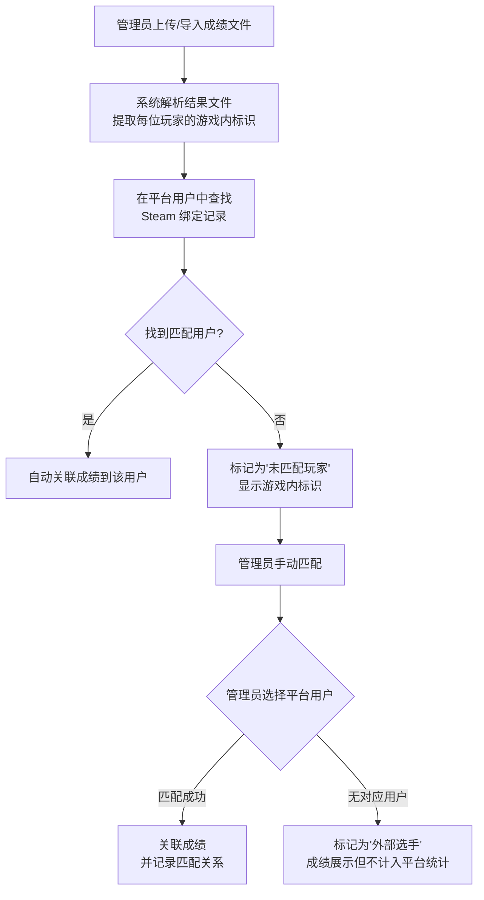
```mermaid
flowchart TD
    A[管理员上传/导入成绩文件] --> B[系统解析结果文件<br/>提取每位玩家的游戏内标识]
    B --> C[在平台用户中查找<br/>Steam 绑定记录]
    C --> D{找到匹配用户?}

    D -->|是| E[自动关联成绩到该用户]
    D -->|否| F[标记为'未匹配玩家'<br/>显示游戏内标识]

    F --> G[管理员手动匹配]
    G --> H{管理员选择平台用户}
    H -->|匹配成功| I[关联成绩<br/>并记录匹配关系]
    H -->|无对应用户| J[标记为'外部选手'<br/>成绩展示但不计入平台统计]
```

**匹配失败处理**：

| 场景 | 处理方案 |
|------|---------|
| 结果文件中的玩家未在平台注册 | 标记为"未匹配"，管理员可标记为"外部选手"，成绩展示但不计入平台用户统计 |
| 结果文件中的玩家已注册但未绑定对应游戏 ID | 标记为"未匹配"，显示游戏内 ID。管理员可通知该用户补充游戏 ID 后重新匹配 |
| 多个平台用户绑定了相同的 Steam 账号 | 系统不允许（绑定时校验唯一性） |
| 用户更换了 Steam 账号 | 用户可在账号设置中更新，管理员可在后台手动修改匹配关系 |

---

# 5. 赛事浏览与报名（前台）

## 5.1 赛事列表页

### 5.1.1 页面功能

- 展示当前区域的所有赛事（含跨区域赛事中发布到本区域的赛事）
- 支持筛选和排序
- 支持切换区域查看其他区域的赛事

### 5.1.2 筛选条件

| 筛选项 | 类型 | 说明 |
|--------|------|------|
| 游戏平台 | 多选 | AC / ACC |
| 车型组 | 多选 | GT3 / GT4 / Formula 等 |
| 时间范围 | 单选 | 本周 / 本月 / 未来所有 |

### 5.1.3 排序选项

| 排序方式 | 说明 |
|---------|------|
| 时间先后（默认） | 按比赛开始时间排序 |
| 报名热度 | 按当前报名人数排序 |
| 最近发布 | 按赛事创建时间排序 |

### 5.1.4 列表卡片信息

赛事列表统一展示 Competition 卡片。

**Competition 卡片**展示：

- 封面图 + 游戏平台标签
- 赛事名称
- 车型组
- Round 数量（仅多 Round 赛事显示）
- 当前/下一 Round 名称、赛道、比赛时间
- 当前 Stage 标签（如预选赛开放中、正赛日、决赛）
- 当前报名人数 / 容量 + 状态标签（右对齐）
- 如当前 Stage 是预选赛，可展示晋级线摘要（如"前 30 晋级，当前第 30 名 1:58.234"）

## 5.2 赛事详情页

平台统一使用 Competition 详情页。无论单场赛还是多站锦标赛都通过同一个页面结构展示，只是 Round/Stage 数量不同。

### 5.2.1 Competition 详情页

```
┌──────────────────────────────────────────┐
│ 封面图 + Competition 名称 + 状态标签      │
├──────────────────────────────────────────┤
│ 基础信息栏                               │
│ ├── 游戏平台                             │
│ ├── 车型组                               │
│ ├── 天气 / 进站                          │
│ └── Round 数量                           │
├──────────────────────────────────────────┤
│ Tab：概览 / 赛程 / 预选榜 / 成绩 / 积分榜 │
├──────────────────────────────────────────┤
│ Tab 1: 概览                              │
│ ├── 描述（含赛制/积分/晋级规则）         │
│ ├── 准入条件                             │
│ ├── 积分表                               │
│ ├── 资源下载                             │
│ └── 公告 / 更新日志                      │
├──────────────────────────────────────────┤
│ Tab 2: 赛程                              │
│ ├── Round 列表                           │
│ ├── 每个 Round 展示 Stage 时间线          │
│ └── 点击 Round 进入分站详情              │
├──────────────────────────────────────────┤
│ Tab 3: 预选榜                            │
│ ├── 当前/历史预选 Stage 选择             │
│ ├── 圈速榜 / 积分榜                      │
│ └── 晋级线与候选名单                     │
├──────────────────────────────────────────┤
│ Tab 4: 成绩                              │
│ ├── Round / Stage / Session 筛选          │
│ └── 成绩表                               │
├──────────────────────────────────────────┤
│ Tab 5: 积分榜                            │
│ └── Competition 总积分 / 分阶段积分      │
├──────────────────────────────────────────┤
│ 右侧栏：当前/下一 Round 行动区           │
│ ├── 当前 Stage 状态                      │
│ ├── 报名/取消报名                        │
│ ├── 当前服务器信息（报名后可见）          │
│ └── 添加到日历                           │
└──────────────────────────────────────────┘
```

### 5.2.2 Round 详情页

Round 详情页用于展示某一站内部的完整 Stage / Session 流程。该页可以是独立路由，也可以在 Competition 详情页中以内嵌面板呈现。

```
┌──────────────────────────────────────────┐
│ Round 名称 + 赛道 + 当前状态             │
├──────────────────────────────────────────┤
│ Stage 时间线：预选赛 → 正赛日 → 决赛     │
├──────────────────────────────────────────┤
│ 当前 Stage 卡片                          │
│ ├── Stage 名称 / 时间窗口                │
│ ├── 晋级规则 / 当前晋级线                │
│ ├── 可进入 Session / 服务器信息          │
│ └── 当前榜单或直播                       │
├──────────────────────────────────────────┤
│ Stage 详情列表                           │
│ ├── 预选赛 Stage                         │
│ │   ├── Practice Session（长时间开放）   │
│ │   ├── 圈速榜                           │
│ │   └── 晋级候选名单                     │
│ ├── 正赛日 Stage                         │
│ │   ├── Practice Session                 │
│ │   ├── Qualifying Session               │
│ │   └── Race Session                     │
│ └── 决赛 Stage（如有）                   │
├──────────────────────────────────────────┤
│ 报名和服务器信息                         │
│ ├── Round 报名状态                       │
│ ├── 当前可参与 Session                   │
│ └── 服务器名称 / 密码 / 直连链接         │
├──────────────────────────────────────────┤
│ 成绩与抗议入口                           │
│ ├── 按 Session 展示成绩                  │
│ └── 赛后可提交抗议                       │
└──────────────────────────────────────────┘
```

**Round 展示规则**：

- Round 只展示本分站特有信息：名称、赛道、报名窗口、Stage 时间线、当前服务器、成绩、抗议入口
- Competition 公共信息（游戏、车型、公共规则、资源等）在 Competition 详情页顶部统一展示
- Stage 可折叠展开；当前 Stage 默认展开并置顶
- 预选赛 Stage 展示持续开放服务器、圈速榜、晋级线和候选名单
- 正赛日 Stage 展示 Practice / Qualifying / Race 的 Session 顺序、时间和服务器信息
- 成绩必须绑定具体 Session；Competition 详情页仅做聚合展示

### 5.2.3 双时区显示

- 所有时间同时显示**赛事当地时间**和**用户本地时间**
- 格式示例：`2026-04-20 20:00 (UTC+8) / 2026-04-20 12:00 (UTC)`
- 跨区域报名的赛事：额外标注赛事所在时区

## 5.3 报名流程

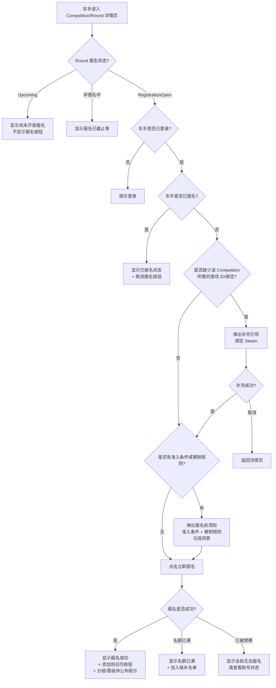
```mermaid
flowchart TD
    A["车手进入 Competition/Round 详情页"] --> B{"Round 报名状态?"}
    B -->|Upcoming| B0["显示尚未开放报名<br/>不显示报名按钮"]
    B -->|非报名中| B1["显示报名已截止等"]
    B -->|RegistrationOpen| C{"车手是否已登录?"}

    C -->|否| C1["提示登录"]
    C -->|是| D{"车手是否已报名?"}

    D -->|是| D1["显示已报名状态<br/>+ 取消报名按钮"]
    D -->|否| E{"是否缺少该 Competition<br/>所需的游戏 ID/绑定?"}

    E -->|是| E2["弹出补充引导<br/>绑定 Steam"]
    E -->|否| E3{"是否有准入条件或赛制规则?"}

    E2 --> E2A{"补充成功?"}
    E2A -->|是| E3
    E2A -->|取消| D2["返回详情页"]

    E3 -->|无| F["点击立即报名"]
    E3 -->|有| E1["弹出报名前须知<br/>准入条件 + 赛制规则<br/>勾选同意"]

    E1 --> F
    F --> G{"报名是否成功?"}

    G -->|是| H["显示报名成功<br/>+ 添加到日历按钮<br/>+ 分组/晋级待公布提示"]
    G -->|名额已满| G1["显示名额已满<br/>+ 加入候补名单"]
    G -->|已被禁赛| G2["显示当前无法报名<br/>请查看账号状态"]
```

> **报名自动通过**：提交报名即视为通过（`approved`），**没有"待审/审核"环节**，车手立即看到"报名成功"。后台无报名审批队列；管理员仅在需要时对个别车手手动「移除报名」或「转为候补」（也可恢复）。报名状态枚举：`approved` / `waitlisted` / `rejected` / `withdrawn`（无 `pending`）。

### 5.3.1 报名成功后操作

| 操作 | 说明 |
|------|------|
| **添加到日历** | 生成 .ics 文件，用户可导入 Google Calendar / Outlook / Apple Calendar 等。包含 Competition / Round / Session 名称、时间、赛道、服务器信息 |
| **查看参赛名单** | 在 Round 详情页查看所有已报名车手 |
| **等待分组通知** | 若启用多 Split，提示"报名截止后将公布分组结果" |

### 5.3.2 取消报名流程

1. 车手在 Competition 或 Round 详情页点击"取消报名"
2. 系统检查是否在取消报名截止时间之前
   - 若已过截止时间：提示"已过取消报名截止时间，如需退出请联系管理员"
   - 若仍在截止时间之前：弹出确认对话框
3. 车手确认取消
4. 名额释放，系统更新报名人数
5. 若启用多 Split 且分组已公布，从对应 Split 中移除该车手
6. 发送取消确认通知（站内）

## 5.4 候补机制

当赛事报名人数达到上限时：

1. 后续报名的车手进入候补名单（Waitlist）
2. 候补名单按报名时间排序
3. 当有车手取消报名释放名额时：
   - 系统自动按候补顺序通知下一位候补车手
   - 候补车手收到通知后需在限定时间内（如 24 小时）确认参赛
   - 超时未确认则名额顺延至下一位候补
4. 候补状态在报名页面实时展示（如"候补名单第 3 位"）

## 5.5 服务器信息展示

### 5.5.1 展示规则

- 服务器信息卡片在**报名后**对已报名车手始终可见
- 如后台自动开服配置已生成可展示信息（名称/密码/加入方式），正常展示
- 如管理员尚未填写，卡片仍显示，提示"比赛进入方式稍后提供"
- 未报名用户看不到服务器信息卡片
- 直连链接（如有）同步展示
- 展示字段来自 AC / ACC 开服配置的可见子集，不展示管理员密码、端口、Steam ID/GUID、插件地址和内部路径

### 5.5.2 展示方式

| 方式 | 说明 | 适用场景 |
|------|------|---------|
| 文字信息 | 展示服务器名称、密码 | AC / ACC |
| 直连链接 | 点击链接直接启动游戏并加入服务器 | 支持 URL Scheme 的游戏（如 ACC 的 `acc://` 链接） |
| 规则摘要 | 展示赛道、车辆、Session 时长、必要规则和天气摘要 | AC / ACC |

两种方式同时展示，车手可选择使用。

## 5.6 边缘情况处理

| 边缘情况 | 处理方案 |
|---------|---------|
| 赛事详情页加载时赛事刚刚被取消 | 页面顶部显示醒目的"本场赛事已取消"横幅，附取消原因 |
| 用户尝试报名其他区域的赛事 | 允许报名，但在报名确认时额外提示"该赛事的服务器可能不位于您的当前区域，服务器连通性和延时可能受影响。" |
| 报名时网络中断 | 前端防重复提交，后端幂等设计。恢复网络后查询报名状态 |
| .ics 文件中的时区信息 | 使用 IANA 时区标准（如 Asia/Shanghai），确保各日历应用正确解析 |
| 车手在多台设备上同时操作 | 以最后一次操作为准，服务端校验报名状态 |
| 车手报名后修改了用户名 | 不影响报名记录，报名记录使用用户 ID 关联 |

---

# 6. 成绩与排名

## 6.1 成绩录入

### 6.1.1 混合录入模式

平台 MVP 阶段优先支持自动导入，具体能力取决于游戏平台（详见 4.8.2）：

| 方式 | 说明 | 适用游戏 |
|------|------|---------|
| **自动导入** | 上传或读取游戏/插件生成的结果文件，系统自动解析并匹配车手 | ACC、AC |
| **手动录入** | 管理员手动修正或补录成绩表 | ACC、AC 的兜底能力 |

### 6.1.2 成绩录入流程

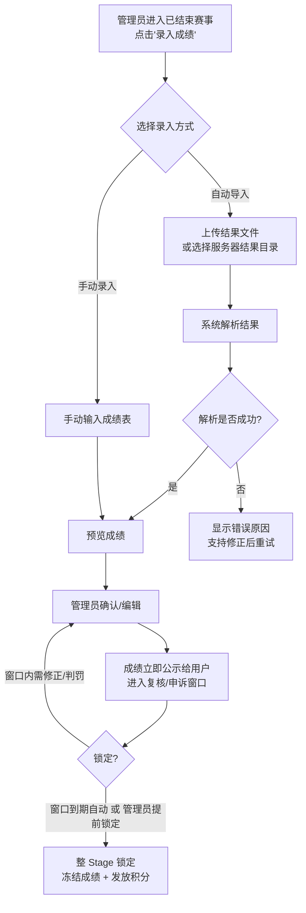
```mermaid
flowchart TD
    A[管理员进入已结束赛事<br/>点击'录入成绩'] --> B{选择录入方式}

    B -->|自动导入| C[上传结果文件<br/>或选择服务器结果目录]
    B -->|手动录入| D[手动输入成绩表]

    C --> E[系统解析结果]
    E --> F{解析是否成功?}
    F -->|是| G[预览成绩]
    F -->|否| F1[显示错误原因<br/>支持修正后重试]

    D --> G
    G --> H[管理员确认/编辑]
    H --> I[成绩立即公示给用户<br/>进入复核/申诉窗口]
    I --> J{锁定?}
    J -->|窗口内需修正/判罚| H
    J -->|窗口到期自动 或 管理员提前锁定| K[整 Stage 锁定<br/>冻结成绩 + 发放积分]
```

> 服务器成绩一上报即对用户**公示**，无需"发布"动作；管理员的关键动作是**锁定**。详见 4.3.3。

### 6.1.3 成绩数据字段

| 字段名 | 类型 | 说明 |
|--------|------|------|
| position | Integer | 最终名次 |
| driver_id | UUID | 车手 ID |
| team_id | UUID | 车队 ID（如有） |
| split_number | Integer | Split 编号 |
| total_time | String | 完赛总时间 |
| best_lap | String | 最快单圈时间 |
| laps_completed | Integer | 完成圈数 |
| gap_to_leader | String | 与领先者的差距 |
| status | Enum | 完赛 / DNF（未完赛） / DNS（未开始） / DSQ（取消资格） |
| penalty | String | 罚时说明（如有） |
| points | Integer | 获得积分 |

## 6.2 积分榜

### 6.2.1 锦标赛积分榜

- 按锦标赛维度展示积分排名，作为**独立积分榜页面**呈现（成绩列表页 / 单赛事成绩页均有入口）
- 积分规则由管理员在锦标赛配置中以自定义文字和/或结构化积分表格描述
- **计分范围**：仅计入**已锁定**且 `awards_points = true` 的 Stage，且只取该 Stage 的 race session 成绩（多 Split 自动汇总）；公示中（未锁定）成绩照常展示但**不计积分**，非计分 Stage 同样不进榜
- 积分榜含**车手榜 / 车队榜**两个 Tab
- 车手榜每行可展开「积分构成」：逐场列出 **分站 / 阶段 · 名次 · 该场最快圈速 · 得分**（不再展示胜场、领奖台次数）
- 管理员可手动输入每位车手在每场的成绩与积分（成绩录入页）

### 6.2.2 晋级与跨 Round 资格

- **Round 内（Stage 之间）**：当 Stage 的参赛资格来源为"上一阶段成绩"时，系统**据已锁定成绩 + 资格规则（名次 / 积分 / 圈速倍率）计算晋级名单**写入下一 Stage（如预选→正赛）；管理员可在此基础上微调。
- **跨 Round**：当前**不支持**按上一 Round 成绩决定下一 Round 资格——每个 Round 独立开放**自由报名**。
- 晋级计算的前置条件是上一 Stage 成绩**已锁定**；未锁定不可晋级。

## 6.3 排行榜

### 6.3.1 排行榜维度

| 排行榜类型 | 说明 |
|-----------|------|
| 总积分排行 | 所有车手的总积分排名 |
| 胜场排行 | 所有车手的获胜次数排名 |
| 参赛次数排行 | 所有车手的总参赛次数排名 |
| 领奖台排行 | 所有车手的领奖台（前三名）次数排名 |

### 6.3.2 排行榜筛选

- 按时间段筛选（本赛季 / 全部时间）
- 按游戏平台筛选

### 6.3.3 排行榜区域筛选规则

排行榜的数据源仅包含**发布到当前区域的赛事**的成绩：

- 切换区域后，排行榜重新计算：仅统计 `regions` 包含当前区域的赛事成绩和积分
- 同一车手在不同区域可能有不同的积分和排名（因为不同区域的赛事集合不同）
- 车手档案页的统计数据（总积分、胜场等）为全区域汇总，与排行榜的区域筛选相互独立

## 6.4 边缘情况处理

| 边缘情况 | 处理方案 |
|---------|---------|
| 成绩导入文件格式错误 | 系统校验文件结构，返回具体的字段错误提示，管理员可修正后重新上传 |
| 成绩中包含未报名车手 | 系统标记异常，管理员确认后可将其标记为"外卡选手"或移除 |
| 成绩**锁定后**需要修正 | 成绩一旦锁定即冻结，不可修改；如确有严重错误需走线下人工流程。公示中（未锁定）则可直接修正。 |
| 积分规则导致平分 | 由管理员在赛制规则中定义 Tie-breaker 规则，管理员手动调整排名 |
| 车手对成绩有异议 | 通过抗议系统（第7章）提交，管理员审核后可修正成绩并重算积分 |

---

# 7. 抗议与处罚

## 7.1 抗议系统

### 7.1.1 抗议提交流程

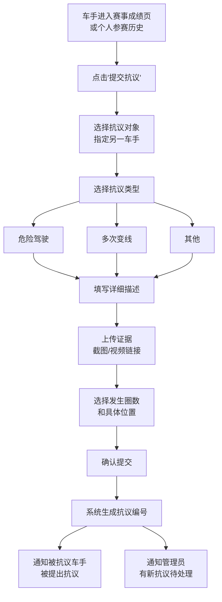
```mermaid
flowchart TD
    A[车手进入赛事成绩页<br/>或个人参赛历史] --> B[点击'提交抗议']
    B --> C[选择抗议对象<br/>指定另一车手]
    C --> D[选择抗议类型]

    D --> D1[危险驾驶]
    D --> D2[多次变线]
    D --> D3[其他]

    D1 & D2 & D3 --> E[填写详细描述]
    E --> F[上传证据<br/>截图/视频链接]
    F --> G[选择发生圈数<br/>和具体位置]
    G --> H[确认提交]

    H --> I[系统生成抗议编号]
    I --> J[通知被抗议车手<br/>被提出抗议]
    I --> K[通知管理员<br/>有新抗议待处理]
```

### 7.1.2 抗议数据字段

| 字段名 | 类型 | 说明 |
|--------|------|------|
| protest_id | UUID | 抗议唯一标识 |
| event_id | UUID | 关联赛事 ID |
| reporter_id | UUID | 提交抗议的车手 ID |
| reported_id | UUID | 被抗议的车手 ID |
| type | Enum | 抗议类型 |
| description | String | 详细描述 |
| evidence_urls | URL[] | 证据链接列表 |
| lap_number | Integer | 发生圈数 |
| location | String | 赛道位置描述 |
| status | Enum | 待审核 / 审核中 / 已裁决 / 已驳回 |
| created_at | DateTime | 提交时间 |
| deadline | DateTime | 抗议截止时间（如赛后 48 小时内） |

### 7.1.3 抗议/申诉时间窗口

- 抗议与申诉只能在该 Stage 成绩的**公示窗口内（锁定前）**提交；窗口时长由赛事配置 `result_lock_window_hours` 决定（默认 24h，管理员可提前锁定）。
- 该 Stage 成绩**锁定后**，抗议/申诉入口关闭，成绩与处罚不再变更。

## 7.2 处罚管理

### 7.2.1 处罚类型

赛事内判罚仅针对**该场成绩**，简化为三类：

| 处罚类型 | 说明 | 效果 |
|---------|------|------|
| **警告** | 轻微违规的书面警告 | 记录在案，不改成绩 |
| **罚时** | 对该场比赛成绩加罚时间 | 按罚时重排名次、按积分表重算积分 |
| **取消该场成绩（DSQ）** | 取消该车手该场比赛成绩 | 该场无积分 |

> **用户封禁/禁赛**（警告、临时封禁、永久封禁、赛事禁赛）属于**用户管理**范畴，见 3.4「封禁与禁赛体系」，不在赛事判罚内。

### 7.2.2 管理员裁决流程

判罚通过**独立判罚弹窗**完成：选择判罚类型（罚时 / 取消成绩 DSQ / 警告）、填写罚时秒数、填写判罚原因。该弹窗在两处复用：

- **成绩录入页**：每条成绩行的「判罚」按钮 → 直接对该车手该 Session 成绩判罚
- **抗议详情页**：裁决"确认违规"时打开同一弹窗，判罚结果回填到抗议裁决记录

裁决流程：

1. 管理员查看抗议列表（按赛事分组）
2. 点击某条抗议，查看详细信息和证据
3. 管理员做出裁决：
   - 驳回抗议（无处罚）
   - 确认违规 → 打开判罚弹窗，选择处罚类型与程度并填写原因
4. 确认判罚
5. 系统自动：
   - 应用判罚并**重算名次与积分**（罚时按积分表重排重算）
   - **写入判罚留痕**（审计日志，记录字段变更、原因、操作人、时间，并关联抗议 ID），在成绩录入页底部「修订历史」展示
   - 更新抗议状态，回填判罚明细到裁决记录
   - 如有禁赛：更新用户状态
   - 通知双方车手裁决结果

### 7.2.3 申诉流程

被处罚的车手可在该 Stage 成绩的**公示窗口内（锁定前）**提出申诉（窗口见 7.1.3）：

1. 车手在通知详情中点击"提出申诉"
2. 填写申诉理由和补充证据
3. 提交给管理员（由另一位未参与初次裁决的管理员复审，如人员允许）
4. 管理员最终裁决：维持原判 / 减轻处罚 / 撤销处罚
5. 申诉结果为最终结果，通知双方

### 7.3 边缘情况处理

| 边缘情况 | 处理方案 |
|---------|---------|
| 车手对已过抗议窗口的事件提出抗议 | 系统拒绝提交，提示"抗议窗口已关闭" |
| 同一事件被多人抗议 | 管理员可合并处理，一次裁决针对被抗议者的多起抗议 |
| 管理员未在规定时间内处理抗议 | 系统在后台发出超时提醒，但不自动裁决 |
| 抗议涉及管理员自身参赛 | 由其他管理员处理 |
| 处罚导致积分榜排名变化 | 管理员手动更新积分并发布变更通知 |

---

# 8. 赛事日历

## 8.1 日历视图

### 8.1.1 视图模式

| 模式 | 说明 |
|------|------|
| **月历视图** | 默认，按月展示赛事安排，每天格子内显示赛事卡片 |
| **周历视图** | 按周展示，每天内按时间线排列赛事 |
| **列表视图** | 按时间顺序列出所有赛事，信息更完整 |

### 8.1.2 日历卡片信息

每场赛事在日历中展示：
- 赛事名称
- 比赛时间
- 游戏平台标签（颜色区分）
- 报名状态指示

## 8.2 日历筛选

| 筛选项 | 说明 |
|--------|------|
| 区域 | 当前区域 / 全部区域 |
| 游戏平台 | 多选 |
| 已报名赛事 | 仅展示用户已报名的赛事（需登录） |

## 8.3 时区处理

- 所有时间以 UTC 存储和传输
- 前端根据用户浏览器/设备时区自动转换为本地时间展示
- 用户可在设置中手动指定时区（覆盖自动检测）
- 跨区域赛事同时显示赛事所在时区时间和用户本地时间

## 8.4 个人日历订阅

- 已报名车手可在赛事详情页点击"添加到日历"下载 .ics 文件
- .ics 文件内容：赛事名称、时间、赛道、服务器信息（如有）
- 支持导入 Google Calendar / Outlook / Apple Calendar 等

## 8.5 边缘情况处理

| 边缘情况 | 处理方案 |
|---------|---------|
| 夏令时切换 | 使用 IANA 时区数据库自动处理，展示的本地时间自动调整 |
| 赛事时间被管理员修改 | 已导出 .ics 不会自动更新，但站内通知提醒车手时间变更 |
| 同一时段多场赛事 | 日历格子内显示多场赛事缩略信息，点击展开 |
| 用户设备时区与账号设置时区不一致 | 优先使用账号设置中的时区偏好 |

---

# 9. 车队系统

## 9.1 车队功能概述

车队系统允许车手组建团队，以车队名义参加耐力赛、团队赛等需要多人协作的赛事。

## 9.2 车队数据模型

| 字段名 | 类型 | 说明 |
|--------|------|------|
| team_id | UUID | 车队唯一标识 |
| name | String | 车队名称（唯一） |
| logo | URL | 车队 Logo |
| description | String | 车队简介 |
| captain_id | UUID | 队长用户 ID |
| members | Member[] | 成员列表 |
| region | Enum | 车队所属区域 |
| created_at | DateTime | 创建时间 |

### 成员（Member）

| 字段名 | 类型 | 说明 |
|--------|------|------|
| user_id | UUID | 用户 ID |
| role | Enum | 队长 / 成员 |
| joined_at | DateTime | 加入时间 |

## 9.3 车队管理流程

### 9.3.1 创建车队

1. 车手在"我的车队"页面点击"创建车队"
2. 填写车队名称、缩写、Logo、简介
3. 选择车队所属区域
4. 提交创建
5. 创建者自动成为队长

### 9.3.2 邀请成员

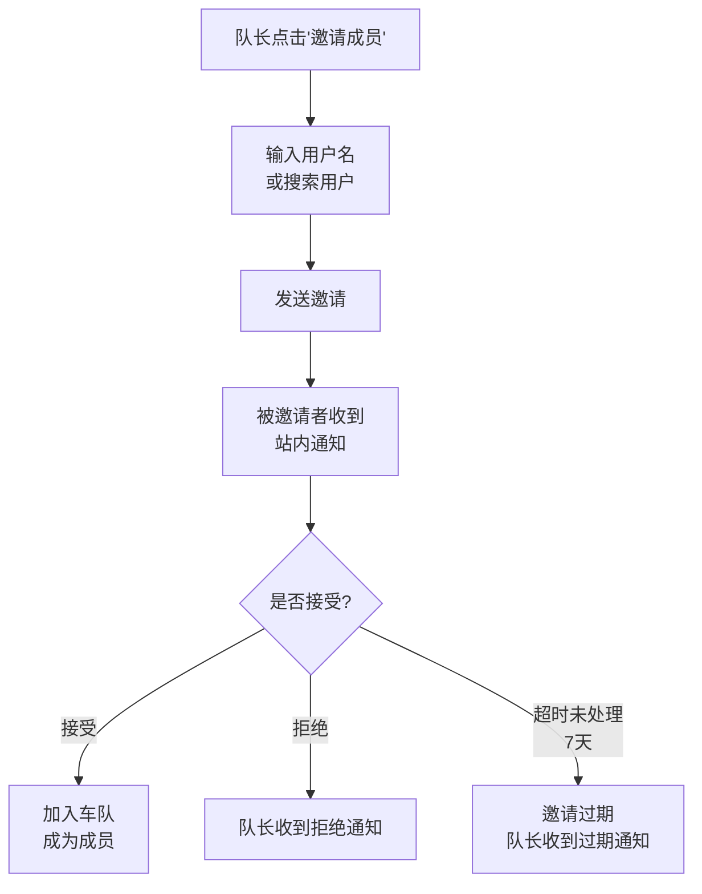
```mermaid
flowchart TD
    A[队长点击'邀请成员'] --> B[输入用户名<br/>或搜索用户]
    B --> C[发送邀请]
    C --> D[被邀请者收到<br/>站内通知]

    D --> E{是否接受?}
    E -->|接受| F[加入车队<br/>成为成员]
    E -->|拒绝| G[队长收到拒绝通知]
    E -->|超时未处理<br/>7天| H[邀请过期<br/>队长收到过期通知]
```

### 9.3.3 移除成员

1. 队长在车队管理页选择要移除的成员
2. 确认移除
3. 被移除的成员收到通知
4. 系统检查该成员是否有正在进行的团队赛事
   - 若有：提示队长"该成员正在参加 XX 赛事，移除后该赛事成绩可能受影响"
   - 队长确认后移除

### 9.3.4 转让队长

1. 队长选择要转让的成员
2. 确认转让
3. 新队长收到通知
4. 原队长变为普通成员

### 9.3.5 退出车队

1. 普通成员在车队页面点击"退出车队"
2. 系统检查是否有进行中的团队赛事
3. 确认退出
4. 队长收到成员退出通知

### 9.3.6 解散车队

1. 队长点击"解散车队"
2. 系统检查是否有正在进行的赛事
   - 若有：提示"车队有正在进行中的赛事，无法解散"
   - 若无：确认解散
3. 所有成员收到解散通知
4. 车队历史成绩保留，但车队页面显示"已解散"

## 9.4 车队报名赛事

- 团队赛赛事中，由队长代表车队报名
- 报名时选择参赛的车队成员（从车队成员列表中勾选）
- 报名成功后，被选中的成员收到通知
- 成员变更：报名截止前队长可修改参赛成员

## 9.5 车队公开页面

- URL 格式：`/team/{team_id}`
- 展示：车队名称、Logo、简介、成员列表、参赛历史、成绩统计
- 所有用户可查看

## 9.6 边缘情况处理

| 边缘情况 | 处理方案 |
|---------|---------|
| 车队解散后历史成绩归属 | 成绩保留，但标记为"已解散车队"，成员个人参赛记录仍保留 |
| 队长被封禁 | 队长被封禁期间车队功能冻结，管理员可指定新队长或解散 |
| 成员退出时正在进行团队赛事 | 允许退出但警告，该赛事中车队可能因人数不足而被视为 DNF |
| 同一用户加入多个车队 | 不允许，一个用户同一时间只能属于一个车队 |
| 车队名称被占用 | 唯一性校验，提示"该名称已被使用" |
| 被移除的成员不满 | 通过客服渠道申诉，管理员可介入处理 |

---

# 10. 通知系统

## 10.1 通知架构

### 10.1.1 通知渠道

| 渠道 | 说明 | 默认状态 |
|------|------|---------|
| **站内通知** | 平台内通知中心，登录后可见 | 始终开启 |
| **Pit House 推送** | 通过 Pit House 客户端推送通知弹窗 | 默认开启，用户可关闭 |
| **邮件通知** | 发送至用户绑定的邮箱 | 默认开启，用户可关闭 |

**Pit House 推送说明**：

Pit House 是 MOZA 设备调节软件，用户在赛车过程中通常保持开启。通过 Pit House 推送通知可以确保车手即使关闭了浏览器网页也能及时收到重要赛事通知（如赛事开始提醒、赛事取消等）。推送实现方式为平台后端通过 API 调用 Pit House 后端服务，Pit House 客户端轮询或接收推送后展示系统通知弹窗。

### 10.1.2 通知渠道配置

- 管理员可在后台配置每类通知的渠道
- 可选项：**仅站内** / **站内 + Pit House** / **站内 + 邮件** / **站内 + Pit House + 邮件**
- 用户可在账号设置中关闭 Pit House 推送和邮件通知（站内通知不可关闭）

## 10.2 通知类型与触发场景

| 通知类型 | 触发场景 | 推荐渠道 | 接收者 |
|---------|---------|---------|--------|
| **报名确认** | 车手成功报名赛事 | 站内 | 报名车手 |
| **报名取消确认** | 车手取消报名 | 站内 | 取消车手 |
| **赛事取消** | 管理员取消赛事 | 站内 + Pit House + 邮件 | 所有已报名车手 |
| **赛事时间变更** | 管理员修改比赛时间 | 站内 + Pit House + 邮件 | 所有已报名车手 |
| **赛事开始提醒** | 比赛开始前（如提前 1 小时） | 站内 + Pit House + 邮件 | 所有已报名车手 |
| **分组结果公布** | Split 分组完成并公布 | 站内 + 邮件 | 所有已报名车手 |
| **成绩公布** | 赛事成绩录入并发布 | 站内 | 所有参赛车手 |
| **抗议通知** | 车手被提出抗议 | 站内 + 邮件 | 被抗议车手 |
| **裁决结果通知** | 管理员对抗议做出裁决 | 站内 + 邮件 | 抗议双方 |
| **处罚通知** | 管理员对车手做出处罚 | 站内 + 邮件 | 被处罚车手 |
| **封禁通知** | 车手被封禁 | 站内 + 邮件 | 被封禁车手 |
| **解封通知** | 车手被封禁解除 | 站内 + 邮件 | 被解封车手 |
| **车队邀请** | 被邀请加入车队 | 站内 + 邮件 | 被邀请者 |
| **候补转正** | 候补车手获得名额 | 站内 + Pit House + 邮件 | 候补车手 |
| **锦标赛晋级** | 管理员标记车手晋级 | 站内 | 晋级车手 |
| **新闻/公告** | 管理员发布新闻或公告 | 站内 | 所有用户 |

## 10.3 站内通知中心

### 10.3.1 功能

- 导航栏显示通知铃铛图标，未读数量气泡
- 点击展开通知列表（最近 20 条）
- 点击单条通知跳转至相关页面
- "查看全部"进入通知中心页面
- 通知中心支持分页、按类型筛选、全部标记已读

### 10.3.2 通知数据模型

| 字段名 | 类型 | 说明 |
|--------|------|------|
| notification_id | UUID | 通知唯一标识 |
| user_id | UUID | 接收者用户 ID |
| type | Enum | 通知类型 |
| title_zh | String | 通知标题（中文） |
| title_en | String | 通知标题（英文） |
| body_zh | String | 通知内容（中文） |
| body_en | String | 通知内容（英文） |
| link | URL | 点击跳转链接 |
| is_read | Boolean | 是否已读 |
| created_at | DateTime | 创建时间 |

## 10.4 邮件通知

### 10.4.1 邮件模板

- 每类通知有对应的邮件模板
- 模板包含：平台 Logo、通知标题、通知内容、相关链接、退订链接
- 支持中英文两套模板

### 10.4.2 邮件发送策略

- 邮件通过异步队列发送，避免阻塞主流程
- 发送失败自动重试（最多 3 次，间隔递增）
- 同一用户短时间内多封邮件不合并（MVP 阶段，后续可优化为摘要邮件）

## 10.5 通知偏好设置

用户可在账号设置中配置：

| 设置项 | 选项 |
|--------|------|
| Pit House 推送总开关 | 开 / 关 |
| 邮件通知总开关 | 开 / 关 |
| 按类型细粒度控制 | 每类通知可单独开关 Pit House 和邮件渠道 |

> 注：站内通知始终开启，不可关闭。

## 10.6 边缘情况处理

| 边缘情况 | 处理方案 |
|---------|---------|
| 邮件发送失败 | 重试 3 次，3 次均失败则标记发送失败，站内通知和 Pit House 推送正常发出。后台可查看发送失败的邮件列表 |
| Pit House 客户端离线 | 推送消息进入队列，客户端下次上线时拉取未读推送。重要通知（赛事取消、时间变更）同时通过邮件兜底 |
| 大量用户同时触发通知（如赛事取消） | 使用消息队列异步发送，避免阻塞。后台可查看发送进度 |
| 用户未绑定邮箱但开启了邮件通知 | 系统发送站内通知和 Pit House 推送，邮件不发送（无目标地址） |
| 通知内容包含链接但目标页面已被删除 | 通知仍然展示，链接点击后显示"该内容已不可用" |
| 用户设置了邮箱但长时间未验证 | 仅发送站内通知和 Pit House 推送，邮箱标记为"未验证"状态，提示用户验证邮箱 |
| 候补转正通知中限定确认时间 | 通知中明确标注"请在 X 小时内确认"，超时后名额自动释放 |

---

# 11. 直播与内容

## 11.1 直播嵌入

### 11.1.1 功能描述

- 赛事详情页嵌入 Twitch / YouTube 直播播放器
- 管理员在赛事配置中填入直播链接
- 赛事进行期间，直播窗口在赛事详情页显著位置展示
- 未直播时显示"直播未开始"占位或隐藏

### 11.1.2 支持的平台

| 平台 | 嵌入方式 |
|------|---------|
| Twitch | iframe 嵌入 |
| YouTube | iframe 嵌入 |
| 其他 | 链接跳转（不嵌入） |

### 11.1.3 直播可见性

| 赛事状态 | 直播展示 |
|---------|---------|
| 未开始 | 隐藏或显示"直播即将开始"占位 |
| 进行中 | 展示直播播放器 |
| 已结束 | 隐藏直播，展示 VOD 回放链接 |

## 11.2 VOD 回放

- 管理员在赛后录入 VOD 回放链接（YouTube / Twitch VOD）
- 在赛事详情页展示"观看回放"按钮
- VOD 链接永久有效（除非源平台删除）

## 11.3 新闻与公告

### 11.3.1 功能描述

- 管理员可发布新闻/公告文章
- 支持中英双语内容录入
- 文章类型：赛事公告 / 平台更新 / 赛事回顾 / 其他

### 11.3.2 文章数据字段

> 同赛事双语策略（见 4.1.1），至少填写一种语言即可发布。

| 字段名 | 类型 | 必填 | 说明 |
|--------|------|------|------|
| article_id | UUID | 自动 | 文章唯一标识 |
| title_zh / title_en | String | 是（至少一种） | 标题（中/英） |
| content_zh / content_en | RichText | 是（至少一种） | 正文（中/英） |
| cover_image | URL | 否 | 封面图 |
| category | Enum | 是 | 分类 |
| regions | Enum[] | 是 | 展示区域 |
| is_pinned | Boolean | 否 | 是否置顶 |
| published_at | DateTime | 自动 | 发布时间 |
| author | String | 否 | 作者 |

### 11.3.3 展示位置

- 首页新闻模块（最近 3-5 条）
- 独立的新闻列表页（`/news`）
- 赛事详情页关联公告（如赛事相关的公告）

## 11.4 边缘情况处理

| 边缘情况 | 处理方案 |
|---------|---------|
| 直播链接失效 | 播放器显示错误信息，不影响赛事页面其他内容 |
| 直播链接为非 Twitch/YouTube | 不嵌入播放器，显示为外部链接按钮 |
| 管理员未配置直播链接 | 不显示直播区域 |
| 新闻仅录入单语 | 降级展示已有语言版本 |
| 新闻设置的区域不包含用户当前区域 | 该新闻不在该用户的新闻列表中显示 |

---

# 12. 管理数据看板

## 12.1 看板指标

### 12.1.1 核心指标

| 指标 | 说明 | 时间维度 |
|------|------|---------|
| 总注册用户数 | 平台累计注册车手数量 | 实时 |
| 新增用户数 | 新注册车手数量 | 日 / 周 / 月 |
| 活跃用户数 | 有登录行为的用户数量 | 日 / 周 / 月 |
| 赛事总数 | 已创建的赛事数量 | 实时 |
| 本周赛事数 | 本周安排的赛事数量 | 周 |
| 平均报名人数 | 每场赛事的平均报名人数 | 周 / 月 |
| 赛事参与率 | 报名人数 / 最大名额 | 周 / 月 |

### 12.1.2 趋势图表

| 图表 | 说明 |
|------|------|
| 用户增长曲线 | 按日/周/月的注册用户增长趋势 |
| 报名人数趋势 | 按赛事或按时间的报名人数变化 |
| 游戏平台分布 | 各游戏平台的赛事/报名占比 |
| 区域分布 | 四区域的用户数/赛事数/报名数对比 |
| 赛事完成率 | 已完成的赛事数 / 已发布的赛事数 |

### 12.1.3 筛选条件

- 按区域筛选（全部 / CN / AP / AM / EU）
- 按时间范围筛选（今日 / 本周 / 本月 / 自定义）

## 12.2 数据看板权限

- 仅管理员可访问数据看板
- 位于管理后台首页

---

# 13. 非功能需求与 MVP 规划

## 13.1 多语言（i18n）

### 13.1.1 需求

- 界面元素支持中文和英文
- 使用标准的 i18n 框架（如 react-intl / vue-i18n）
- 用户可随时切换语言，切换后整个界面即时更新
- 语言偏好持久化至用户账号或浏览器本地存储

### 13.1.2 内容双语

- 管理员在后台录入内容时提供中英文双栏编辑器
- 前台根据用户语言偏好展示对应版本
- 缺失某语言版本时降级展示

## 13.2 响应式设计

| 设备 | 优先级 | 说明 |
|------|--------|------|
| 桌面端（1280px+） | 最高 | 主要使用场景 |
| 平板端（768px-1279px） | 中 | 适配浏览 |
| 移动端（<768px） | 中 | 适配浏览和基础操作 |

## 13.3 SEO 优化

- 赛事列表页和详情页需要被搜索引擎收录
- 关键页面设置合适的 meta 标签（title / description / OG tags）
- 使用服务端渲染（SSR）或静态生成（SSG）确保爬虫可抓取
- 生成 sitemap.xml
- URL 结构清晰语义化（如 `/events/{slug}`, `/championships/{slug}`）

## 13.4 性能要求

| 指标 | 目标值 |
|------|--------|
| 首页加载时间（FCP） | < 2s |
| 交互响应时间（TTI） | < 3s |
| API 响应时间（P95） | < 500ms |
| 并发用户支持 | 初期 1000 并发 |

## 13.5 安全要求

| 安全措施 | 说明 |
|---------|------|
| HTTPS | 全站 HTTPS |
| XSS 防护 | 所有用户输入转义处理 |
| CSRF 防护 | 表单和 API 使用 CSRF Token |
| SQL 注入防护 | 使用参数化查询 / ORM |
| 频率限制 | API 限流（如报名接口每用户每分钟 5 次） |
| 防刷报名 | 同一赛事同一用户仅允许报名一次（服务端校验） |
| 管理后台访问控制 | IP 白名单 + 管理员账号双因素认证（2FA） |
| 敏感信息保护 | 服务器密码等信息加密存储，仅对已报名用户解密展示 |

## 13.6 技术方案建议

此处仅用于AI生成原型。

| 层次 | 建议技术 | 说明 |
|------|---------|------|
| 前端 | React / Vue 3 + TypeScript | SPA 或 SSR |
| 后端 | Node.js / Go / Java（根据团队技术栈） | RESTful API 或 GraphQL |
| 数据库 | PostgreSQL | 关系型数据 |
| 缓存 | Redis | 会话、热点数据缓存 |
| 文件存储 | S3 兼容对象存储 | 图片、结果文件 |
| 消息队列 | RabbitMQ / Redis Queue | 异步通知发送 |
| 部署 | Docker + 云服务 | 弹性扩缩 |

## 13.7 MVP 分期规划

### Phase 1 — MVP（核心功能上线）

**目标**：平台具备基本的赛事发布、浏览、报名和成绩展示能力。

| 模块 | 包含功能 |
|------|---------|
| 用户系统 | Pit House SSO 登录、Discord/Steam 绑定、基础车手档案 |
| 区域系统 | IP 自动识别区域、手动切换区域 |
| 赛事管理 | 创建/编辑赛事、赛事模板、发布到区域、赛事状态流转 |
| 赛事浏览 | 赛事列表、筛选、赛事详情页 |
| 报名系统 | 报名/取消报名、取消截止时间、.ics 日历导出 |
| 多 Split | 基础多 Split 配置和展示 |
| 成绩系统 | 手动录入成绩、成绩展示 |
| 通知系统 | 站内通知（核心场景：报名确认、赛事取消、成绩公布） |
| 日历 | 月历/列表视图 |
| 中英双语 | 界面双语 + 管理员双语录入 |

**不包含**：Rating 系统、车队系统、抗议系统、邮件通知、直播嵌入、数据看板

### Phase 2 — 社区与竞赛增强

**目标**：增加竞赛相关的完整功能链路。

| 模块 | 包含功能 |
|------|---------|
| 抗议与处罚 | 抗议提交、管理员裁决、处罚记录、申诉流程 |
| 车队系统 | 车队创建/管理/邀请、团队报名 |
| 封禁体系 | 完整的用户封禁/禁赛管理 |
| 邮件通知 | 邮件通知渠道、通知偏好设置 |
| API 自动导入 | 对接支持 API 的游戏自动导入成绩 |
| Competition 增强 | Round/Stage/Session 管理、积分榜、人工晋级管理 |
| 直播嵌入 | Twitch/YouTube 直播嵌入 |

### Phase 3 — 增长与运营

**目标**：运营效率提升和数据驱动。

| 模块 | 包含功能 |
|------|---------|
| 数据看板 | 运营数据统计看板 |
| 新闻/公告 | 文章发布系统 |
| 候补机制 | 报名满员后的候补名单 |
| VOD 回放 | 赛后回放链接管理 |
| MOZA 设备展示 | 车手档案页 MOZA 设备展示 |
| 通知增强 | 更多通知场景、邮件模板优化 |

### Phase 4 — 扩展功能（远期）

| 模块 | 包含功能 |
|------|---------|
| Rating 系统 | 车手实力评分、基于 Rating 的准入和 Split 分组 |
| 排行榜增强 | 多维度排行榜 |
| 性能分析 | 基础的赛后数据分析（圈速趋势等） |
| 移动端优化 | 响应式优化或独立移动端 |

---

> **v3.0 变更摘要**：赛事核心结构从 Event / Championship 双模型调整为 `Competition → Round → Stage → Session`。每一站为 Round，站内流程为 Stage，具体服务器和成绩归属为 Session。赛事复杂度由 Round/Stage 层级关系自然体现，不再需要独立的形态字段。

> **v3.1 变更摘要**：明确 MVP 阶段赛事仅支持 AC / ACC；新增 Session 自动开服配置模型，补充 ACC 七个 Dedicated Server 配置文件字段与 AC 两个核心 INI 配置文件字段，并说明后台字段到前台服务器信息展示的复用边界。

> **v3.2 变更摘要**（CompetitionRuleset 精简）：
> - **合并字段**：`rules_zh/en`、`scoring_rules_zh/en`、`advancement_rules_zh/en` 合并到 Competition `description` 字段，不再作为 CompetitionRuleset 独立字段
> - **移除字段**：`cancel_registration_deadline_offset` 不再作为 Competition 级配置
> - **Split 配置下移**：多 Split 配置（enable_multi_split、max_entries_per_split、max_splits、split_assignment_rule）从 CompetitionRuleset 移至 Stage 层级（SplitConfig）
> - **Round 精简**：移除 `round_number`（由排列顺序派生）和 `track_layout`（赛道布局不再单独配置）
> - **Stage 精简**：`type` 不再在编辑器中可选择（由模板预设）；`description` 始终可编辑；`eligibility_source` 新增条件子字段（roundRegistration 无额外字段 / previousStageResult 含 metric+direction+limit / manualInvite 含车手勾选列表）；原 `AdvancementRule` 子模型由条件子字段替代

> **v3.3 变更摘要**（Stage 统一服务器配置 + Session 弱化）：
> - **Session 不再独立**：Session 从独立实体降级为 Stage 内部的轻量条目（`Session`），仅保留游戏内 Practice/Qualifying/Race 的时序参数（时长、时段、时间倍率）。服务器配置、参赛名单和成绩全部上移到 Stage 层级
> - **一个 Stage = 一份服务器配置**：新增 `Stage.game_config`（SessionGameConfig，按 AC/ACC 配置文件组织）、`Stage.splits[]`（服务器实例列表，含独立参数和 Entry List）、`Stage.bop_entries[]`（性能平衡）。原 `SessionServerProvisioningConfig` 模型移除
> - **成绩归属变更**：成绩从绑定 Session 改为绑定 `Stage.splits[].results`，聚合路径变为 Split → Stage → Round → Competition
> - **Entry List**：每个 Split 维护独立的 `entry_list`（EntryListEntry[]），支持从 Round 报名自动生成 + 手动编辑
> - **SplitConfig 扁平化**：`enable_multi_split`、`max_entries_per_split`、`max_splits`、`split_assignment_rule` 从嵌套的 SplitConfig 对象改为 Stage 的扁平字段
> - **晋级规则重构**：`AdvancementRule.direction` 字段移除（方向由 metric 自动推断）；metric `bestLap` 更名为 `lapTime`；新增 `lap_time_multiplier` 字段（metric 为 lapTime 时用圈速倍率筛选代替固定名额）
> - **CompetitionRuleset**：新增 `scoring_note_zh / scoring_note_en`（积分表总计备注）
> - **统一配置弹窗**：Stage 编辑通过"会话与服务器配置"弹窗一站式管理 Sessions（P/Q/R 时序）、Servers（多 Split）、Game Settings（游戏引擎参数）、Entry List 和 BoP

> **v3.4 变更摘要**（Session 重新提升为成绩归属颗粒度）：
> - **四层结构确立**：赛事核心结构明确为 `Competition → Round → Stage → Session` 四层（原 v3.0 表述的"成绩归属为 Session"在此正式落地）。Session 重新从"Stage 内部轻量条目"提升为独立层级。
> - **Session = 成绩归属的最小颗粒度**：成绩不再笼统绑定到 `Stage.splits[].results`，而是归属于具体的（Split, Session）。同一个"正赛日" Stage 中，qualifying Session 的排位成绩与 race Session 的正赛成绩各自独立、可分别查看。
> - **Split 是 Stage 的横向并行维度**：Split 数量在 Stage 层级设定（`max_splits`）；一份共享开赛参数（`game_config`）+ Session 时序模板（`Stage.sessions`）分发给该 Stage 下所有 Split，各 Split 仅在服务器参数与 Entry List 上独立。
> - **成绩聚合链路**：Session → Split → Stage → Round → Competition。先按 Session 在 Split 间合并，再聚合到 Stage，由此可分别得到排位榜、正赛成绩、分站成绩与年度积分。
> - **涉及调整**：4.1.3（分层模型重写）、4.1.6（Stage/splits 字段说明）、4.1.7（Session 重写为成绩颗粒度）、4.1.8（配置归属）、4.1.9（成绩归属表）。注：v3.3 中"Session 不再独立""成绩绑定 Stage.splits[].results"的结论被本版本修正。

> **v3.5 变更摘要**（状态流转细化 + 判罚/分组/锁定模型修订）：
> - **成绩生命周期 公示 → 锁定**：服务器上报后成绩即对用户可见（公示中，可改/可申诉）；管理员锁定或到计划锁定时间后冻结（锁定，停申诉、发积分）。命名落地为 `results_locked_at` / `lockStageResults` / Round 状态 `ResultsLocked`。锁定以整个 Stage 为单位。详见 4.3.3。
> - **Stage 计划锁定时间**：新增 `Stage.results_lock_at`，默认 = `ends_at` + `result_lock_window_hours`（默认 24h，可配），到点自动锁定；管理员亦可手动提前锁定。
> - **Round 状态跟随最新 Stage**：多 Stage 时 Round 状态取最新（已开赛）Stage 的状态（含派生锁定）；报名阶段按时间 + `registration_override`（forceOpen/forceClosed）推导。Competition 聚合 = 当前站。
> - **判罚简化为三类**：警告 / 罚时 / 取消该场成绩（DSQ）。删除名次下调、扣分；用户封禁/禁赛归入用户管理（3.4），不在赛事判罚内。详见 7.2.1。
> - **分组模型重构**：删除 `max_splits` / `max_entries_per_split` / `enable_multi_split` 与"总容量"概念。服务器（Split）数量在**报名截止后于报名页按实际人数确定并均分**；`max_registrations` 仅限制报名总量，不做 Stage 容量校验。Stage 仅保留 `min_entries` 与 `split_assignment_rule`。详见 4.5.4。
> - **报名人数不足提示**：报名截止时若通过人数低于 `min_entries`，报名页强提示。
> - **CompetitionRuleset 修订**：移除 `weather` / `has_pitstop` / `min_entries` / `result_lock_window_hours`（`result_lock_window_hours` 改为 Competition 级字段；`min_entries` 在 Stage 层；天气由 `game_config` 表达）。
> - **Round 模型修订**：`stage_ids` → 内嵌 `stages`；移除未实现的 `rule_overrides`；新增 `registration_override`。
> - **硬编辑锁矩阵**：身份/规则（报名开放即锁）、成绩锁定窗口（成绩锁定前可改，锁定后锁）、参赛资格来源（报名截止锁）、报名时间与人数上限（Stage 开赛锁）、服务器配置（已开服/Stage 结束锁）、参赛名单（Stage 开赛锁）、Stage 开始时间（开赛锁）、成绩（锁定后不可修改）、删除（仅 Draft）、取消（成绩公示/锁定后禁）。均为字段禁用 + 提交拒绝的硬拦截。详见《赛事状态流转设计》§4。

> **v3.6 变更摘要**（多 Split 服务器配置派生 + 报名流程细化）：
> - **多 Split 服务器派生规则**（新增 4.5.7）：Split 1 为"基准服务器"（母版），模版只配置一份服务器参数。报名截止后扩展为 N 个 Split 时，新增 Split 从 Split 1 克隆全部服务器参数（端口不递增、密码/标志位/容量完全一致），仅 serverName 按编号派生（`基准名 #N`）、entryList 和成绩清空各自独立。管理员调整 Split 1 后保存时自动广播到其他 Split（保留各自的 serverName/entryList/成绩）。修正了 4.1.3 / 4.1.6 / 4.1.8 中"各 Split 服务器参数独立配置"的旧描述。
> - **第一个 Stage 资格锁定**：Round 内第一个 Stage 必须使用 `roundRegistration`（此前无成绩可判断），资格来源下拉不可改。
> - **成绩锁定截止约束**：上一阶段成绩锁定时间最晚不超过下一阶段开赛前 10 分钟（硬编码），违反时编辑器红字提示 + 保存阻断。
> - **晋级规则精简**：删除 `points` 指标，仅保留 `lapTime`（圈速倍率）和 `position`（名次取前 N）。

> **文档结束**
