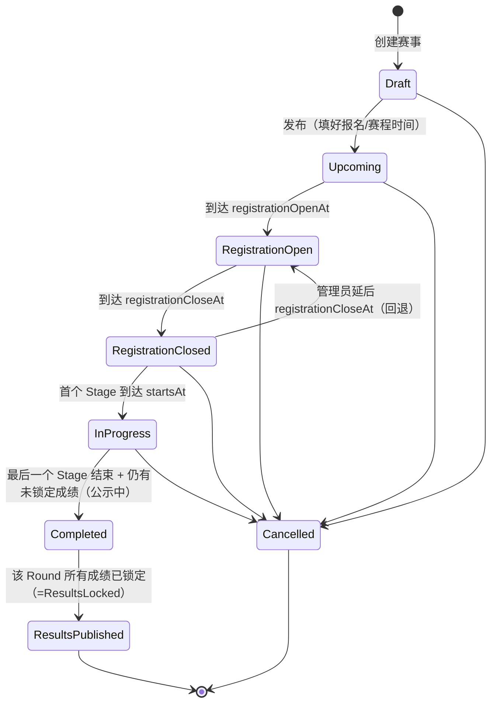

# Racing Arcade — 赛事状态流转与权限设计

> 本文是对当前"赛事状态流转"的细化设计：明确**状态的层级归属**，以及在每个状态下**选手（前台）能做什么、管理员（后台）能做什么 / 不能做什么**。
>
> 写作目的：当前状态枚举存在，但"到了某状态后谁能干什么"没有成文规范，导致编辑/操作的边界不清。本文给出目标设计（target），并在末尾标注与现状原型（prototype）的差距和待你拍板的开放问题。

---

## 修订记录（基于 2026-06-23 会议结论）

本次会议与本文原稿**总体一致**，主要带来一处结构性修订和若干确认/补充：

| # | 会议结论 | 对本文的影响 |
|---|---------|------------|
| R1 | 服务器成绩**立即展示给用户**；之后进入"公示 → 锁定"两段 | **结构性修订**：把原稿"录入→发布才可见"的模型改为"**公示中（即时可见、可改、可申诉）→ 锁定（冻结、停申诉、发积分）**"。代码里的 `publish/ResultsPublished/resultsPublishedAt` **已定改名** `lock/ResultsLocked/resultsLockedAt`（见 §8 确认项） |
| R2 | 成绩锁定窗口默认 **24h，可提前**；锁定后**才发放积分** | 申诉窗口 = 公示窗口（锁定前）；积分仅在**锁定后**计入榜单（原稿"录入即算"需收紧） |
| R3 | 报名开放即锁定：**积分表、游戏、车型组、准入门槛、赛区** | 与原稿 §4 一致，措辞对齐为这 5 项 |
| R4 | 人数上限不得低于当前已报名人数 | 与原稿一致 |
| R5 | 报名结束后：**参赛资格来源（eligibility_source）锁定** | 原稿未单列，§4 新增该行（报名截止时锁定） |
| R6 | 报名结束后**可延后报名截止时间 → 回退到"报名开放"** | 原稿 §8 开放问题#4 **已确认为是**（因状态按时间推导，把 `registrationCloseAt` 推到未来即自动回退） |
| R7 | Stage 进行中：**不能改开始时间，可改结束时间** | 原稿 §4"赛程时间"细化为"开始🔒·结束✅" |
| R8 | Stage 2 名单 = 资格来源 + **已锁定成绩** 计算 | 晋级需"成绩已锁定"为前置（原稿"出成绩即可晋级"需收紧） |
| R9 | **跨 Round 不支持按上一 Round 成绩定资格**，每个 Round 自由报名 | 原稿未明确，新增"作用域"说明：`previousStageResult` 仅在 **Round 内** 的 Stage 间生效 |

**追加修订（2026-06-23 决策，已落地原型）：**

| # | 决策 | 影响 |
|---|------|------|
| R10 | **判罚简化为三类**：警告 / 罚时 / 取消该场成绩（DSQ） | 删除名次下调、扣分；用户封禁/禁赛归入用户管理 |
| R11 | **删除 `maxSplits` / `maxEntriesPerSplit` / `enableMultiSplit` 与"总容量"概念** | 服务器数量于报名截止后按实际人数确定并均分；`maxRegistrations` 仅限制报名总量，不做 Stage 容量校验。§4 锁矩阵"容量/分组"行改为"分组" |
| R12 | **Stage 锁定 = 可设定时间**（`resultsLockAt`，默认 = 结束 + 24h），亦支持手动锁定 | §1.2 的"窗口到期自动锁定"细化为"到 `resultsLockAt` 自动锁定"，24h 仅为默认值 |
| R13 | **Round 状态跟随最新（已开赛）Stage 的状态**（含派生锁定） | §1.1 的"最后一个 Stage 结束"口径调整为"最新 Stage"；多 Stage 时 Round 状态 = 当前/最新 Stage 状态 |

> 下文相关章节已据此更新；其余原稿结论（三层模型、配置锁、取消规则等）维持不变。

---

## 0. 一句话结论（先看根因）

当前"不清晰"的根因是 **把三个层级的状态混为一谈**。实际上：

- **报名生命周期** 挂在 **Round（分站）** 上（`registrationOpenAt / registrationCloseAt`）。
- **比赛与成绩生命周期** 挂在 **Stage（阶段）** 上（`startsAt / endsAt` + 成绩子状态）。
- **Competition（赛事）状态** 只是它下属所有 Round 状态的**聚合展示**，本身不承载具体操作权限。

所以"选手/管理员能干什么"应当**主要按 Round 状态 + Stage 子状态**来定义，而不是按 Competition 聚合状态。下文据此展开。

---

## 1. 三层状态模型

| 层级 | 状态来源 | 承载什么 | 谁关心 |
|------|---------|---------|--------|
| **Competition 赛事** | 取**当前站**状态（见 §1.4；除非 `statusOverride`=Draft/Cancelled） | 列表展示、筛选、整体叙事 | 主要是后台列表 / 前台浏览 |
| **Round 分站** | `getRoundStatus()` 按时间 + 成绩推导 | **报名**、分组、开赛、成绩公示与锁定 | 选手报名与参赛的主单位 |
| **Stage 阶段** | 自身 `startsAt/endsAt` + `getStageResultStatus()` | 开服、跑赛、收成绩、判罚、锁定、晋级 | 后台运营的实操单位 |

> 关键：**状态主要由推导得出**，叠加少量人工覆盖（草稿/取消，以及报名阶段的"提前结束/重开"，见 §1.5）。比赛/成绩阶段的流转仍由**时间到点**和**成绩动作**驱动，管理员不能随意"点一下跳到下一个状态"。这是一个需要明确的产品事实。

### 1.1 Round 状态机（核心）



触发条件（与代码一致）：

| 流转 | 触发 |
|------|------|
| Draft → Upcoming | 赛事有 Round 且未设 `statusOverride='Draft'`，当前时间 < 报名开始 |
| Upcoming → RegistrationOpen | `now ≥ registrationOpenAt` |
| RegistrationOpen → RegistrationClosed | `now ≥ registrationCloseAt`（且首个 Stage 还没开赛） |
| RegistrationClosed → RegistrationOpen（回退） | 管理员把 `registrationCloseAt` 延后到未来（状态按时间推导，自动回退） |
| RegistrationClosed → InProgress | 任一 Stage 处于 `[startsAt, endsAt)` |
| InProgress → Completed | `now ≥` 最后 Stage 的 `endsAt`，且存在"有成绩但未锁定（公示中）"的 Split |
| Completed → ResultsPublished | 所有有成绩的 Split 都已**锁定**（`resultsPublishedAt`，语义=锁定时间） |
| 任意 → Cancelled | 管理员取消（Round 写 `cancelledReason`，或 Competition 设 `statusOverride='Cancelled'`） |

### 1.2 Stage 成绩子状态（正交于 Round 状态）★会议修订

Stage 结束后，成绩走 **公示 → 锁定** 两段（取代原稿"录入→发布才可见"）：

```
（无成绩）—Stage 结束/服务器上报—→ 【公示中】 —管理员锁定 或 公示窗口(默认24h,可配)到期自动锁定—→ 【锁定】
```

| Stage 成绩阶段 | 含义 | 可见性 | 可改 | 可申诉 | 积分 |
|------|------|------|:----:|:----:|------|
| **无成绩** | Stage 未结束或未上报 | — | — | — | — |
| **公示中** | 服务器成绩**已立即展示给用户**；进入复核/申诉窗口（默认 24h） | ✅ 立即可见 | ✅ 管理员可改 | ✅ 选手可申诉 | 未计入 |
| **锁定** | 管理员锁定，或公示窗口（默认 24h，每赛事可配）到期自动锁定 | ✅ | 🔒 不可改 | 🔒 停止申诉 | **锁定后发放**，计入榜单 |

要点：
- **展示不需要"发布"动作**——成绩一产生就对用户可见；管理员的关键动作是**锁定**，不是"让其可见"。
- **命名已定**：代码现有的 `resultsPublishedAt` / `publishStageResults` / Round 状态 `ResultsPublished` 实为锁定语义，落地时改名为 `resultsLockedAt` / `lockStageResults` / `ResultsLocked`（仅命名，不改数据形状）。
- **锁定以整个 Stage 为单位**一次完成——该 Stage 的所有 Split 同时锁定，**不设逐 Split 的 `partial`**（`getStageResultStatus` 简化为 `无成绩 / 公示中 / 锁定`）。
- **窗口可配**：公示/申诉/自动锁定时长为**每赛事配置项** `resultLockWindowHours`（默认 24h），管理员可在窗口内**提前锁定**。
- **统计口径**（是否计分、积分表应用）随锁定一并冻结。
- **积分**仅在 Stage **锁定后**计入榜单（落地时 `calculateStandings` 应只计已锁定成绩）。
- 这条线**与 Stage 时间维度正交**，组合才完整描述一个 Stage。

### 1.3 报名子状态（挂在 Registration 上）

`approved`（默认，**报名自动通过**）/ `waitlisted`（候补）/ `rejected`（被移除）/ `withdrawn`（车手主动退）。**已无 `pending`**。

### 1.4 Competition 聚合状态 = 当前站（current round）★会议修订

会议确认：**Competition 状态不再用"优先级聚合"，改为取"当前站"的状态。**

- **当前站（current round）** = 按 `roundNumber` 顺序，**第一个尚未进入终态**（Completed / ResultsLocked / Cancelled）的 Round；若所有站均已终结，取**最后一站**。
- **Competition 状态 = 当前站的 `getRoundStatus()`**。

| 各站状态 | 当前站 | Competition 显示 |
|---|---|---|
| R1 进行中, R2 未开放 | R1 | InProgress |
| R1 已锁定, R2 报名中 | R2 | RegistrationOpen |
| R1 报名中, R2 未开放 | R1 | RegistrationOpen |
| 全部已锁定 | 末站 | Completed / ResultsLocked |
| 全部取消 | 末站 | Cancelled |

> 取代旧 `getCompetitionStatus()` 的多分支优先级合并；列表筛选、首页待办均改按"当前站"口径。`statusOverride`=Draft/Cancelled 仍优先。

### 1.5 人工状态覆盖（会议确认：需要更多）

默认仍由**时间 + 成绩**推导状态；在此之外，管理员可**手动覆盖/强制**以下**报名阶段**状态（覆盖优先于时间推导）：

| 覆盖动作 | 作用 | 现状 |
|---|---|---|
| 草稿 Draft | 保持未发布、对外不可见 | 已有 |
| 取消 / 恢复 Cancelled | 终止赛事（开赛前可恢复） | 已有 |
| **提前结束报名** | 未到 `registrationCloseAt` 也立即关闭报名 → RegistrationClosed | **新增** |
| **重新开放 / 延长报名** | 已截止后重新开放或延长 → RegistrationOpen | **新增**（给显式一键动作，不必只靠改时间） |

- **比赛/成绩阶段不设"强制跳转"**：进行中 / 公示 / 锁定由 Stage 时间与"提前锁定"动作控制，管理员不直接改这些状态。
- 落地建议：在 Round 上加 `registrationOverride: 'forceOpen' | 'forceClosed' | null`，与 `statusOverride` 一并参与 `getRoundStatus()`；覆盖均留痕。

---

## 2. 角色

| 角色 | 说明 | 目前原型是否有界面 |
|------|------|------|
| **选手 Driver** | 前台用户，报名、参赛、看成绩、提抗议/申诉 | ❌ 尚无前台（本文的"选手"列是产品目标，用于约束后台必须支持的能力） |
| **管理员 Admin** | 后台运营，建赛、分组、开服、收成绩、判罚、锁定/发积分、晋级 | ✅ 当前原型即后台 |
| **系统 System** | 自动行为：按时间推导状态、报名自动通过、参赛名单随报名自动生成、预选服按间隔重启等 | 部分模拟 |

---

## 3. 逐状态：选手能干什么 / 管理员能干什么、不能干什么

> 下表的"状态"指 **Round 状态**（选手与报名的主视角）。每个状态再标注该阶段 Stage 维度的运营动作。

### 3.1 Draft（草稿）

- **含义**：赛事已创建但未发布（`statusOverride='Draft'` 或尚无 Round）。对外不可见。
- **选手**：看不到、无任何操作。
- **管理员 能**：自由编辑全部内容（名称、赛区、时区、Round/Stage、积分表、准入、服务器配置、模板套用）；删除赛事；发布（填好时间并去掉 Draft 覆盖 → 进入 Upcoming/RegistrationOpen）。
- **管理员 不能**：（无限制，草稿期一切可改）。
- **系统**：无。

### 3.2 Upcoming（已发布·报名未开放）

- **含义**：已对外发布，`now < registrationOpenAt`。
- **选手 能**：浏览赛事详情、规则、赛程、奖励、积分表、服务器信息（隐藏密码）；预约提醒 / 加入日历（未来）；看到"报名将于 X 开放"。
- **选手 不能**：报名（尚未开放）。
- **管理员 能**：仍可较自由地改配置（赛程、Round/Stage、积分、服务器配置、提前开放报名）；取消赛事。
- **管理员 不能 / 谨慎**：原则上身份与规则（见 §4 锁矩阵）此时仍可改，但**一旦改了再发布给选手就形成承诺**，建议从此刻起对"游戏/车型组/积分表/准入"等启用变更提醒。
- **系统**：到点自动转 RegistrationOpen。

### 3.3 RegistrationOpen（报名开放）★选手核心阶段

- **含义**：`registrationOpenAt ≤ now < registrationCloseAt`。
- **选手 能**：**报名**（填 Steam GUID、车号、车队，提交即自动通过）；在 `cancelRegistrationDeadline` 前**取消自己的报名**；名额已满时**加入候补**；查看当前报名人数 / 参赛名单；（可选）修改自己的报名信息（车号偏好等）。
- **选手 不能**：查看他人隐私信息；自行选择分组（分组由管理员在报名截止后定）。
- **管理员 能**：查看报名（已自动通过）；对**个别**车手「移除报名」`rejected` 或「转候补」`waitlisted` / 恢复；编辑非破坏性信息（描述、封面、资源、直播链接）；取消赛事/分站。
- **管理员 不能 / 应被拦截**：
  - **改积分表 / 游戏 / 车型组 / 准入门槛 / 赛区**——选手报名时已据此决策，改动破坏公平（§4 锁定）。
  - **把报名上限 `maxRegistrations` 改到低于当前已报名数**——应拒绝（硬校验，不得低于已报名数）。
  - 删除赛事（应走"取消"而非"删除"，以保留记录并触发通知）。
- **系统**：到点转 RegistrationClosed；**车手取消时自动从候补补位**（建议，见 §6）。

### 3.4 RegistrationClosed（报名截止·待开赛）★管理员核心准备阶段

- **含义**：`registrationCloseAt ≤ now <` 首个 Stage `startsAt`。
- **选手 能**：查看最终参赛名单（公布后）；查看自己的**分组**（公布后）；查看服务器加入信息（开服后、按可见性规则）。
- **选手 不能**：再报名或自助取消（已过截止，需联系管理员）。
- **管理员 能**（这是分组与开服的窗口）：
  - **分组**：决定分几组、按报名时间/随机**均分**（按水平待上线）；超容量或每组人数过少时系统强提示。
  - **应用到参赛名单**（approved → 各 Stage 的 entryList）。
  - 微调服务器配置；**开服**（启动该 Stage 的各 Split 服务器）。
  - 处理缺额：移除未到岗者、从候补补位。
  - **重新开放报名**：延后 `registrationCloseAt` 即可**回退到"报名开放"**（会议确认，因状态按时间推导）。
- **管理员 不能 / 应被拦截**：
  - 改积分/规则/车型组/准入/赛区（持续锁定）。
  - **改 Stage 的参赛资格来源 `eligibility_source`**——报名截止起锁定（会议确认；此后开始据此算名单/分组）。
- **系统 / 边界**：若报名数 < `minEntries`，提示管理员**取消或照常开赛**（不自动取消，见 §6）。

### 3.5 InProgress（进行中）

- **含义**：至少一个 Stage 处于 `[startsAt, endsAt)`，或多 Round 锦标赛中部分 Round 已跑完而其它在进行。
- **选手 能**：用分配到的服务器参赛（练习/排位/正赛）；查看正在生成的成绩（公示）；赛后窗口内**提交抗议**。
- **选手 不能**：更换分组 / 服务器；修改已产生的成绩。
- **管理员 能**：监控/启停各 Split 服务器；Stage 结束后成绩**立即展示（公示中）**并可手动修正/导入；**判罚**（自动重算名次积分并留痕）；处理抗议。
- **管理员 不能 / 应被拦截**：
  - 改已开赛 Stage 的参赛名单 / 服务器时序（避免与正在跑的比赛冲突）。
  - **修改该 Stage 的开始时间**（会议确认锁定）；但**可调整结束时间**（提前/延后收车）。
- **系统**：所有 Stage 结束 → 进入"成绩公示中"（见 §3.6）。

### 3.6 Completed（已结束·成绩公示中）★会议修订

- **含义**：`now ≥` 末 Stage `endsAt`，存在"有成绩但未锁定"的 Stage（公示窗口内，默认 24h）。
- **选手 能**：**立即查看**该 Stage 成绩（服务器一上报即可见）；在公示窗口内**提交抗议 / 申诉判罚**。
- **选手 不能**：自行修改成绩。
- **管理员 能**：复核并**修改成绩**；处理抗议、**判罚**（自动重算名次积分、留痕）；**锁定成绩**（公示窗口到期自动锁定，亦可**提前锁定**）。
- **管理员 不能 / 应被拦截**：（公示中成绩可改，无特别限制；锁定后才进入下条）。
- **系统**：公示窗口（`resultLockWindowHours`，默认 24h）到期自动锁定，或管理员提前锁定 → 成绩锁定（ResultsLocked）。

### 3.7 ResultsPublished（成绩已锁定）★会议修订

> 名称沿用代码现状 `ResultsPublished`，**语义实为"已锁定"**（建议改名 `ResultsLocked`，见 §8）。

- **含义**：该 Round 所有成绩已锁定（`resultsPublishedAt` = 锁定时间）。Competition 聚合层显示为 Completed。
- **锁定即生效**：管理员**不能再改成绩**、**不能再改统计口径**；选手**不能再申诉**；**锁定后发放积分**，计入车手榜/车队榜。
- **选手 能**：查看最终成绩、名次、**积分构成**、车手榜/车队榜。
- **管理员 能**：（锦标赛内）据**已锁定成绩** + 资格来源计算下一 Stage 名单（晋级）；归档。极端情形如需改已锁定成绩，必须显式"撤销锁定 → 修正 → 重新锁定"，全程留痕+通知（见 §7，应设为高门槛例外）。
- 对单个 Round 为**终态**；锦标赛则继续下一 Round（下一 Round 为**自由报名**，不按上一 Round 成绩定资格，见 §6）。

### 3.8 Cancelled（已取消）

- **含义**：Round 写 `cancelledReason` 或 Competition `statusOverride='Cancelled'`。可从 Upcoming / RegistrationOpen / RegistrationClosed / InProgress 进入。
- **选手 能**：看到取消通知与原因；若已报名收到取消通知。
- **选手 不能**：报名 / 参赛。
- **管理员 能**：查看；（建议）在原定开赛时间前**撤销取消**恢复为推导状态。
- **管理员 不能**：运营该赛事。

---

## 4. 配置可编辑性"锁矩阵"（管理员"能改什么"的核心）

> 这是把"管理员不能干什么"落到具体字段的关键。✅ 可编辑｜⚠️ 可改但有**硬校验**/需二次确认（如不得低于已报名数；改时间需确认+通知）｜🔒 **硬拦截**（会议确认：字段禁用、提交即拒绝，**非软提醒**；特例需显式解锁+留痕）。

> 后三列是 **Stage 维度**的阶段（进行中 / 成绩公示中 / 成绩锁定后），前四列是 Round 维度。

| 字段类别 | Draft | Upcoming | 报名开放 | 报名截止 | Stage进行中 | Stage公示中 | Stage锁定后 |
|----------|:----:|:----:|:----:|:----:|:----:|:----:|:----:|
| **身份/规则**（game、carClass、regions、积分表、准入门槛、ruleset、`resultLockWindowHours`） | ✅ | ✅ | 🔒 | 🔒 | 🔒 | 🔒 | 🔒 |
| **报名时间**（regOpen/Close、cancelDeadline、maxRegistrations） | ✅ | ✅ | ⚠️不得低于已报名 | ⚠️可延后→回退报名开放 | 🔒 | 🔒 | 🔒 |
| **参赛资格来源**（eligibility_source） | ✅ | ✅ | ✅ | 🔒（报名截止起锁定） | 🔒 | 🔒 | 🔒 |
| **分组**（默认分组方式、min_entries；服务器数报名截止后于报名页定并均分） | ✅ | ✅ | ✅ | ✅分组实操 | 🔒 | 🔒 | 🔒 |
| **服务器配置**（Split 字段、gameConfig、sessions 时序） | ✅ | ✅ | ✅ | ✅ | 🔒已开服/✅未开服 | 🔒 | 🔒 |
| **Stage 起止时间** | ✅ | ✅ | ⚠️ | ⚠️未开赛可改 | 🔒开始·✅结束 | 🔒 | 🔒 |
| **参赛名单**（entryList） | ✅ | —自动 | —自动 | ✅应用/微调 | 🔒已开赛 | 🔒 | 🔒 |
| **成绩**（results） | — | — | — | — | —（无终态成绩） | ✅可改 | 🔒 |
| **统计口径/是否计分**（awardsPoints、积分表应用） | ✅ | ✅ | ✅ | ✅ | ✅ | ✅锁定前可改 | 🔒 |
| **外观/信息**（description、cover、resources、streamUrl） | ✅ | ✅ | ✅ | ✅ | ✅ | ✅ | ✅ |
| **取消**（cancel） | ✅ | ✅ | ✅通知 | ✅ | ⚠️罕见 | ⚠️ | 🔒 |
| **删除**（delete，从列表移除） | ✅ | 🔒改用取消 | 🔒 | 🔒 | 🔒 | 🔒 | 🔒 |

---

## 5. 矩阵速查：谁在什么状态能做什么

> 末两列 Completed=**成绩公示中**、Published=**成绩锁定后**。

| 能力 \ Round 状态 | Upcoming | 报名开放 | 报名截止 | 进行中 | Completed(公示) | Published(锁定) |
|---|:--:|:--:|:--:|:--:|:--:|:--:|
| 选手：浏览详情 | ✅ | ✅ | ✅ | ✅ | ✅ | ✅ |
| 选手：报名 | — | ✅ | — | — | — | — |
| 选手：自助取消报名 | — | ✅(截止前) | — | — | — | — |
| 选手：加入候补 | — | ✅(满员时) | — | — | — | — |
| 选手：查看分组/参赛名单 | — | 部分 | ✅ | ✅ | ✅ | ✅ |
| 选手：参赛 | — | — | — | ✅ | — | — |
| 选手：**看成绩**（服务器一上报即见） | — | — | — | ✅(逐 Stage) | ✅ | ✅ |
| 选手：提交抗议 / 申诉判罚 | — | — | — | ✅(赛后窗口) | ✅(锁定前窗口内) | 🔒(锁定后停止) |
| 选手：看**积分榜** | — | — | — | — | —(未锁定不计分) | ✅(含积分构成) |
| 管理员：编辑身份/规则 | ✅ | 🔒 | 🔒 | 🔒 | 🔒 | 🔒 |
| 管理员：移除/候补个别车手 | — | ✅ | ✅ | ✅(慎) | — | — |
| 管理员：分组+应用名单 | — | — | ✅ | (已应用) | — | — |
| 管理员：开服 | — | — | ✅ | ✅ | — | — |
| 管理员：录入/修正成绩 | — | — | — | ✅(Stage 结束后) | ✅ | 🔒(需先撤销锁定) |
| 管理员：判罚 | — | — | — | ✅ | ✅ | 🔒(锁定后不可改) |
| 管理员：**锁定成绩** | — | — | — | — | ✅(满 24h 自动/可提前) | (已锁定) |
| 管理员：**发放积分** | — | — | — | — | —(锁定后才发) | ✅ |
| 管理员：晋级（算下一 Stage 名单） | — | — | — | ✅(上一 Stage **已锁定**后) | ✅ | ✅ |
| 管理员：取消赛事 | ✅ | ✅ | ✅ | ⚠️ | 🔒 | 🔒 |

---

## 6. 关键规则与边界（建议）

1. **最低开赛人数 `minEntries`**：报名截止时若不足，**不自动取消**，而是在报名页强提示，由管理员决定"取消"或"照常开赛"。
2. **报名上限与候补**：报名达 Round 级 `maxRegistrations` 后转入候补（为空不限）；**有人取消时自动补位**最早候补者并通知（管理员可手动覆盖顺序）。服务器数量与容量无关，于报名截止后人工决定。
3. **分组时机**：分组在 **RegistrationClosed** 后做，均分（组间差 ≤1）；仅对"资格来源=分站报名"的 Stage 生效，晋级类 Stage 不参与。
4. **取消**：取消触发对已报名者的通知；允许在**原定开赛时间前**撤销取消恢复。
5. **成绩公示与锁定**（会议核心）：Stage 结束后服务器成绩**立即公示**（用户可见、管理员可改、选手可申诉）→ 公示窗口到期**自动锁定**，管理员可**提前锁定**。窗口时长为**每赛事配置项** `resultLockWindowHours`（默认 24h）。**锁定以整个 Stage 为单位一次完成**（所有 Split 同时锁定，无逐 Split 部分锁定）。锁定后冻结成绩与**统计口径**、停止申诉、**发放积分**；**仅已锁定的成绩计入榜单**（落地时 `calculateStandings` 应只计已锁定）。
6. **锁定后改成绩**：必须"撤销锁定 → 修正 → 重新锁定"，每步写 `auditLogs` 并通知受影响车手；应设为高门槛例外。
7. **抗议/申诉窗口**：在成绩**公示窗口（锁定前）**内提交；锁定后停止受理。
8. **跨 Round 自由报名**（会议确认）：当前**不支持**按上一 Round 成绩决定下一 Round 资格；每个 Round 独立开放自由报名。`eligibility_source=previousStageResult` **仅在同一 Round 内的 Stage 之间**生效（如预选→正赛），且以**已锁定成绩**为依据。
9. **状态由时间驱动**：管理员不能手动"跳状态"；要提前/延后只能改对应时间字段（且受锁矩阵约束）。延后 `registrationCloseAt` 即可回退到"报名开放"。
10. **Competition 状态取当前站**：赛事整体状态 = 当前站（第一个未终态的 Round）的状态，而非各站优先级合并（见 §1.4）。

---

## 7. 现状原型 vs 目标设计的差距（实现时参考）

| 维度 | 现状（prototype） | 目标设计 |
|------|------|------|
| 编辑锁 | 编辑页**几乎任何字段任何状态都能改**，无锁矩阵 | 按 §4 锁矩阵约束（至少锁身份/规则/已开赛项/资格来源） |
| 选手前台 | **不存在**（仅后台） | 需前台支持 §3/§5 的选手能力 |
| **成绩展示/锁定** | "同步→点发布"两步才可见；`publish` 即终态，无锁定窗口 | 服务器成绩**立即公示**；公示窗口（每赛事可配 `resultLockWindowHours`，默认 24h）到期或提前**整 Stage 锁定**；`publish/ResultsPublished/resultsPublishedAt` **改名** `lock/ResultsLocked/resultsLockedAt` |
| **积分计入榜单** | 所有已录入成绩都计入（不论是否锁定/发布） | **仅已锁定**且 `awardsPoints` 的 race session 计入 |
| 锁定后改成绩 | 可直接撤销发布再改 | 撤销锁定→修正→重锁定，强制留痕+通知，高门槛 |
| 候补补位 | 手动 | 取消时**自动补位**最早候补者+通知 |
| 人工状态覆盖 | 仅 Draft/Cancelled | + **提前结束报名 / 重开报名**（§1.5），均留痕 |
| 编辑锁强度 | 无 | 🔒 = **硬拦截**（禁用+拒绝） |
| 最低人数 | 字段在，未联动 | 报名截止强提示 |
| **跨 Round 资格** | `eligibility_source` 含 `previousStageResult`，跨 Round 行为未约束 | 跨 Round **自由报名**；`previousStageResult` 仅 Round 内 Stage 间 |
| 取消 vs 删除 | 都可用，未按状态限制 | 按 §4：发布前可取消，公开后禁删除 |
| Competition 聚合 | `getCompetitionStatus()` 优先级合并各 Round | **取当前站（current round）状态**（§1.4） |
| 锁定粒度/窗口 | 无锁定概念，`publish` 逐 Split | **整 Stage 一次锁定**；窗口=每赛事 `resultLockWindowHours`（默认 24h） |

---

## 8. 决策汇总（已全部确认）

本设计的待定问题已全部拍板：

**编辑与状态**
- **编辑锁 = 硬拦截**：🔒 字段禁用、提交即拒绝，无软提醒例外（§4）。
- **人工状态覆盖 = 扩充**：除草稿/取消外，新增"提前结束报名""重开/延长报名"（§1.5）；比赛/成绩阶段不设强制跳转。
- **Competition 状态 = 当前站（current round）状态**，取代优先级聚合（§1.4）。

**报名**
- 报名**全自动**（无待审）；候补**自动补位**最早候补者 + 通知。
- 报名截止后可延后 `registrationCloseAt` **回退到报名开放**。
- 人数上限不得低于当前已报名数。
- 跨 Round **自由报名**；`previousStageResult` 仅在同一 Round 内 Stage 间生效。

**成绩 / 积分**
- 成绩**立即公示** → 公示窗口（每赛事可配 `resultLockWindowHours`，默认 24h，可提前）到期**整 Stage 一次锁定**。
- `publish` 正式改名 `lock`：`publishStageResults → lockStageResults`、`resultsPublishedAt → resultsLockedAt`、`ResultsPublished → ResultsLocked`（仅命名，不改数据形状与流转）。
- 锁定后冻结成绩与统计口径、停止申诉、**发放积分**；**仅已锁定成绩计入榜单**。

---

*本设计文档为讨论稿，未改动任何代码。确认方向后可据此细化各页面的禁用态/提示文案，并在 `lib/` 增加状态守卫（如 `canEditField(comp, field)`、`canRegister(round)`、`canStartServer(stage)` 等纯函数）。*
